# Lab 1 — Introduction to AWS IAM

## Overview

My first AWS lab was all about **Identity and Access Management (IAM)**, the service that controls who can sign in to an AWS account and what they're allowed to do.

I started by exploring three IAM users (`user-1`, `user-2`, `user-3`) and three user groups. None of the users had any permissions yet. Each group had a policy attached: two used AWS managed policies and one used an inline policy. Then I followed a business scenario and put each user into the group that matched their job. Last, I signed in as each user in a private browser window and tested what they could and couldn't do in S3 and EC2, including trying to stop an EC2 instance called **LabHost**.

The big takeaway is that permissions should go on **groups**, not individual users. When someone is added to a group they get exactly what that job needs, and anything outside of that is denied by default.

## Objectives

- Explore the pre-created IAM users and user groups
- Read the IAM policies attached to each group and understand what they allow
- Add users to groups based on their job function
- Find and use the IAM sign-in URL for the account
- Test how each user's policies affect what they can do in S3 and EC2

## Tools & Technologies

| Category | Tools |
|---|---|
| Cloud platform | Amazon Web Services (AWS) |
| Services | IAM, Amazon S3, Amazon EC2 |
| Objects | IAM users, user groups, AWS managed policies, inline policies |
| Region | US East (N. Virginia) `us-east-1` |

---

## Task 1 — Explore the Users and Groups

### 1.1 IAM dashboard

**Console → IAM → Dashboard** shows a count of the IAM resources in the account. This account had **3 user groups, 4 users, 17 roles, and 1 policy**. The right side shows the **Sign-in URL for IAM users in this account**, which I used later in Task 3.

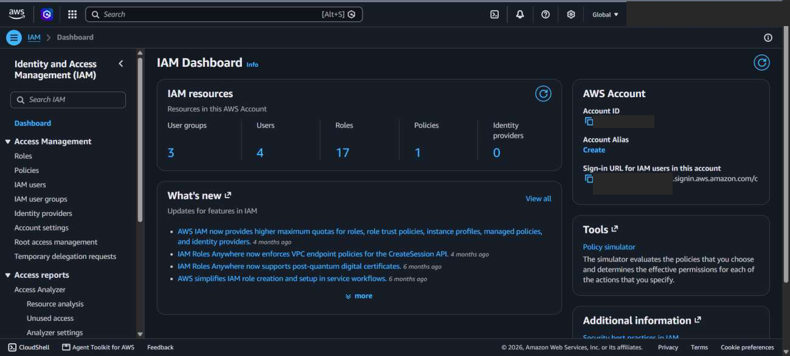

### 1.2 IAM users

**Access management → IAM users** lists the users. Besides the `awsstudent` user, there were `user-1`, `user-2`, and `user-3`, each in **0** groups.

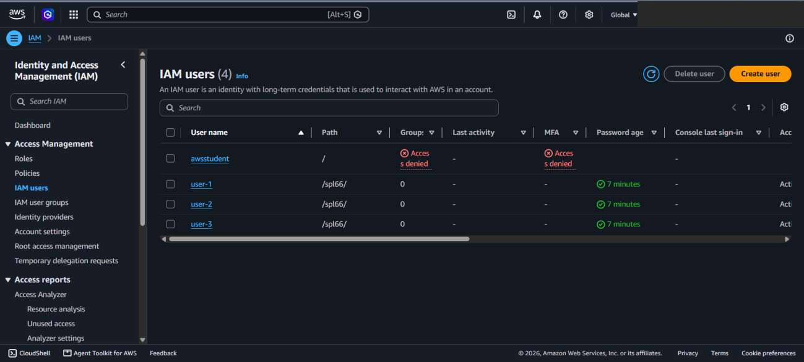

### 1.3 Look at user-1

I opened `user-1` and checked each tab:

- **Permissions:** no policies attached, so this user can't do anything yet.

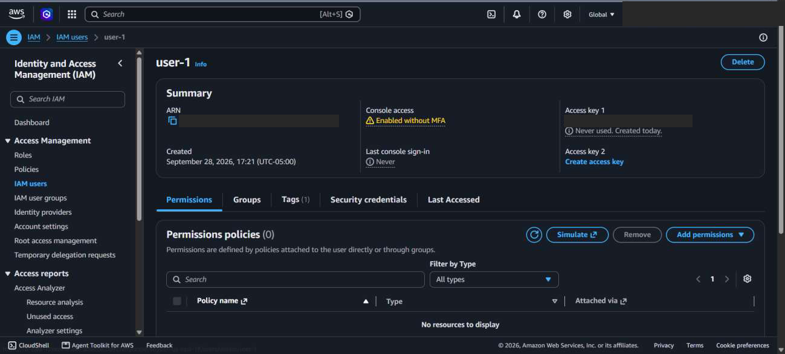

- **Groups:** not a member of any group.

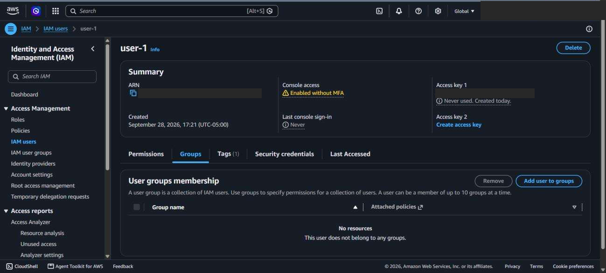

- **Security credentials:** the user has a **console password**, so they can sign in to the AWS Management Console.

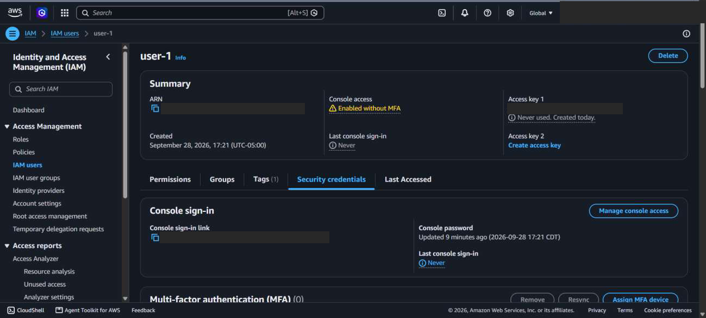

> The summary shows **Console access: Enabled without MFA**. That's fine for a lab, but in a real account every user who can sign in to the console should have MFA turned on.

### 1.4 User groups

**Access management → IAM user groups** shows the three groups. Each one has **0 users** but already has permissions defined.

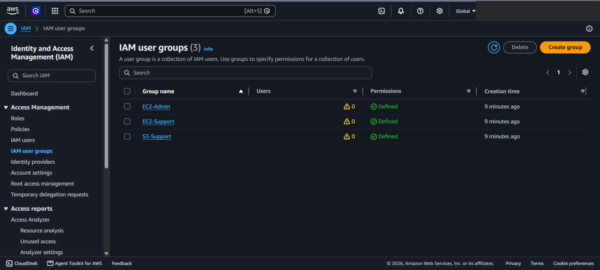

### 1.5 EC2-Support group

The **EC2-Support** group has the **AmazonEC2ReadOnlyAccess** AWS managed policy attached.


Expanding the policy shows the JSON. It only allows `Describe*` actions on EC2 and Elastic Load Balancing (plus CloudWatch and Auto Scaling further down), on every resource (`"Resource": "*"`). A support person can see everything but can't change anything.

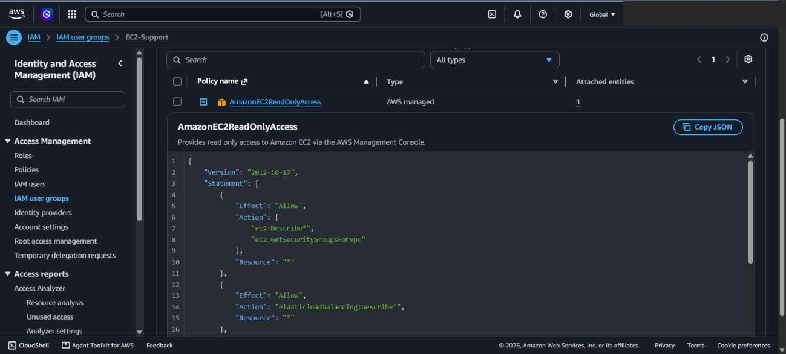

A policy statement has three main parts:

| Element | What it does | Example |
|---|---|---|
| `Effect` | Whether the statement allows or denies | `"Allow"` |
| `Action` | Which API calls it covers | `"ec2:Describe*"` |
| `Resource` | Which resources it applies to | `"*"` (everything) |

### 1.6 S3-Support group

The **S3-Support** group has the **AmazonS3ReadOnlyAccess** AWS managed policy.

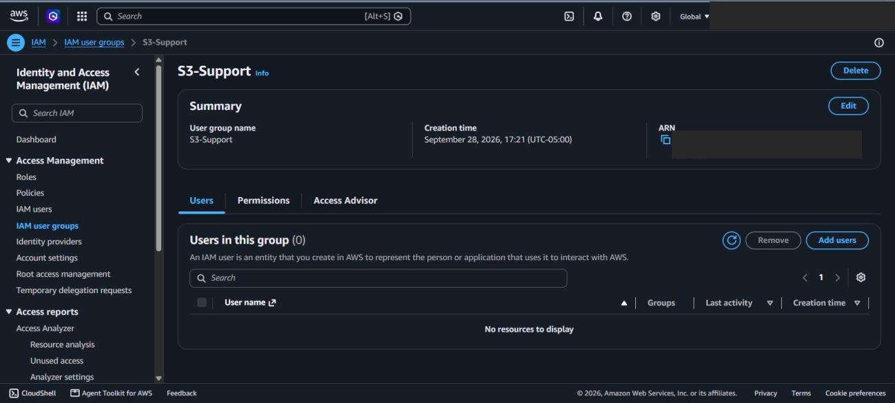

It allows `s3:Get*`, `s3:List*`, and `s3:Describe*` (plus the S3 Object Lambda equivalents), so members can list buckets and read objects but can't upload or delete anything.

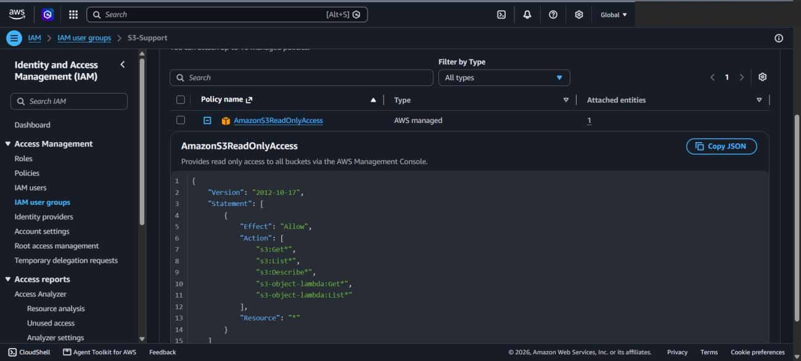

### 1.7 EC2-Admin group

The **EC2-Admin** group is different. Instead of a managed policy, it has an **inline policy** called `EC2-Admin-Policy`, and its type shows as **Customer inline**.


```json
{
  "Version": "2012-10-17",
  "Statement": [
    {
      "Action": [
        "ec2:Describe*",
        "ec2:StartInstances",
        "ec2:StopInstances"
      ],
      "Resource": ["*"],
      "Effect": "Allow"
    }
  ]
}
```

This lets members view EC2 and also **start and stop** instances, but not launch or terminate them.

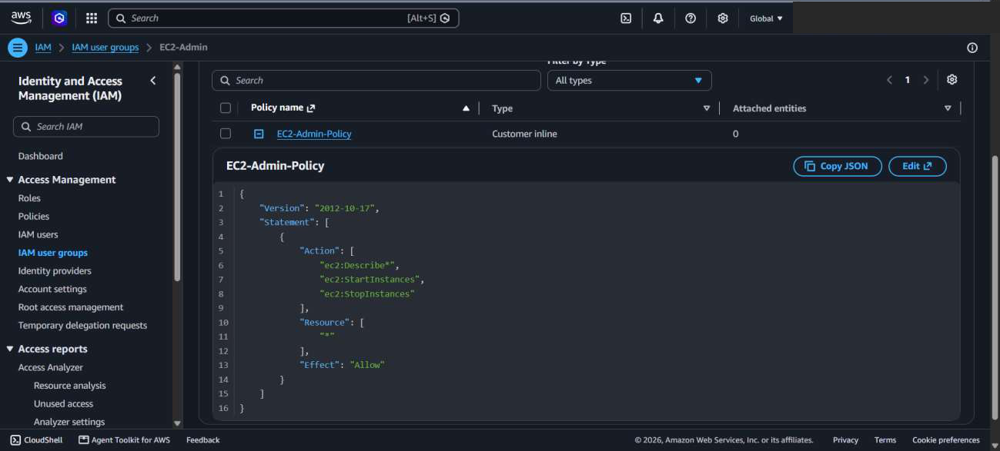

### Managed vs inline policies

| | Managed policy | Inline policy |
|---|---|---|
| Where it lives | A standalone policy that can be attached to many users, groups, or roles | Embedded directly in one user, group, or role |
| Reusable | Yes | No |
| Updates | Changing it updates every identity it's attached to | Only affects the one identity |
| Who makes it | AWS (AWS managed) or you (customer managed) | You |
| Good for | Common job functions like read-only access | One-off permissions for a single case |

---

## Business Scenario

The company is using more EC2 and S3, and new staff need access based on their job:

| User | Group | Permissions |
|---|---|---|
| user-1 | S3-Support | Read-only access to Amazon S3 |
| user-2 | EC2-Support | Read-only access to Amazon EC2 |
| user-3 | EC2-Admin | View, start, and stop EC2 instances |

---

## Task 2 — Add Users to Groups

### 2.1 user-1 → S3-Support

**IAM user groups → S3-Support → Users → Add users:**

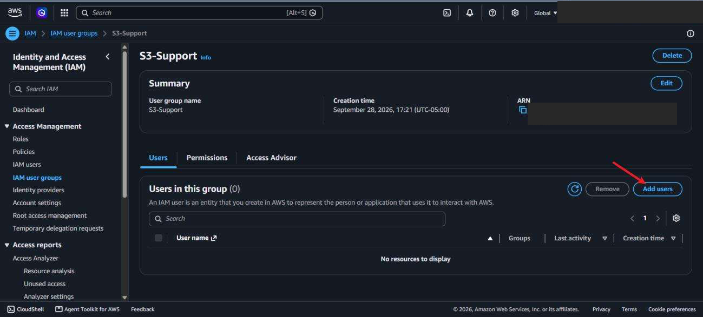

Select `user-1`, then **Add users**:

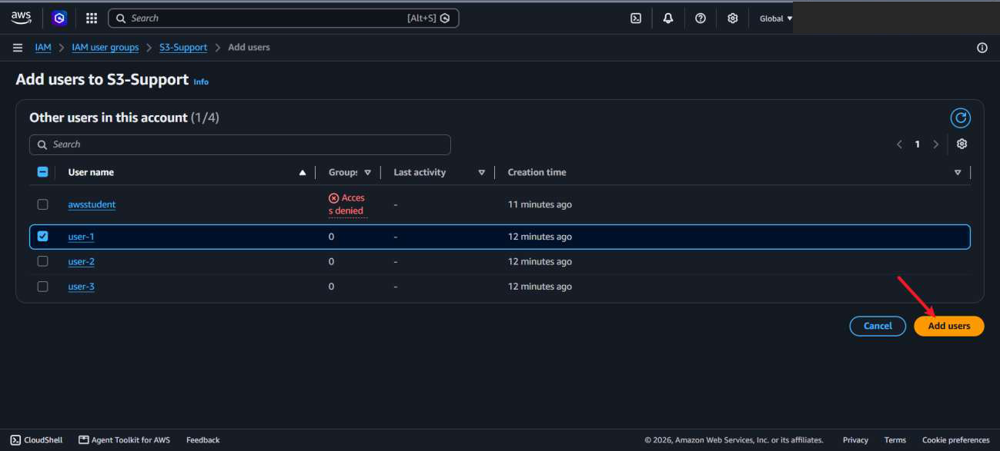

### 2.2 user-2 → EC2-Support

Same steps on the **EC2-Support** group:

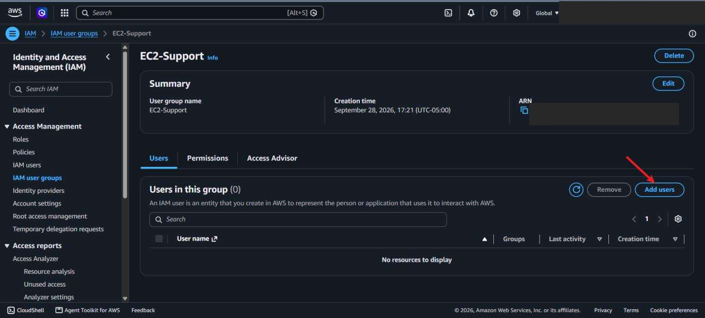

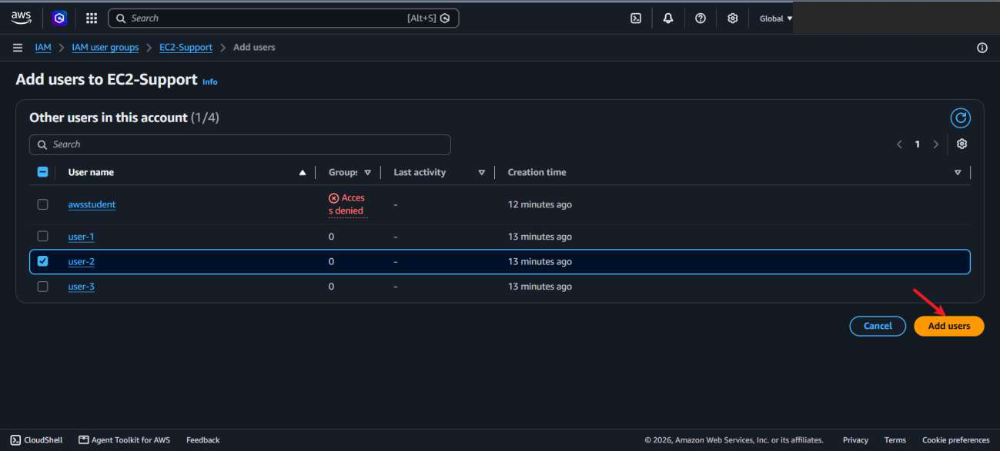

### 2.3 user-3 → EC2-Admin

And again on **EC2-Admin**:

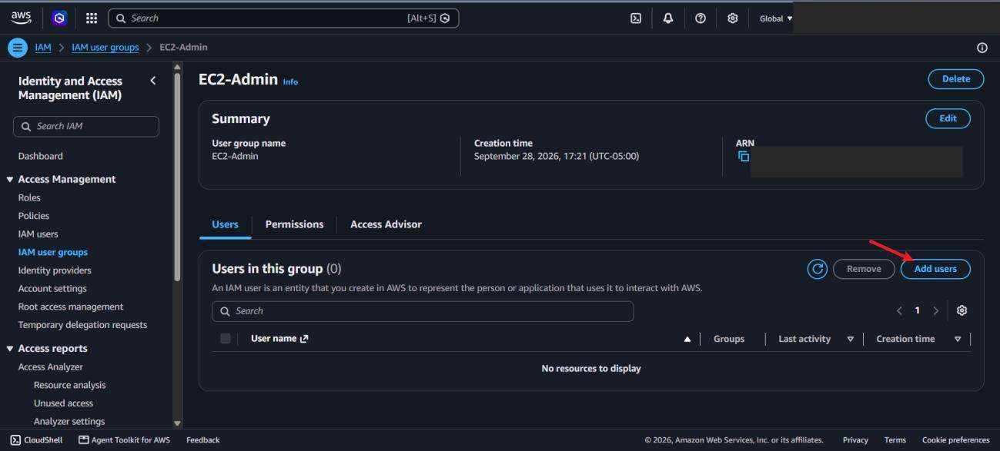

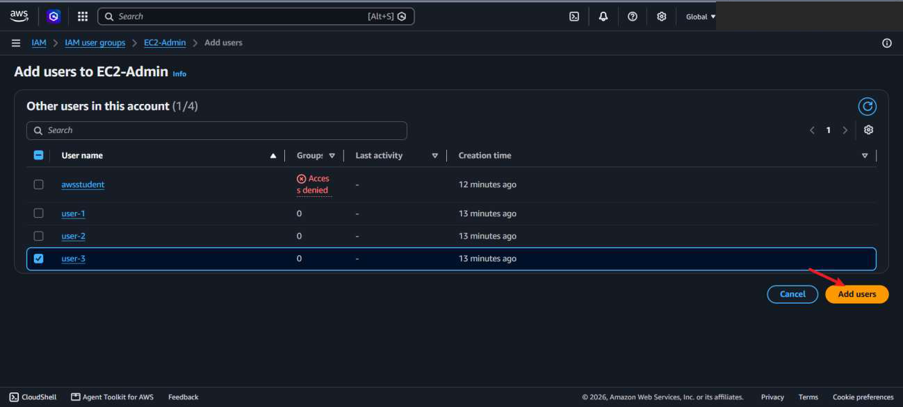

After this, each group showed **1** in the Users column. None of the users have a policy attached to them directly. They only get permissions from the group they're in.

---

## Task 3 — Sign In and Test Each User

I copied the **Sign-in URL for IAM users** from the IAM dashboard, opened a **private (InPrivate/Incognito) window**, and signed in as each user one at a time. Using a private window kept my main lab session signed in while I tested the other users.

### 3.1 user-1 (S3-Support)

In **S3**, user-1 could see the bucket in the account and open it (it was empty).

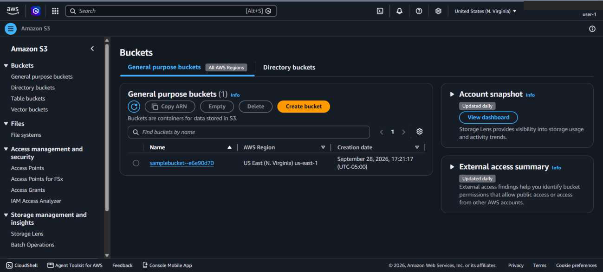

In **EC2 → Instances**, user-1 got an error saying they're **not authorized** to call `ec2:DescribeInstances` because **no identity-based policy allows** it. user-1 has no EC2 permissions at all, so it's denied by default.

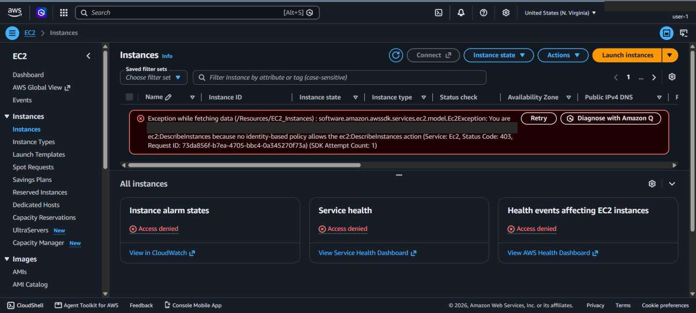

### 3.2 user-2 (EC2-Support)

After signing out and back in as user-2, **EC2 → Instances** showed the running instances, including **LabHost**, because of the read-only policy.

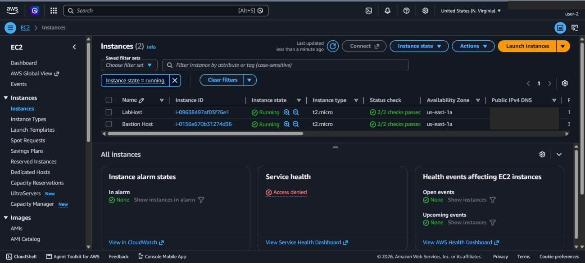

Next I selected LabHost and tried **Instance state → Stop instance**. It failed because the read-only policy doesn't include `ec2:StopInstances`.

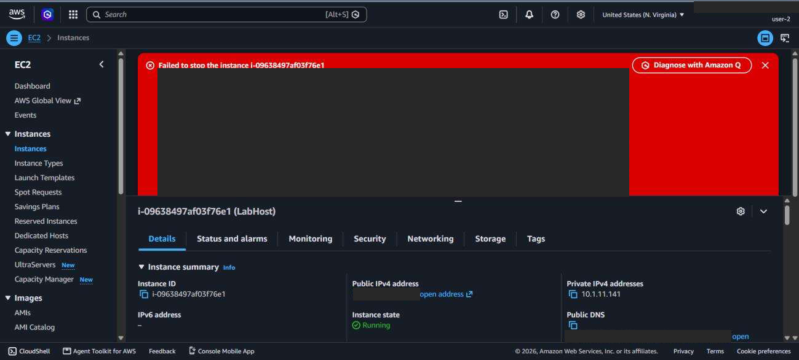

> The error also includes an **encoded authorization failure message**. An admin can decode it with `aws sts decode-authorization-message` to see exactly which action and resource were denied. I redacted it here because it contains account details.

In **S3**, user-2 got **You don't have permissions to list buckets**, because they don't have `s3:ListAllMyBuckets`.

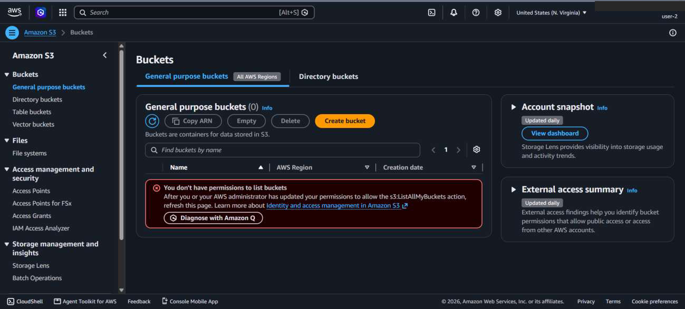

### 3.3 user-3 (EC2-Admin)

Signed in as user-3, I selected **LabHost** and chose **Instance state → Stop instance**. This time it worked: **Successfully initiated stopping**, and the instance state changed to **Stopping**.

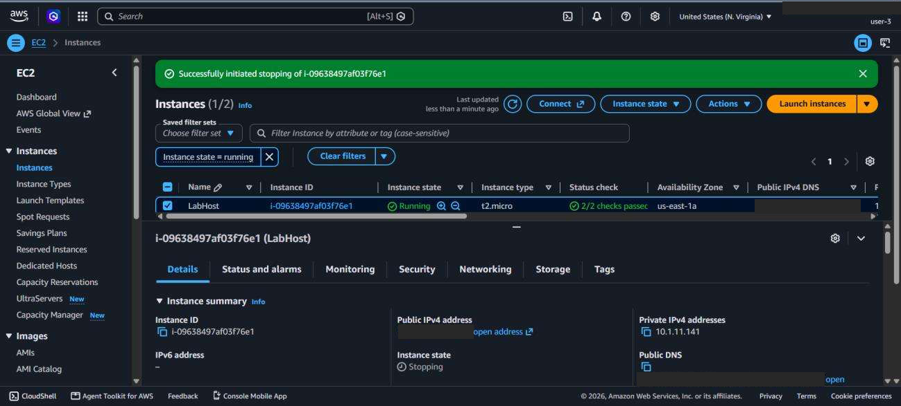

After refreshing, LabHost showed as **Stopped**.

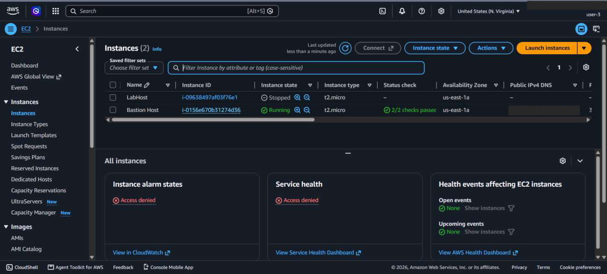

Then I closed the private window.

### Results

| User | S3 | EC2 view | EC2 stop |
|---|---|---|---|
| user-1 (S3-Support) | ✅ Allowed | ❌ Denied | ❌ Denied |
| user-2 (EC2-Support) | ❌ Denied | ✅ Allowed | ❌ Denied |
| user-3 (EC2-Admin) | — (not tested) | ✅ Allowed | ✅ Allowed |

---

## What I Learned

- IAM is **deny by default**. A brand-new user can't do anything until a policy allows it
- Putting permissions on **groups** instead of on individual users is easier to manage. When someone changes jobs, you just move them to a different group
- How to read a policy's JSON: `Effect`, `Action`, and `Resource`, and how wildcards like `ec2:Describe*` cover a whole set of actions
- The difference between **AWS managed** policies (reusable, maintained by AWS) and **inline** policies (tied to one identity, good for one-off cases)
- This is the **principle of least privilege** in practice. Each user got only what their job needed: user-2 could look at EC2 but not stop anything, and user-3 could stop instances but still couldn't launch or terminate them
- IAM users sign in with the account's own sign-in URL, and a private browser window is an easy way to test another user without signing out of your own session
- Console access without MFA shows up as a warning in IAM, which is a reminder to turn on MFA for real users

---

> **Note:** Screenshots are from a temporary AWS lab account. The AWS account ID, my lab session username, ARNs, the access key ID, the IAM sign-in URLs, public IP addresses and public DNS names, and the encoded authorization message have been redacted. `user-1`, `user-2`, and `user-3` are sample users that were already set up in the account, and the environment was shut down after I finished.

[← Back to AWS Labs](../)
