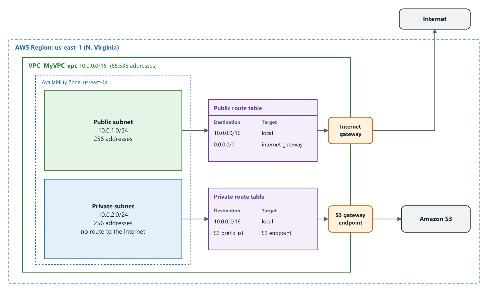
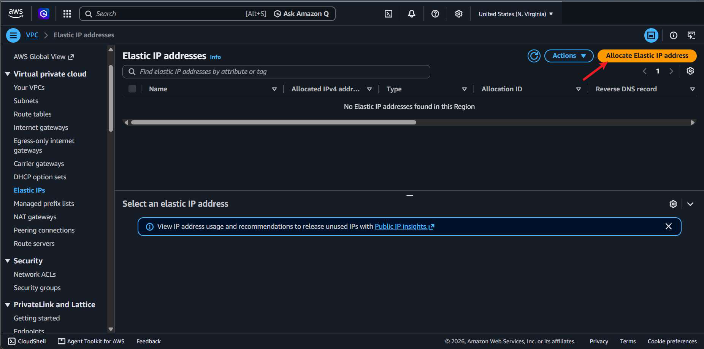
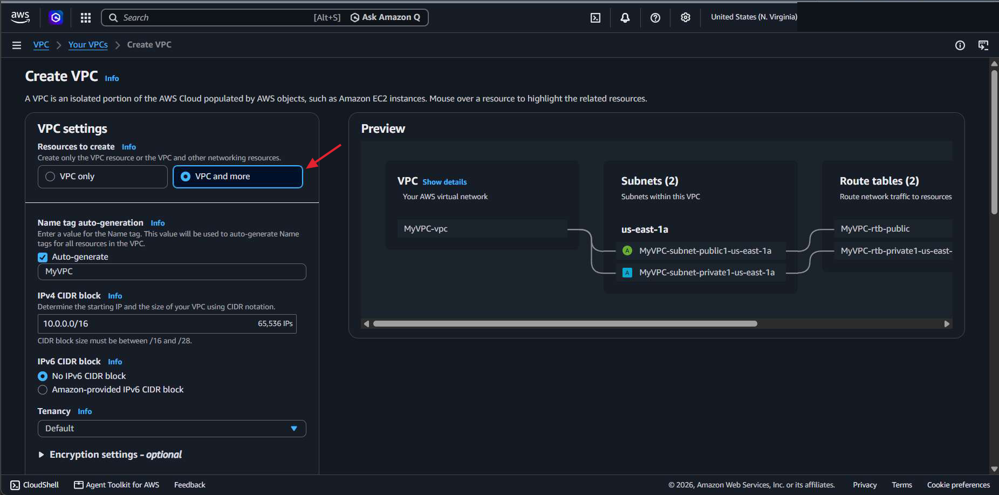
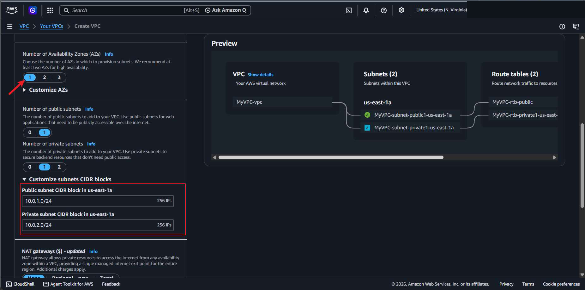
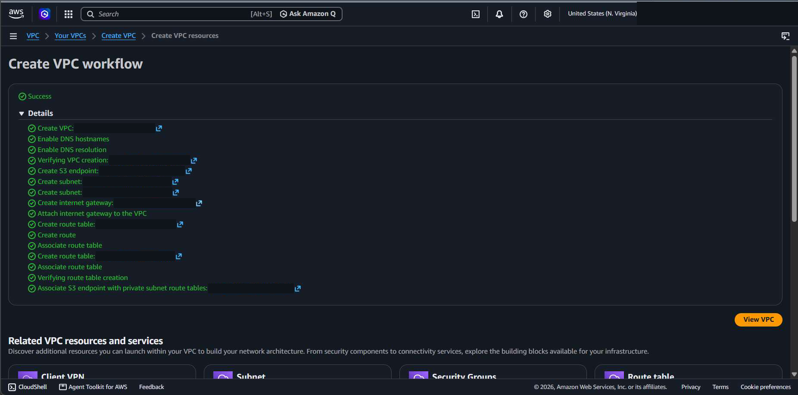
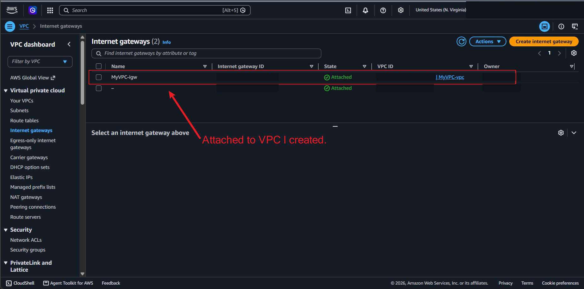
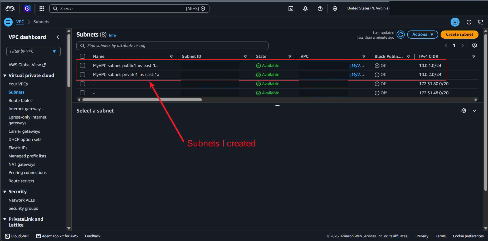
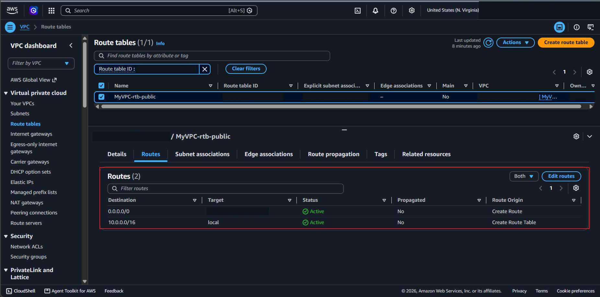
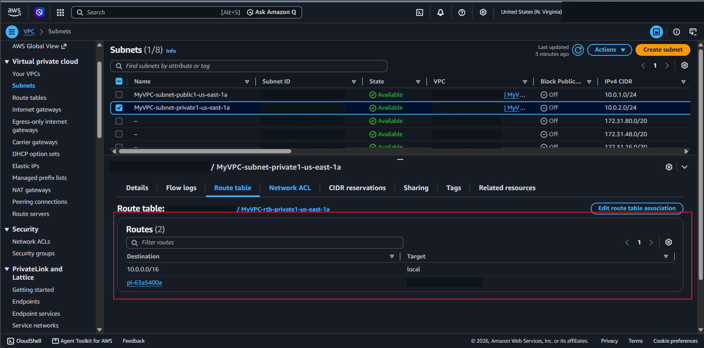
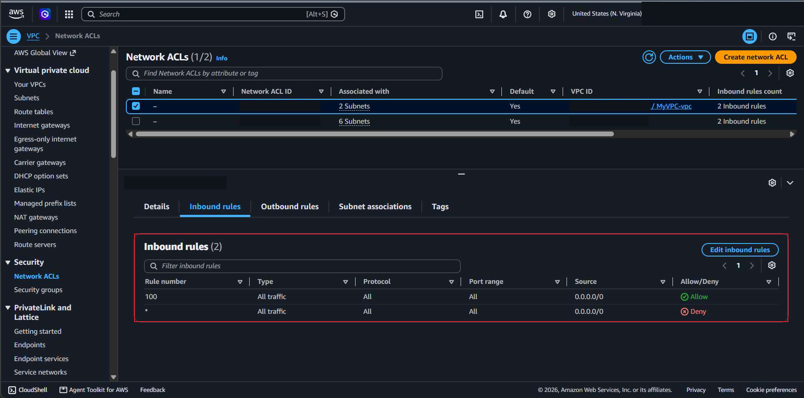

# Lab 2 — Building a VPC with Public and Private Subnets

## Overview

This lab was about **Amazon VPC (Virtual Private Cloud)**, which is my own private slice of the AWS network. I allocated an Elastic IP address, then used the VPC creation wizard to build a VPC with one public subnet and one private subnet. After that I went through each piece the wizard made (subnets, internet gateway, route tables, and network ACL) to see how they fit together.

The main thing I took from it is that a subnet is only "public" because of its **route table**. The public subnet has a route to an internet gateway and the private subnet doesn't.

## Objectives

- Allocate an Elastic IP address
- Create a VPC with a public and a private subnet using the wizard
- Find the internet gateway and confirm it is attached to the VPC
- Compare the public and private route tables
- Look at the default network ACL rules

## Tools & Technologies

| Category | Tools |
|---|---|
| Cloud platform | Amazon Web Services (AWS) |
| Service | Amazon VPC |
| Objects | VPC, subnets, internet gateway, route tables, S3 gateway endpoint, network ACL, Elastic IP |
| Region | US East (N. Virginia) `us-east-1` |

## Architecture

This is what I built. Everything sits in one Availability Zone.

| Resource | Value |
|---|---|
| VPC | `10.0.0.0/16` (65,536 addresses) |
| Public subnet | `10.0.1.0/24` (256 addresses) |
| Private subnet | `10.0.2.0/24` (256 addresses) |
| Internet gateway | Attached to the VPC |
| NAT gateway | None |
| VPC endpoint | S3 gateway |

---

## Task 1 — Allocate an Elastic IP Address

An **Elastic IP** is a fixed public IPv4 address that stays reserved in my AWS account until I release it.

- It stays the same when an EC2 instance stops and starts, and it can be moved to another instance.
- A common use is keeping a website's public address the same so DNS doesn't have to change.
- The life cycle is **Allocate → Associate → Release**: reserve it, attach it to a resource, then give it back to AWS.

**VPC → Elastic IPs → Allocate Elastic IP address.** I kept the default option, Amazon's pool of IPv4 addresses, and chose **Allocate**.

---

## Task 2 — Create the VPC

### 2.1 VPC settings

**VPC → Your VPCs → Create VPC.** I picked **VPC and more**, which creates the subnets, route tables, and gateway along with the VPC. The preview on the right updates as the settings change.

| Setting | Value |
|---|---|
| Name tag | `MyVPC` (the wizard uses it to name every resource) |
| IPv4 CIDR block | `10.0.0.0/16` |
| IPv6 CIDR block | None |
| Tenancy | Default |

### 2.2 Subnets

I chose **1** Availability Zone, **1** public subnet, and **1** private subnet. A subnet lives in a single Availability Zone. Under **Customize subnets CIDR blocks** I changed the ranges to `10.0.1.0/24` and `10.0.2.0/24`. A `/24` leaves 8 bits for the host part, so each subnet has 2^8 = 256 addresses.

For the rest I left **NAT gateways** on **None**, kept the **S3 Gateway** endpoint, and left both DNS options turned on. Then I chose **Create VPC**.

### 2.3 Result

The workflow page lists every step the wizard ran: the VPC, two subnets, an internet gateway, two route tables, and the S3 endpoint.

---

## Task 3 — Explore What Was Created

### 3.1 Internet gateway

An **internet gateway** connects the VPC to the internet. `MyVPC-igw` shows as **Attached** to my VPC. If it were deleted, the VPC would have no internet access.

### 3.2 Subnets

Both of my subnets are listed with the ranges I set. The other subnets on the page belong to the default VPC that was already in the account.

In the details of the public subnet, the available address count was **251**, not 256. AWS reserves five addresses in every subnet.

### 3.3 Public route table

Each subnet is associated with one route table. The public one has two routes:

| Destination | Target | Meaning |
|---|---|---|
| `10.0.0.0/16` | local | Traffic stays inside the VPC, so resources in the VPC can talk to each other |
| `0.0.0.0/0` | Internet gateway | Everything else goes out to the public internet |

### 3.4 Private route table

The private subnet's route table has the same local route but **no** `0.0.0.0/0` route, so the private subnet has no internet access. The second entry (`pl-…`) is the AWS prefix list for S3, and it points to the S3 gateway endpoint the wizard created. That lets the private subnet reach S3 without going through the internet.

The demo diagram from the course had a NAT gateway in the public subnet so the private subnet could reach the internet for outbound traffic. I left NAT gateways on None, so mine doesn't have that route.

### 3.5 Network ACL

A **network ACL** acts as a firewall for traffic going in and out of a subnet. The default one is associated with both of my subnets and is open. The inbound and outbound rules are the same:

| Rule | Type | Source / Destination | Allow / Deny |
|---|---|---|---|
| 100 | All traffic | `0.0.0.0/0` | Allow |
| * | All traffic | `0.0.0.0/0` | Deny |

Since the default network ACL allows everything, **security groups** are what I would use to tighten access.

---

## What I Learned

- A VPC is a private network inside AWS that I define with a CIDR block, and subnets split that block into smaller ranges
- A subnet lives in one Availability Zone
- How to work out subnet size from the prefix: a `/24` has 8 host bits, which is 256 addresses, and AWS keeps five of them
- What makes a subnet public is a `0.0.0.0/0` route to an internet gateway. Without that route it is private.
- The local route is in every route table and lets everything inside the VPC communicate
- An Elastic IP is a public address that stays mine until I release it
- The default network ACL allows all traffic, so security groups do the real filtering
- The **VPC and more** wizard builds all of these pieces at once, and the workflow page is a good checklist of what a VPC needs

---

> **Note:** Screenshots are from a temporary AWS lab account. The AWS account ID, my lab session username, and the IDs of the VPC, subnets, gateways, route tables, endpoint, and network ACLs have been redacted. The architecture diagram is my own drawing of what I built.

[← Back to AWS Labs](../)
