# Lab 2 — Build a VPC and Launch a Web Server

## Overview

In this lab I built my own network in AWS with **Amazon VPC** and then put a web server inside it. I used the VPC wizard to create a VPC with a public and a private subnet, added two more subnets in a second Availability Zone, and connected the new subnets to the right route tables. After that I made a security group that allows web traffic and launched an EC2 instance that installs a web server by itself when it starts.

At the end I opened the instance's public DNS name in a browser and the web page loaded, which showed that every piece was connected correctly.

## Objectives

- Create a VPC
- Create subnets
- Configure a security group
- Launch an EC2 instance into a VPC

## Tools & Technologies

| Category | Tools |
|---|---|
| Cloud platform | Amazon Web Services (AWS) |
| Services | Amazon VPC, Amazon EC2 |
| Objects | VPC, subnets, internet gateway, NAT gateway, route tables, security group, EC2 instance, user data script |
| Region | US East (N. Virginia) `us-east-1` |

## Architecture

This is what I had built by the end of the lab.

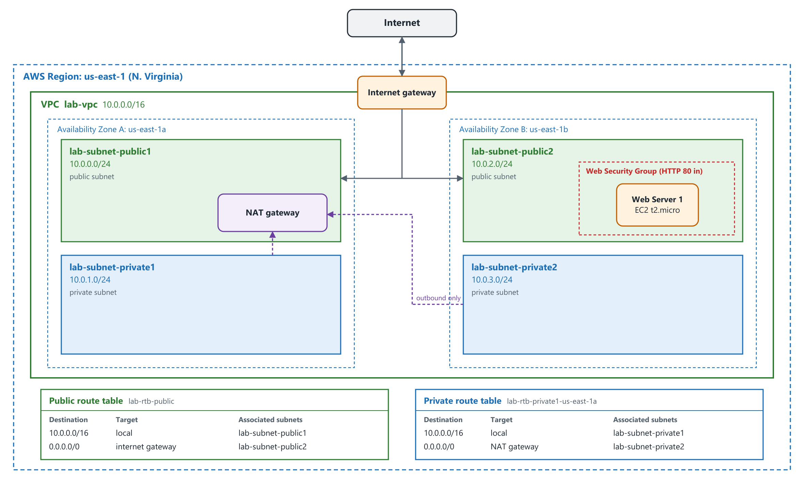

| Subnet | CIDR | Availability Zone | Route table |
|---|---|---|---|
| `lab-subnet-public1-us-east-1a` | `10.0.0.0/24` | us-east-1a | `lab-rtb-public` |
| `lab-subnet-private1-us-east-1a` | `10.0.1.0/24` | us-east-1a | `lab-rtb-private1-us-east-1a` |
| `lab-subnet-public2` | `10.0.2.0/24` | us-east-1b | `lab-rtb-public` |
| `lab-subnet-private2` | `10.0.3.0/24` | us-east-1b | `lab-rtb-private1-us-east-1a` |

---

## Task 1 — Create the VPC

### 1.1 VPC settings

**VPC → VPC dashboard → Create VPC.** I chose **VPC and more** so the wizard would create the subnets, route tables, and gateways along with the VPC. I changed the name tag from `project` to `lab`, which the wizard then uses to name everything, and kept the IPv4 CIDR block at `10.0.0.0/16`.

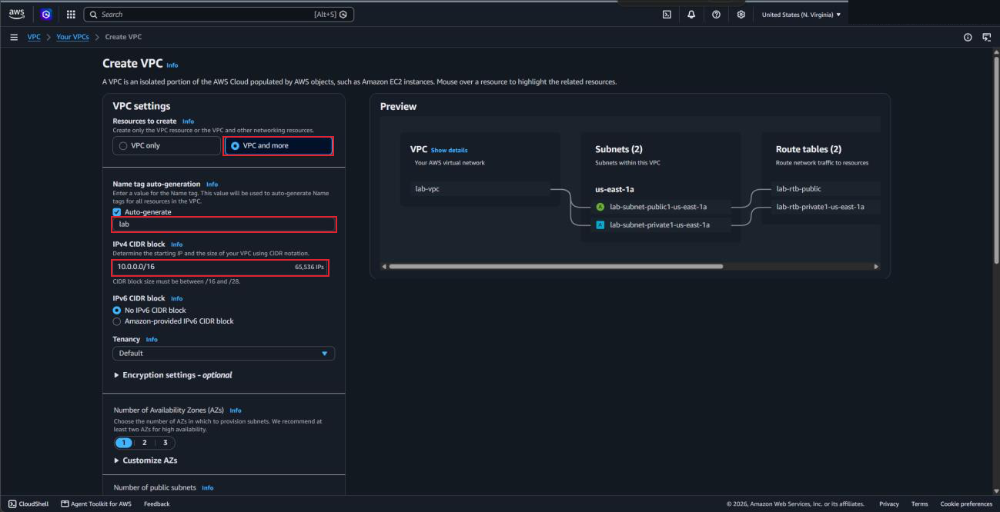

### 1.2 Subnets and NAT gateway

| Setting | Value |
|---|---|
| Number of Availability Zones | 1 |
| Public subnets | 1, with CIDR `10.0.0.0/24` |
| Private subnets | 1, with CIDR `10.0.1.0/24` |
| NAT gateways | Zonal, **In 1 AZ** |
| VPC endpoints | None |
| DNS hostnames and DNS resolution | Enabled |

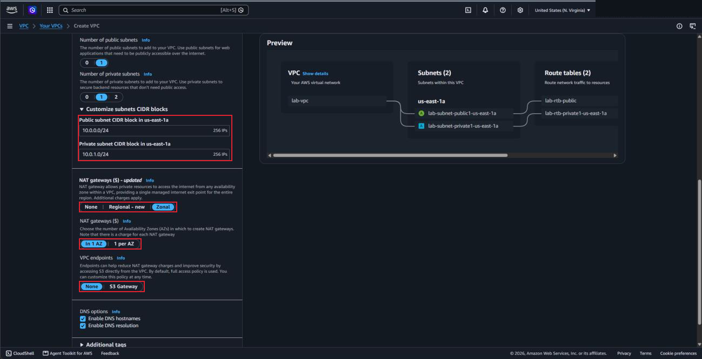

### 1.3 Result

I chose **Create VPC** and waited for every step to finish, since the NAT gateway takes a few minutes to activate. The workflow page listed everything the wizard made: the VPC, two subnets, an internet gateway, an Elastic IP and NAT gateway, and two route tables. Then I chose **View VPC**.

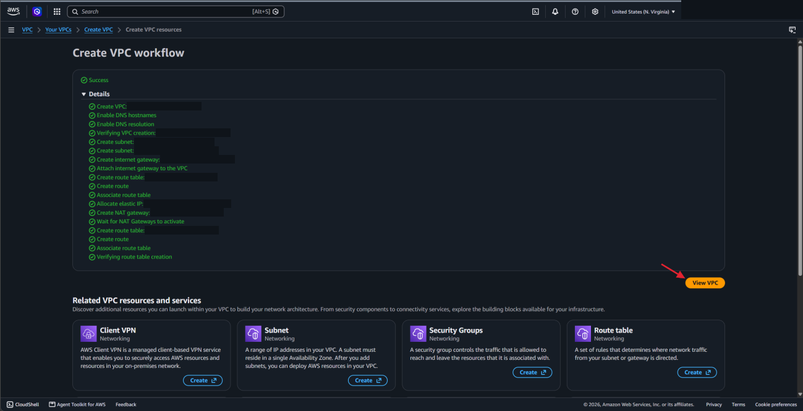

What each piece does:

- **Internet gateway:** lets instances in the VPC talk to the internet.
- **Public subnet (`10.0.0.0/24`):** holds every address starting with `10.0.0.x`. It is public because its route table sends `0.0.0.0/0` traffic to the internet gateway.
- **NAT gateway:** gives instances in a private subnet a way out to the internet without connecting them directly to the internet gateway.
- **Private subnet (`10.0.1.0/24`):** holds every address starting with `10.0.1.x`.

---

## Task 2 — Create Additional Subnets

Having subnets in more than one Availability Zone is what makes high availability possible. A subnet lives entirely inside one Availability Zone, so I added a second public and a second private subnet in `us-east-1b`.

### 2.1 Second public subnet

**Subnets → Create subnet.** I selected `lab-vpc`, named the subnet `lab-subnet-public2`, picked `us-east-1b`, and gave it `10.0.2.0/24`.

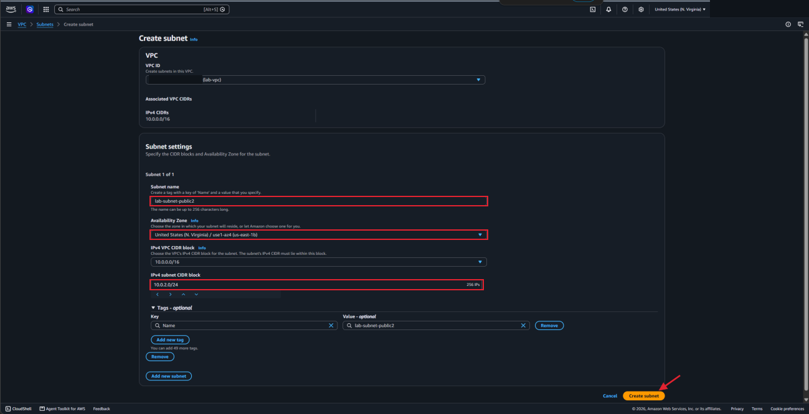

### 2.2 Second private subnet

Same steps, with the name `lab-subnet-private2` and the CIDR `10.0.3.0/24`.

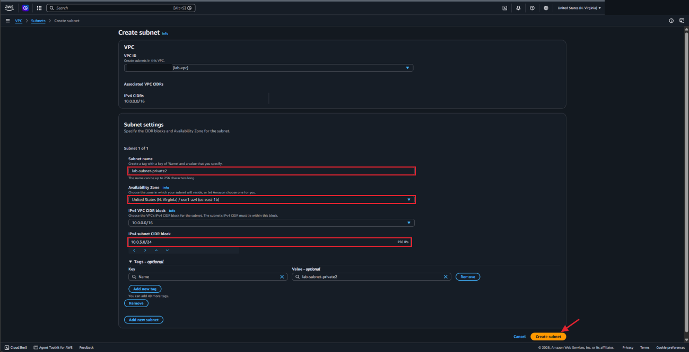

### 2.3 Private route table

A new subnet doesn't use the route tables I want until I associate it. Until then it falls back to the VPC's main route table.

**Route tables → `lab-rtb-private1-us-east-1a` → Routes.** The `0.0.0.0/0` route points to the NAT gateway (`nat-…`), so internet-bound traffic from a private subnet goes to the NAT gateway, and the NAT gateway forwards it to the internet.

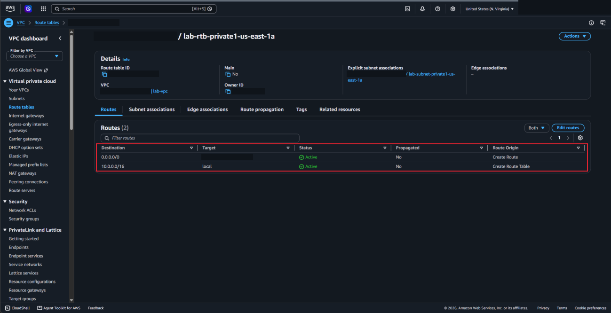

On the **Subnet associations** tab I chose **Edit subnet associations**, left `lab-subnet-private1-us-east-1a` selected, also selected `lab-subnet-private2`, and saved.

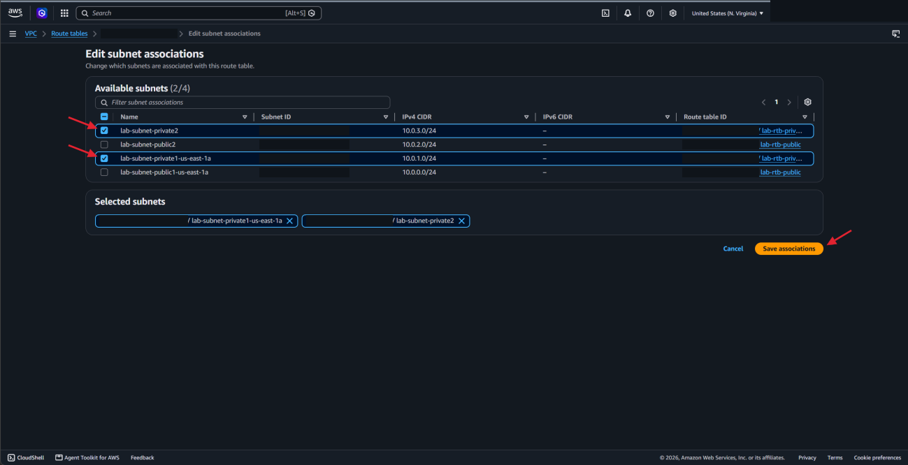

### 2.4 Public route table

**Route tables → `lab-rtb-public` → Routes.** Here `0.0.0.0/0` points to the internet gateway (`igw-…`), so traffic goes straight out to the internet.

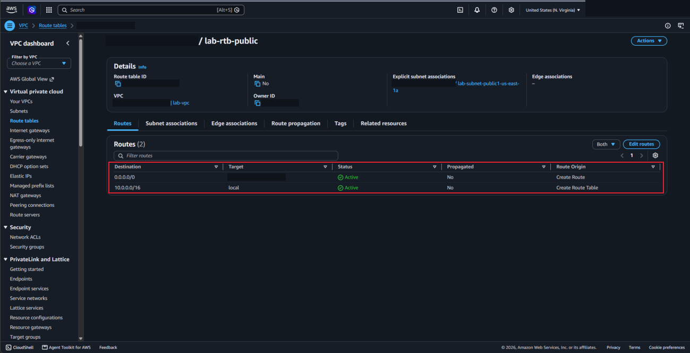

I edited the subnet associations the same way, this time adding `lab-subnet-public2` next to `lab-subnet-public1-us-east-1a`.

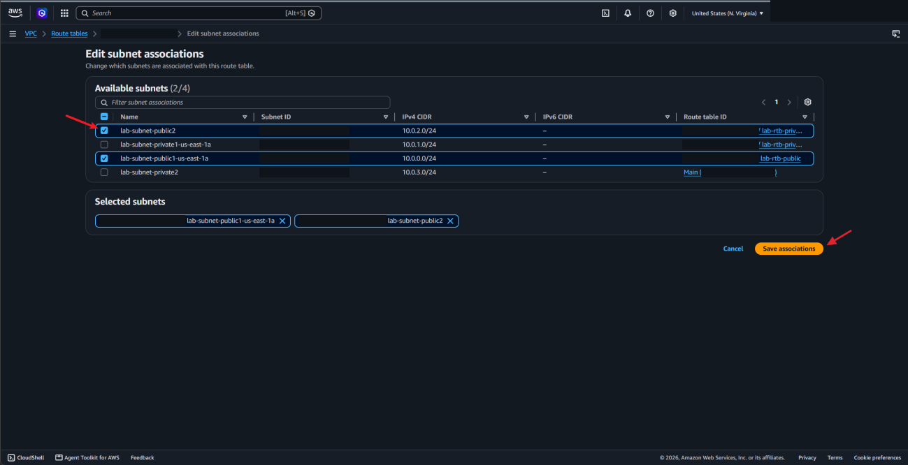

Now the VPC has a public and a private subnet in two Availability Zones, and each one uses the correct route table.

---

## Task 3 — Create a VPC Security Group

A **security group** works like a virtual firewall for an instance. Its rules decide what traffic is allowed in and out.

**Security groups → Create security group.**

| Setting | Value |
|---|---|
| Security group name | `Web Security Group` |
| Description | `Enable HTTP Access` |
| VPC | `lab-vpc` |
| Inbound rule | Type **HTTP** (TCP port 80), Source **Anywhere-IPv4** (`0.0.0.0/0`) |

The only thing this allows in is web traffic on port 80. I left the outbound rule at its default, which allows all traffic out.

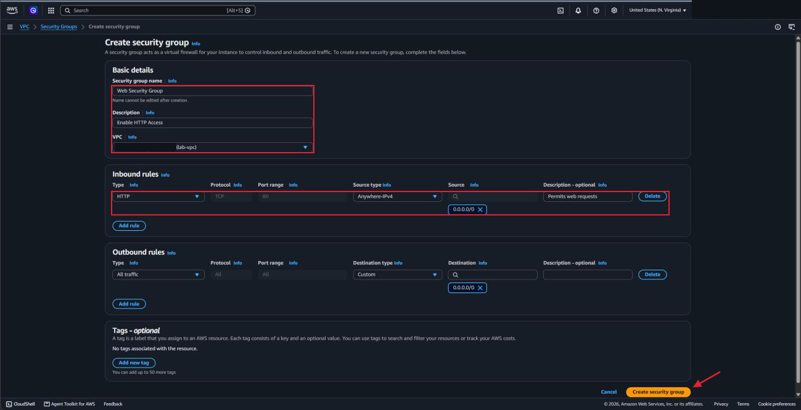

---

## Task 4 — Launch a Web Server Instance

### 4.1 Instance settings

**EC2 → Launch instance.**

| Setting | Value |
|---|---|
| Name | `Web Server 1` |
| AMI | Amazon Linux 2023 |
| Instance type | `t2.micro` |
| Key pair | `vockey` |
| Network | `lab-vpc` |
| Subnet | `lab-subnet-public2` |
| Auto-assign public IP | Enable |
| Security group | `Web Security Group` (existing) |
| Storage | Default (8 GiB) |

Naming the instance creates a tag with the key `Name`. The AMI decides which operating system the instance runs, and the instance type decides how much hardware it gets. The subnet has to be the **public** one or the web server couldn't be reached from the internet.

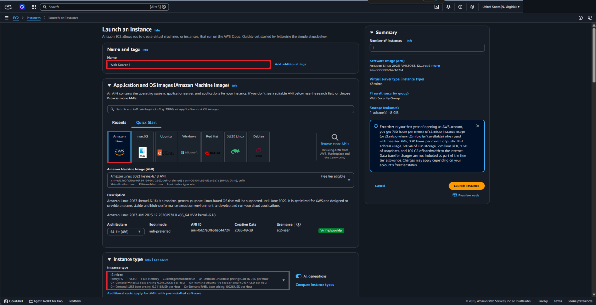

### 4.2 User data script

Under **Advanced details** I pasted this script into the **User data** box. It runs as root the first time the instance starts.

```bash
#!/bin/bash
# Install Apache Web Server and PHP
dnf install -y httpd wget php mariadb105-server
# Download Lab files
wget https://aws-tc-largeobjects.s3.us-west-2.amazonaws.com/CUR-TF-100-ACCLFO-2/2-lab2-vpc/s3/lab-app.zip
unzip lab-app.zip -d /var/www/html/
# Turn on web server
chkconfig httpd on
service httpd start
```

It installs a web server, a database, and PHP, downloads the lab's web app, and starts the web server. I didn't have to sign in to the instance to set any of it up.

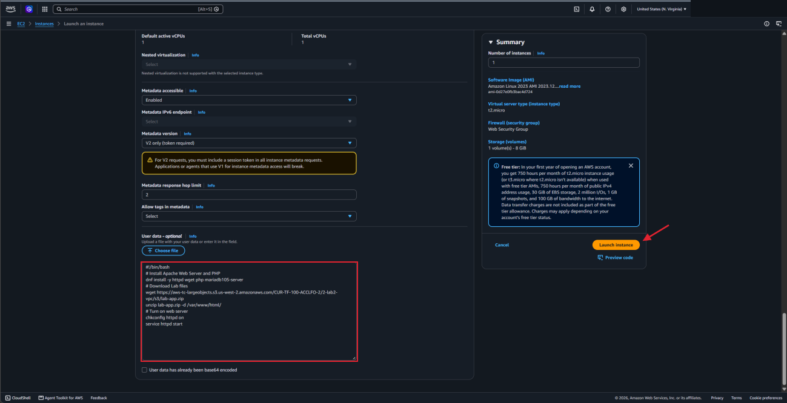

### 4.3 Check the instance

I chose **Launch instance → View all instances** and waited until `Web Server 1` showed **2/2 checks passed**. It was running in `us-east-1b` with the private address `10.0.2.196`, which is inside the `lab-subnet-public2` range. Then I copied the **Public DNS** value from the Details tab.

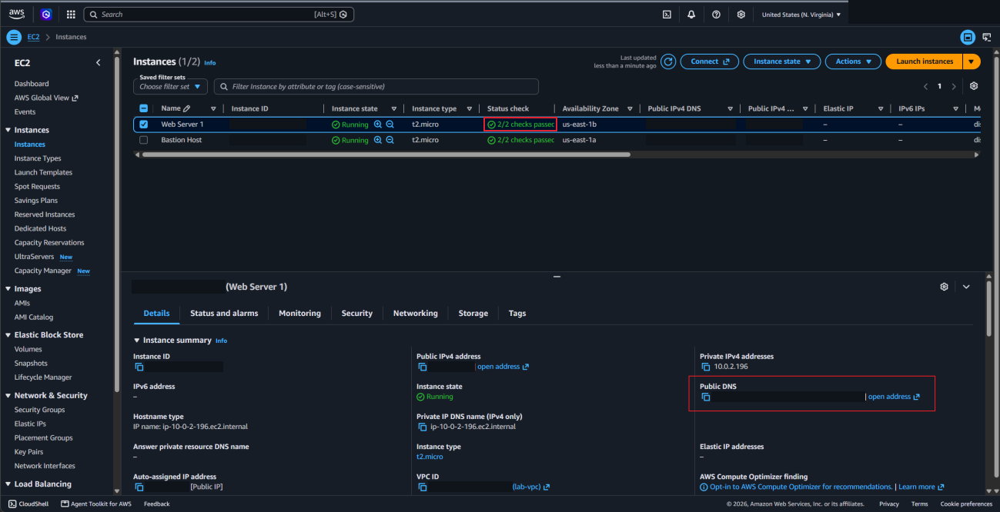

### 4.4 Open the web page

I pasted the public DNS name into a new browser tab. The page loaded and showed the instance's metadata, including the same Availability Zone, `us-east-1b`.

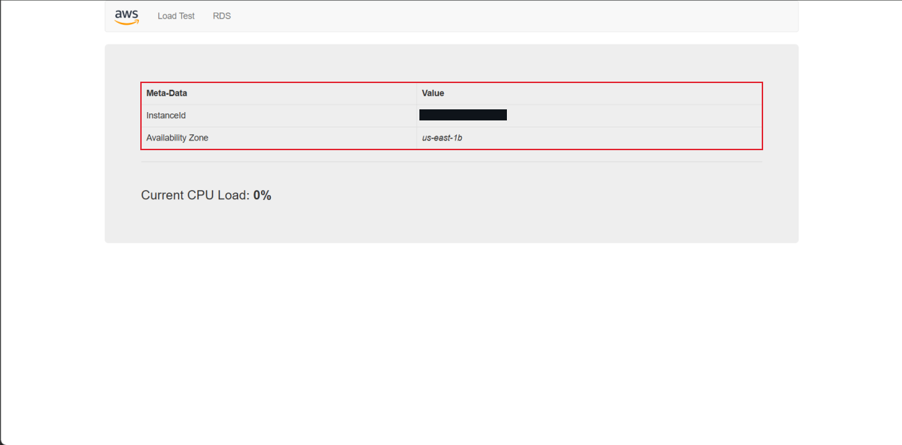

For that page to load, the request had to come in through the internet gateway, follow the public route table to `lab-subnet-public2`, and get past the security group on port 80.

---

## What I Learned

- A VPC is my own private network inside AWS, and subnets split its address range into smaller pieces
- A subnet lives in one Availability Zone, so using two zones means making subnets in both
- What makes a subnet public is its route table: `0.0.0.0/0` goes to an internet gateway. In a private subnet it goes to a NAT gateway instead.
- A new subnet uses the main route table until I associate it with a different one
- A NAT gateway lets private instances reach the internet without being reachable from it
- A security group is a firewall for the instance, and I only opened the one port the web server needs
- A user data script can set up a server automatically when it launches
- All of the pieces have to line up for the page to load: public subnet, public IP, route to the internet gateway, and the HTTP rule

---

> **Note:** Screenshots are from a temporary AWS lab account. The AWS account ID, my lab session username, the public IP addresses and public DNS names, and the IDs of the VPC, subnets, gateways, route tables, and instances have been redacted. The architecture diagram is my own drawing. The environment was shut down after I finished.

[← Back to AWS Labs](../)
