# Lab 3 — Introduction to Amazon EC2

## Overview

This lab was about **Amazon EC2 (Elastic Compute Cloud)**, the AWS service for running virtual servers. I launched an instance that sets itself up as a web server, looked at the different ways to monitor it, and then fixed its security group so the web page could be reached. After that I resized the instance and its disk, looked at the EC2 limits on the account, and tested stop protection.

The part that stood out was Task 3. The web server was running the whole time, but the page would not load until I added one inbound rule to the security group.

## Objectives

- Launch a web server with termination protection enabled
- Monitor the EC2 instance
- Modify the security group to allow HTTP access
- Resize the instance and its EBS volume, and enable stop protection
- Explore EC2 limits
- Test stop protection
- Stop the instance

## Tools & Technologies

| Category | Tools |
|---|---|
| Cloud platform | Amazon Web Services (AWS) |
| Services | Amazon EC2, Amazon EBS, Amazon CloudWatch, Service Quotas |
| Objects | EC2 instance, AMI, key pair, security group, EBS volume, user data script |
| Region | US East (N. Virginia) `us-east-1` |

## Architecture

This is what I built. The VPC and subnet were already set up in the lab account.

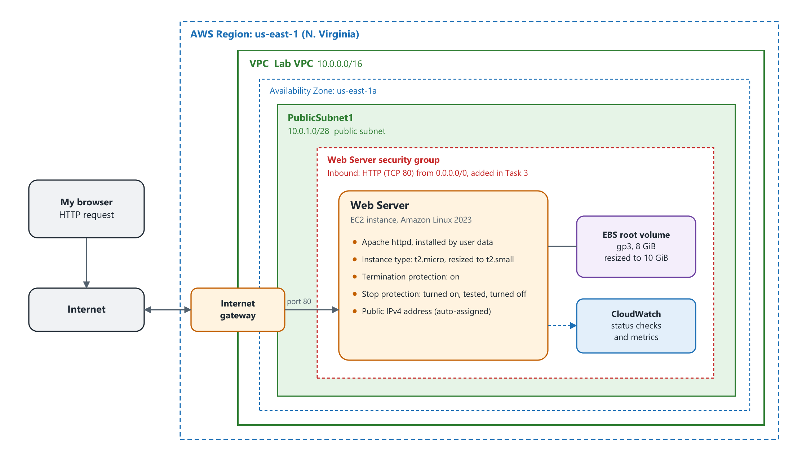

---

## Task 1 — Launch the EC2 Instance

**EC2 → Launch instance.** The launch page is one long form, so I split it into the steps below.

### 1.1 Name and AMI

I named the instance `Web Server`. The name is saved as a **tag**, which is a key and value pair (here the key is `Name`). For the **AMI** (Amazon Machine Image) I kept **Amazon Linux 2023**. The AMI is the template for the instance, including its operating system.

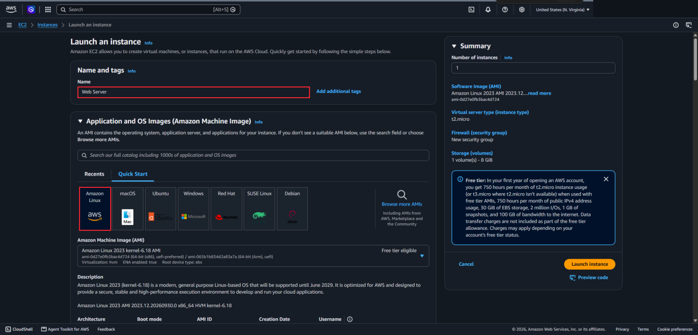

### 1.2 Instance type, key pair, and network

| Setting | Value |
|---|---|
| Instance type | `t2.micro` (1 vCPU, 1 GiB memory) |
| Key pair | `vockey` |
| VPC | `Lab VPC` |
| Subnet | `PublicSubnet1` |
| Auto-assign public IP | Enable |

The key pair is what would let me sign in to the instance over SSH. I didn't sign in during this lab, but a key pair choice is still required at launch.

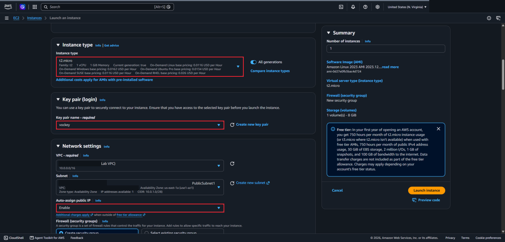

### 1.3 Security group

I chose **Create security group**, named it `Web Server security group`, and gave it the description `Security group for my web server`. Then I removed the one inbound rule that was there by default, so the group started with **no inbound rules**. Storage stayed at the default 8 GiB root volume.

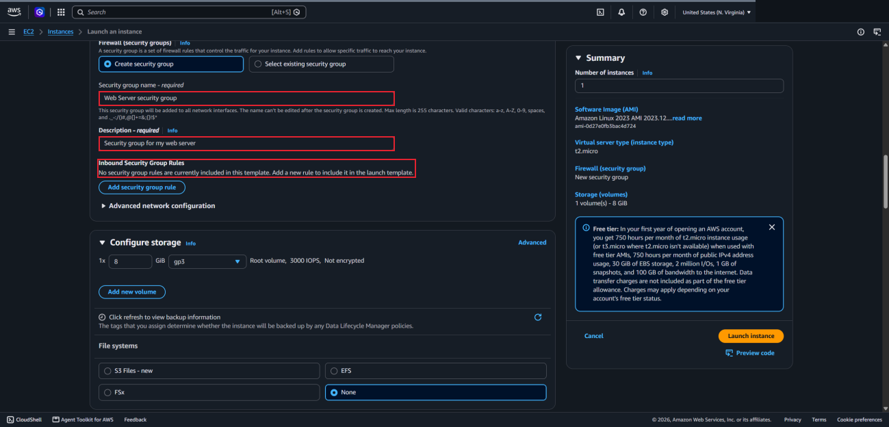

### 1.4 Termination protection

Under **Advanced details** I set **Termination protection** to **Enable**. Terminating an instance deletes it, and the data on it can't be recovered. With this setting on, the instance can't be terminated until the setting is turned off.

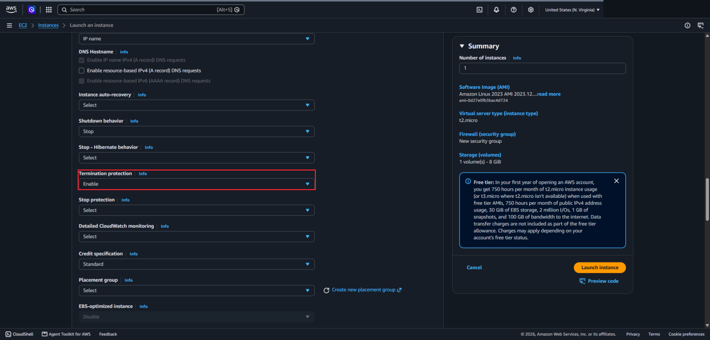

### 1.5 User data

At the bottom of Advanced details I pasted this script into **User data**. It runs as root the first time the instance starts.

```bash
#!/bin/bash
dnf install -y httpd
systemctl enable httpd
systemctl start httpd
echo '<html><h1>Hello From Your Web Server!</h1></html>' > /var/www/html/index.html
```

It installs the Apache web server, sets it to start on boot, starts it, and creates a simple web page. Then I chose **Launch instance**.

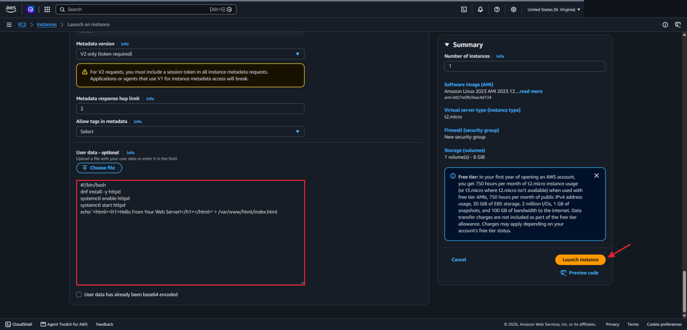

### 1.6 Instance running

**View all instances.** The instance went from Pending to Running, and I waited until it showed **2/2 checks passed**.

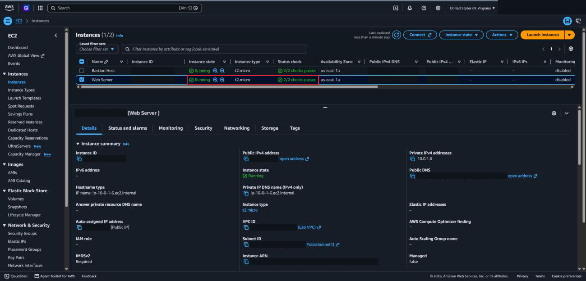

---

## Task 2 — Monitor the Instance

### 2.1 Status checks

The **Status and alarms** tab shows the automatic checks EC2 runs on every running instance. Both the **System status** and **Instance status** checks had passed.

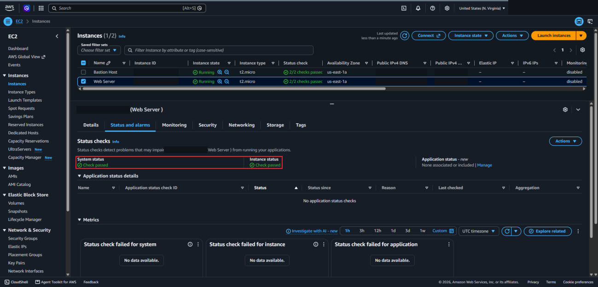

### 2.2 CloudWatch metrics

The **Monitoring** tab shows Amazon CloudWatch metrics for the instance, like CPU utilization and network traffic. There wasn't much data yet because the instance was new. Basic monitoring sends data every five minutes by default, and detailed monitoring (every minute) can be turned on.

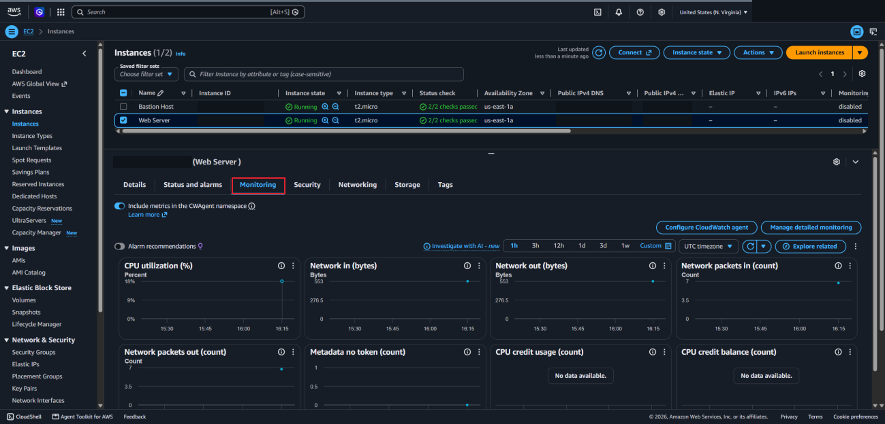

### 2.3 System log

**Actions → Monitor and troubleshoot → Get system log.** The system log is the console output of the instance. Scrolling through it, I could see the `httpd` packages being installed, which confirmed that my user data script ran.

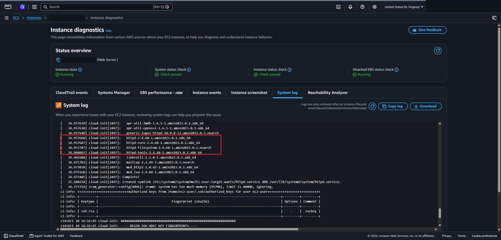

### 2.4 Instance screenshot

**Actions → Monitor and troubleshoot → Get instance screenshot.** This shows what the instance's screen would look like if a monitor were attached. It is useful when an instance can't be reached over SSH.

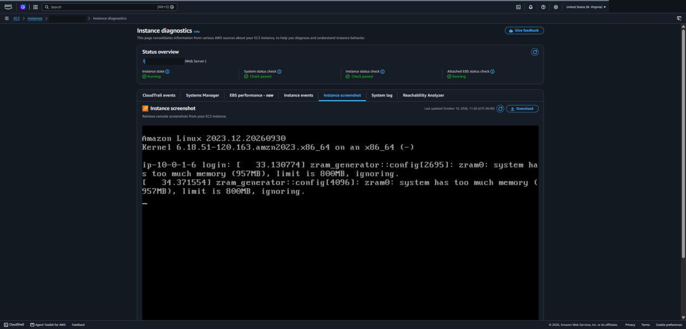

---

## Task 3 — Update the Security Group and Access the Web Server

### 3.1 The page doesn't load

I copied the **Public IPv4 address** from the Details tab and opened it in a new browser tab. It timed out.

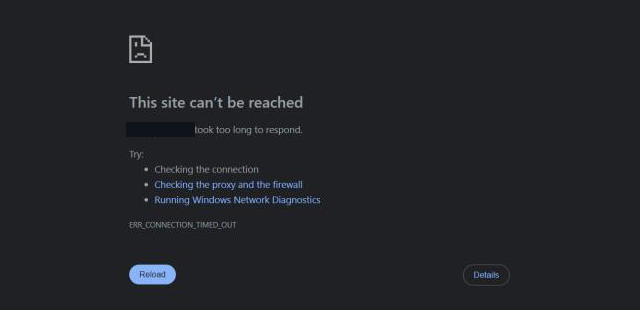

The web server was running, but the security group had no inbound rules, so nothing was allowed in on port 80. The instance's **Security** tab showed this: "No rules to display".

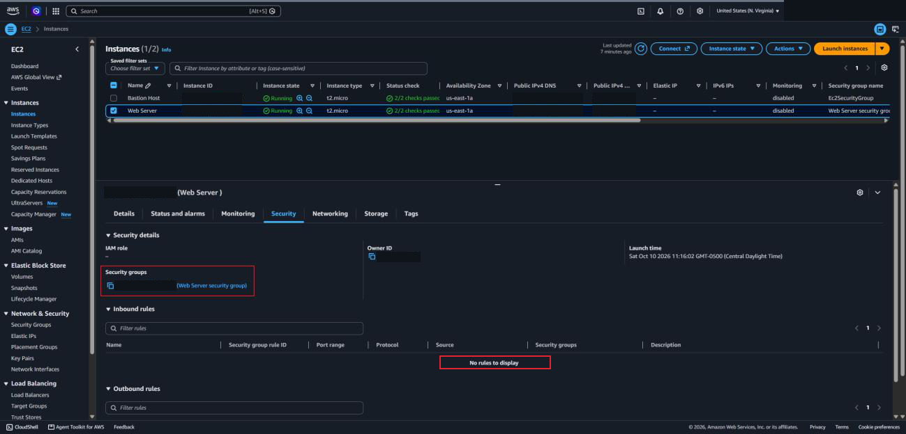

### 3.2 Add the HTTP rule

**Security Groups → Web Server security group → Inbound rules → Edit inbound rules → Add rule.**

| Type | Protocol | Port | Source |
|---|---|---|---|
| HTTP | TCP | 80 | Anywhere-IPv4 (`0.0.0.0/0`) |

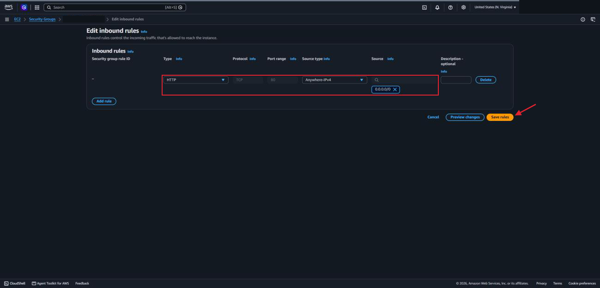

### 3.3 The page loads

I went back to the browser tab and refreshed it. The page loaded without restarting anything on the instance.


---

## Task 4 — Resize the Instance

### 4.1 Stop the instance

An instance has to be stopped before its type can be changed. **Instance state → Stop instance.** A stopped instance has no running charge, but the attached EBS volume is still billed for storage.

### 4.2 Change the instance type

**Actions → Instance settings → Change instance type.** I changed it from `t2.micro` to `t2.small`. The comparison table on that page shows the difference: the same 1 vCPU, but memory goes from 1024 MiB to 2048 MiB.

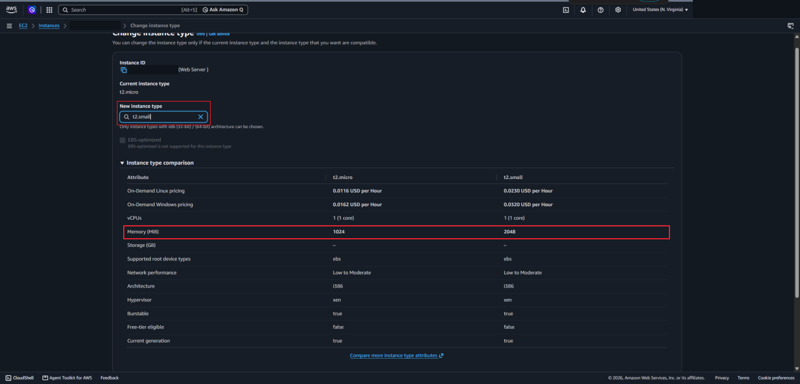

### 4.3 Enable stop protection

**Actions → Instance settings → Change stop protection → Enable → Save.**

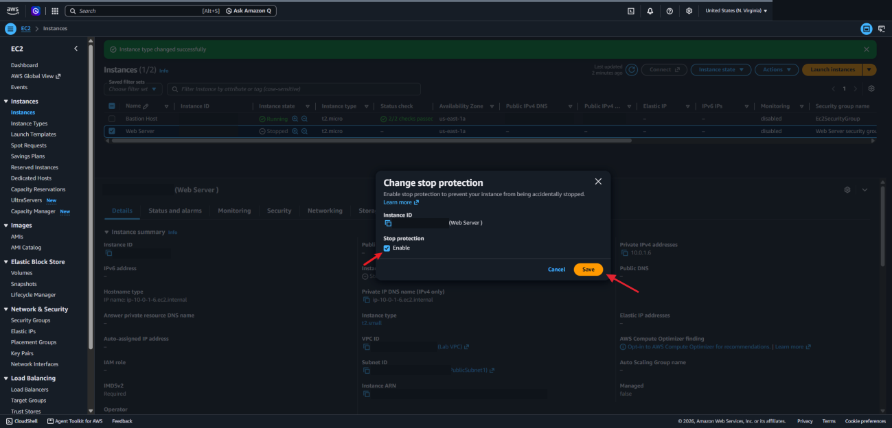

### 4.4 Resize the EBS volume

On the **Storage** tab I opened the volume, then chose **Actions → Modify volume** and changed the size from 8 GiB to `10`.

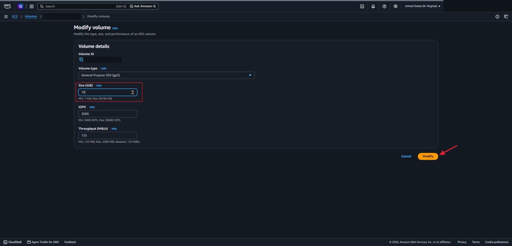

### 4.5 Start the instance

**Instance state → Start instance.** The instance came back as a `t2.small`. It kept its private IP address, but the public IP address was different from before.

---

## Task 5 — Explore EC2 Limits

**Service Quotas → AWS services → Amazon Elastic Compute Cloud (Amazon EC2)**, then I searched for `running on-demand`.

Each Region has limits on how many instances of each type can run at once. For example, **Running On-Demand Standard (A, C, D, H, I, M, R, T, Z) instances** has its own quota. A launch request fails if it would go over the limit, and the account owner can request an increase.

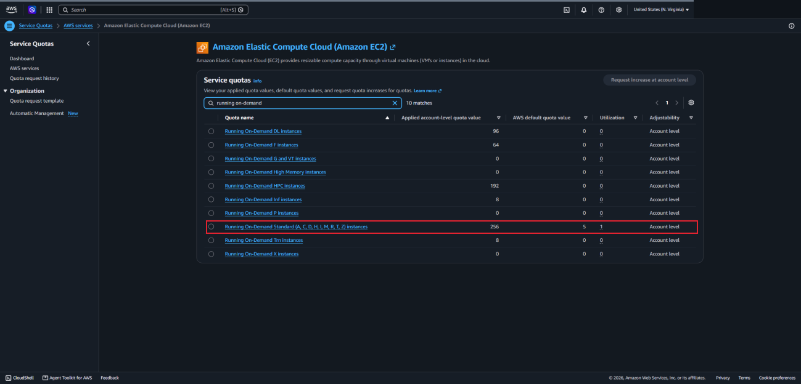

---

## Task 6 — Test Stop Protection

### 6.1 Try to stop the instance

Back in EC2, I selected Web Server and chose **Instance state → Stop instance → Stop**. It failed:

> Failed to stop the instance. The instance may not be stopped. Modify its 'disableApiStop' instance attribute and try again.

This is the stop protection I turned on in Task 4.

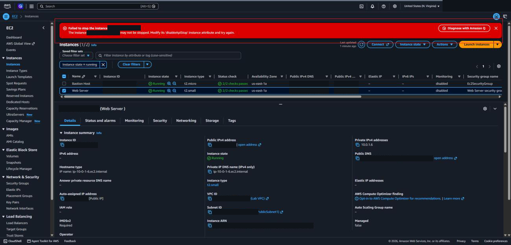

### 6.2 Turn stop protection off and stop

**Actions → Instance settings → Change stop protection**, cleared the **Enable** box, and saved. After that, **Stop instance** worked and the instance showed **Stopped**.

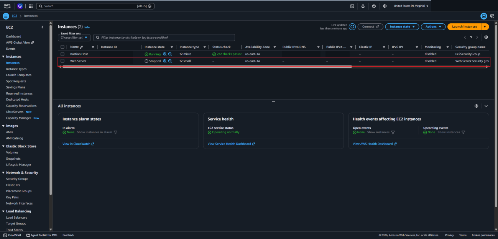

---

## What I Learned

- What goes into launching an EC2 instance: a name, an AMI, an instance type, a key pair, network settings, a security group, and storage
- A user data script can install and start a web server at launch, and the system log is where to check that it ran
- A security group with no inbound rules blocks everything. The server can be healthy and still be unreachable.
- Changing a security group rule takes effect without restarting the instance
- Status checks, CloudWatch metrics, the system log, and the instance screenshot are four different ways to see how an instance is doing
- An instance has to be stopped to change its type, and it gets a new public IP address when it starts again
- Termination protection and stop protection are separate settings that guard against deleting or stopping an instance by accident
- AWS accounts have per-Region limits on how many instances can run

---

> **Note:** Screenshots are from a temporary AWS lab account. The AWS account ID, my lab session username, the public IP addresses and public DNS names, the SSH key fingerprint, and the IDs of the instances, VPC, subnet, security group, and volume have been redacted. The architecture diagram is my own drawing. The environment was shut down after I finished.

[← Back to AWS Labs](../)
