# Lab 1 — Manage Users, Groups, Licenses, and Custom Security Attributes

## Overview

This is my first SC-300 lab. It follows the *Implement an Identity Management Solution* part of the Microsoft Learn SC-300 series, and I did everything in my own Microsoft Entra tenant for a made-up company called **Bam Co.**

I created a user, looked at what Entra stores about them, then deleted them and saw where deleted users go. Next I built a security group, tried a dynamic membership rule, and added and removed members by hand. After that I assigned a license to a user and then to a group from the Microsoft 365 admin center. Last, I made a custom security attribute (a security clearance level), gave it to a user, and filtered the user list by it.

The big takeaway is that most of this is about keeping identities clean from day one. If users are created with the right properties and put in the right groups, licenses and access can mostly be handled through groups, so fewer things have to be done user by user.

## Objectives

- Create, view, disable, and delete users in the Microsoft Entra admin center
- Understand the required user fields and why the optional properties matter
- Create security groups and compare Assigned vs Dynamic membership
- Add and remove group members manually
- Assign and remove licenses per user and through group-based licensing
- Create a custom security attribute set, define an attribute with predefined values, and assign it to a user

## Tools & Technologies

| Category | Tools |
|---|---|
| Identity platform | Microsoft Entra ID P2 |
| Portals | Microsoft Entra admin center, Microsoft 365 admin center |
| Objects | Users, security groups, licenses, custom security attributes |
| Course | Microsoft Learn: SC-300 Identity and Access Administrator |

---

## Task 1 — Create and Manage Users

### 1.1 View all users

**Entra admin center → Entra ID → Users → All users** shows every user in the tenant. The **On-premises sync** column shows whether a user is cloud-only or synced from on-prem Active Directory. Entra has three kinds of users: cloud identities, directory-synchronized identities, and external (guest) users.

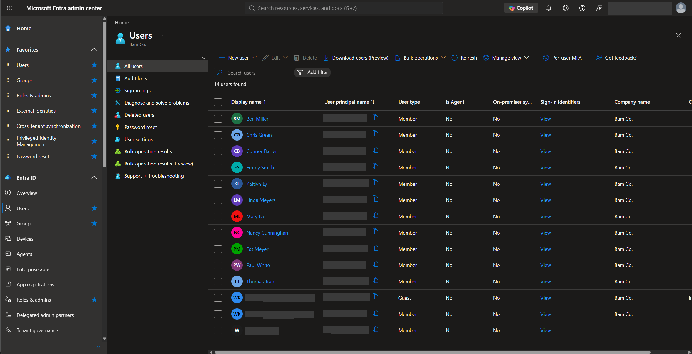

### 1.2 Create a new user

**New user → Create new user.** (Use **Invite external user** for a guest instead.)

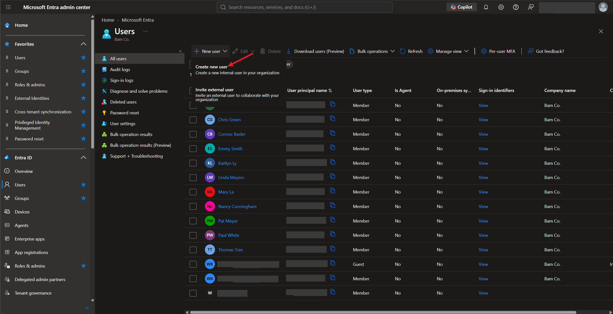

**Basics tab.** Only four fields are required:

| Required field | Example |
|---|---|
| User principal name | `fg@<tenant>.onmicrosoft.com` |
| Mail nickname | `fg` (derived from the UPN) |
| Display name | Frank Gallagher |
| Password | Auto-generated |

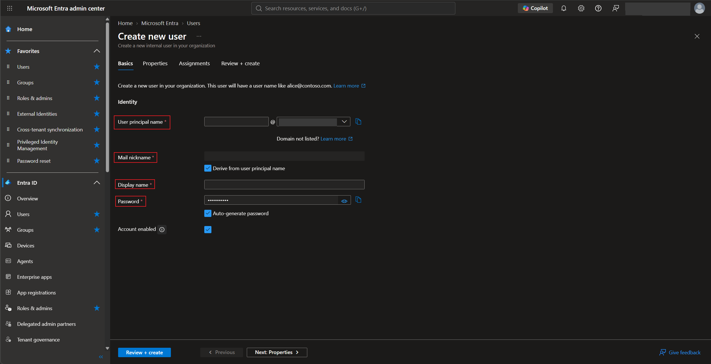

> **Account enabled** can be unchecked when the account is created. If someone doesn't start for a few weeks, the account can exist but stay disabled until their first day. This is a small part of practicing **Zero Trust**: an account shouldn't be usable before it's needed.

**Properties tab.** None of these are required, but they're worth filling in. Job title, department, company name, and usage location can drive automation later, for example dynamic groups (Task 2) and license assignment (Task 3).

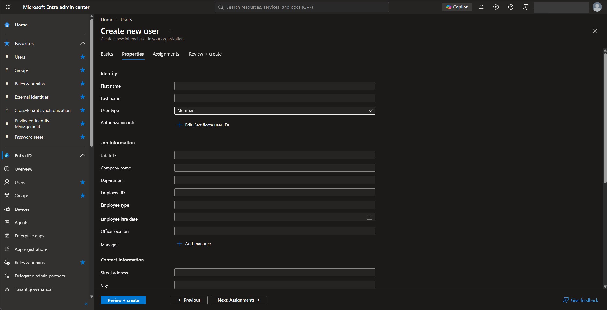

> **Usage location** matters for licensing. A license can't be assigned to a user until their usage location is set.

**Assignments tab.** Here you can add the user to up to 20 groups or roles, and to one administrative unit. I left this empty.

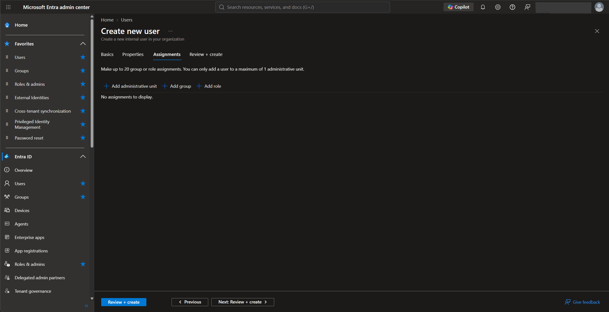

**Review + create:**

| Property | Value |
|---|---|
| Display name | Frank Gallagher |
| Job title | IT Architect |
| Company name | Bam Co. |
| Department | Information Technology |
| Usage location | United States |

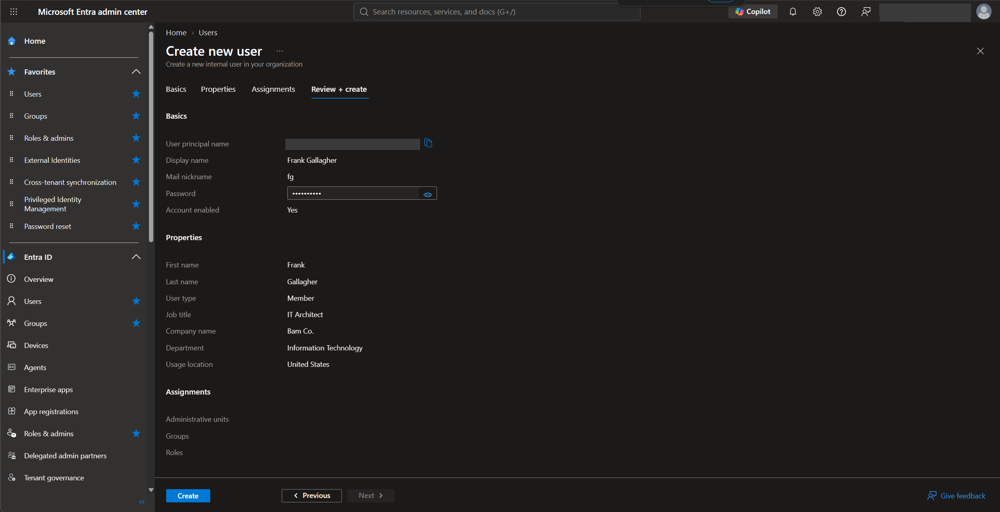

### 1.3 The user object

The user's overview page shows their UPN, their **Object ID** (the GUID that uniquely identifies this user in the directory), the user type, and the account status. The **Account status → Edit** link is where you enable or disable sign-in.

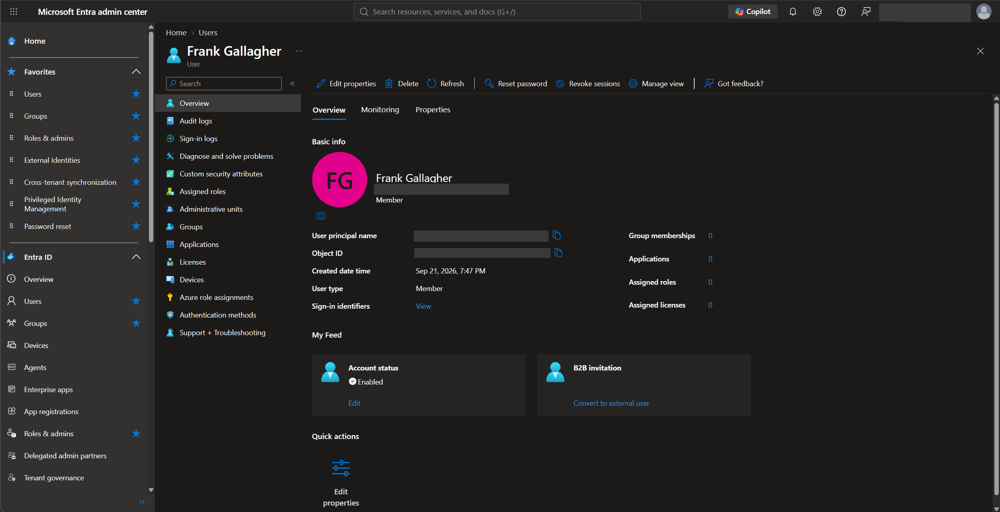

### 1.4 Delete a user

Select the user in **All users** and click **Delete**:

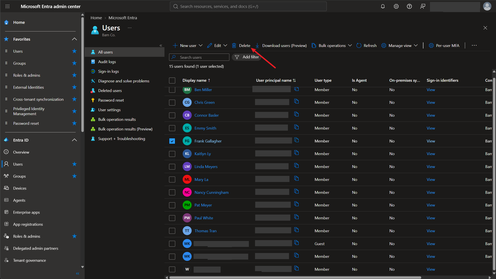

The user moves to **Deleted users**. Deleted users stay there for **30 days** and can be restored. After 30 days they're deleted permanently.

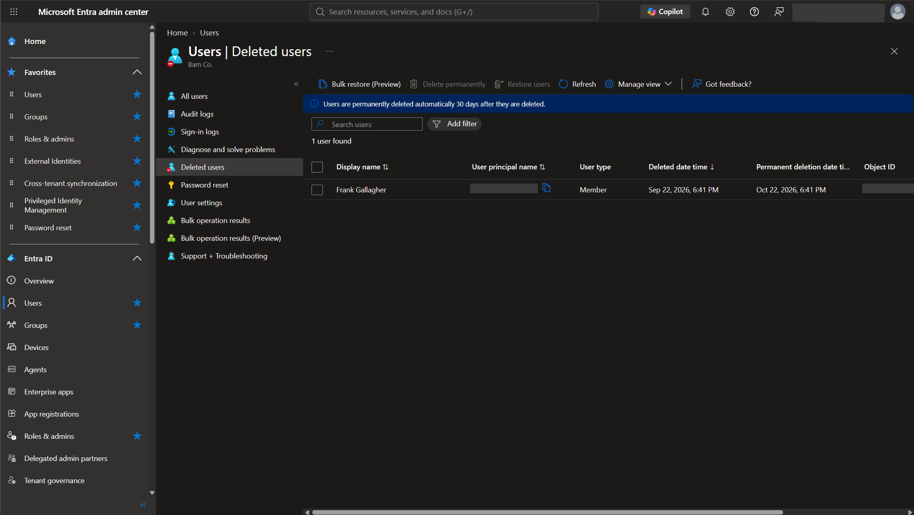

---

## Task 2 — Create and Manage Groups

### Security groups vs Microsoft 365 groups

| | Security group | Microsoft 365 group |
|---|---|---|
| Used for | Access to apps and resources, and license assignment | Collaboration: shared mailbox, calendar, files, SharePoint site |
| Members can be | Users, devices, service principals, and other groups | Users only |
| Can be nested | Yes | No |

### 2.1 Create a group

**Groups → All groups → New group.**

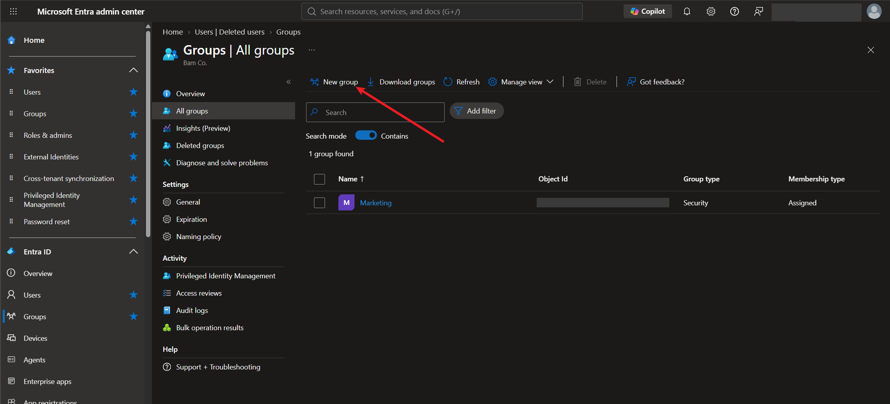

| Setting | Value |
|---|---|
| Group type | Security |
| Group name | Identity Administrators |
| Description | All the IAM Administrators to be added to this group |
| Microsoft Entra roles can be assigned to the group | No |
| Membership type | Assigned |

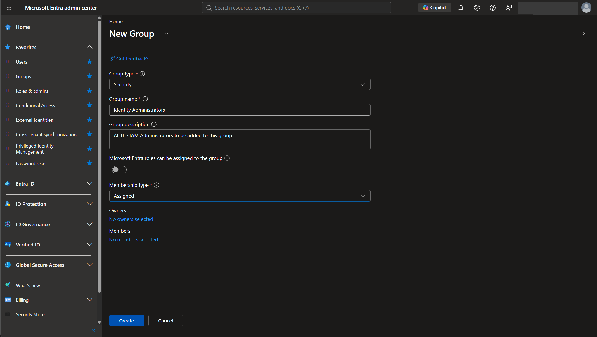

> **Role-assignable groups:** turning this on lets you give the group an Entra role, like *User Administrator*, so every member gets it. **This setting can't be changed after the group is created.**

**Membership types:**

| Type | How members are added |
|---|---|
| Assigned | Manually, by an admin or a group owner |
| Dynamic User | Automatically, based on user attributes |
| Dynamic Device | Automatically, based on device attributes |

Group **owners** can add and remove members of the group without needing an admin role.

### 2.2 Dynamic membership rule (example)

With **Dynamic User** selected, a rule decides who is in the group. With this rule, any user whose department is *Information Technology* is added automatically. Frank from Task 1 would have been added.

```text
(user.department -eq "Information Technology")
```

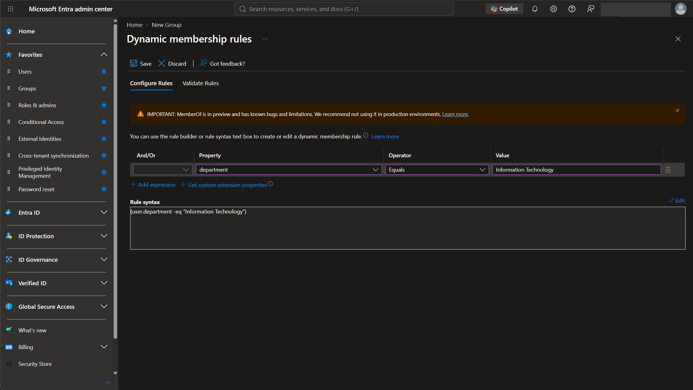

> You **can't manually add** users to a dynamic group. Membership comes only from the rule.

I kept the group as **Assigned** so I could practice adding and removing members by hand:

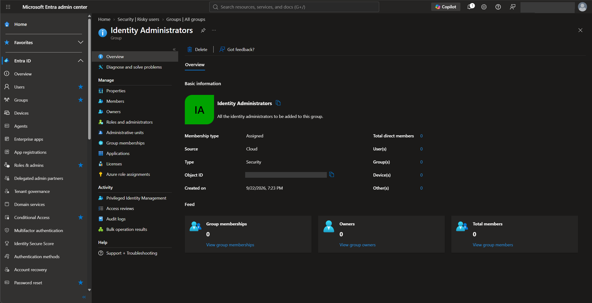

### 2.3 Add and remove members

**Group → Members → Add members:**

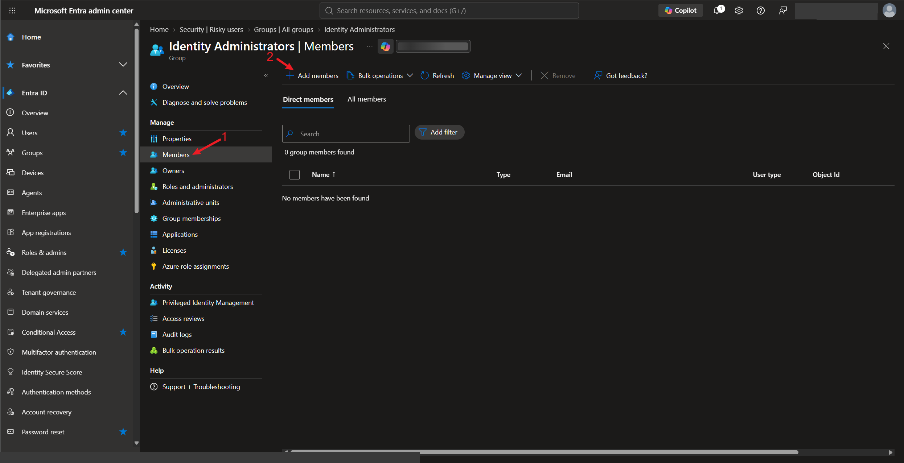

To remove someone: **Members → select the member → Remove.**

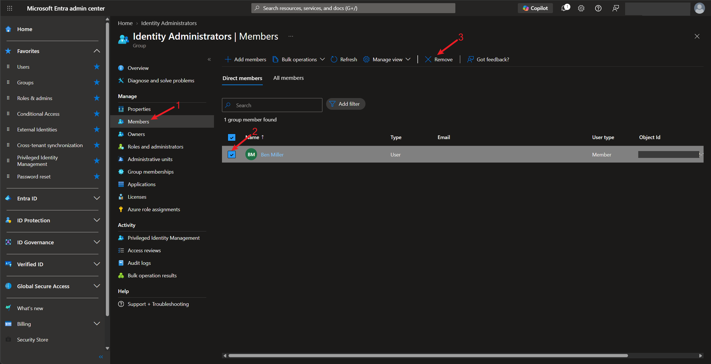

### 2.4 Group nesting limits

Security groups can be nested (a group can be a member of another group), with two exceptions:

1. **Dynamic groups** can't have other groups as members.
2. **Role-assignable groups** (groups with an Entra role assigned) can't contain other groups.

```text
SG1 ──► SG2 (Dynamic)          ✗ can't nest SG3 inside
SG1 ──► SG2 (Role-assignable)  ✗ can't nest SG3 inside
```

---

## Task 3 — Manage Licenses

### Licensing basics

- **Microsoft Entra ID Free** comes with every tenant.
- **Microsoft Entra ID P1 / P2** add premium features. They're included in Microsoft 365 **E3** (P1) and **E5** (P2).
- **Microsoft Entra ID Governance** is an add-on for entitlement management, lifecycle workflows, access reviews, and PIM.
- Paid services like Microsoft 365 need a license for **each user**.

### 3.1 Where licenses are managed

The Entra admin center shows a user's licenses (here, *Microsoft Entra ID P2*, assigned directly), but assigning, removing, and reprocessing licenses is now done in the **Microsoft 365 admin center**.

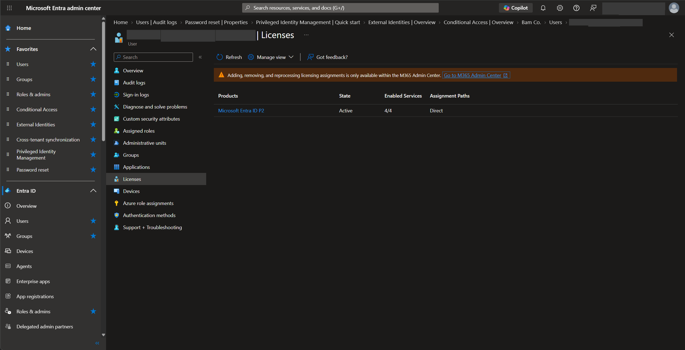

### 3.2 Assign a license to a user

**Microsoft 365 admin center → Billing → Licenses → select the product → Assign licenses.** I used the free *Microsoft Fabric* license.

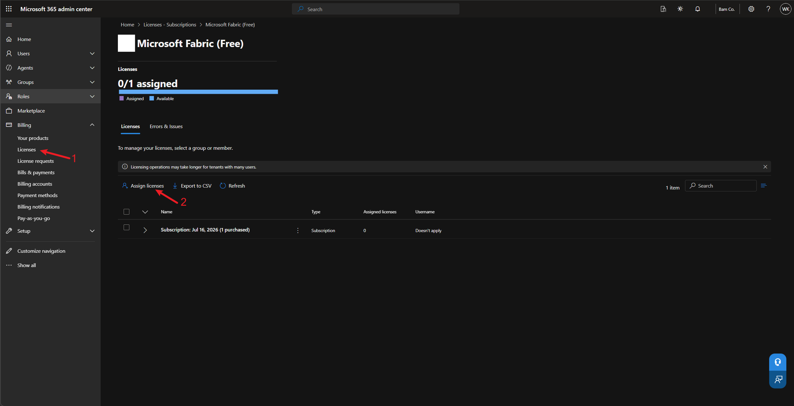

Search for the user, pick the subscription, and choose which **apps and services** in the license to turn on. You can switch off features you don't want the user to have.

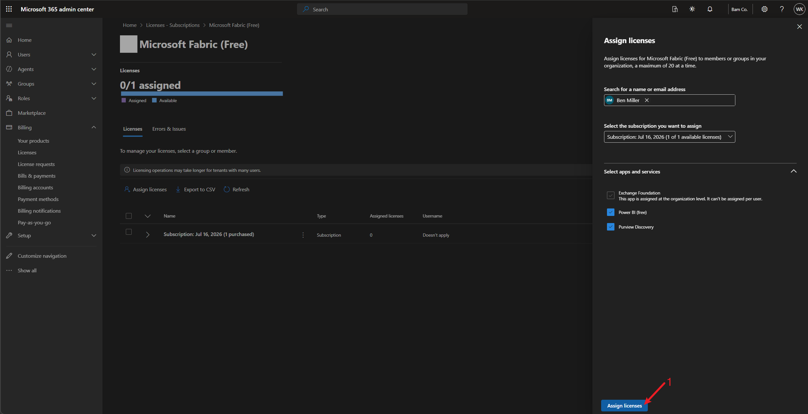

### 3.3 Remove a license

Select the user in the license's list, then **Unassign licenses**:

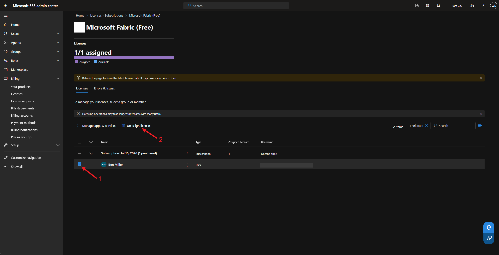

### 3.4 Group-based licensing

Instead of a user, search for a **group** in the same pane. Every member of the group gets the license, and members lose it automatically when they leave the group.

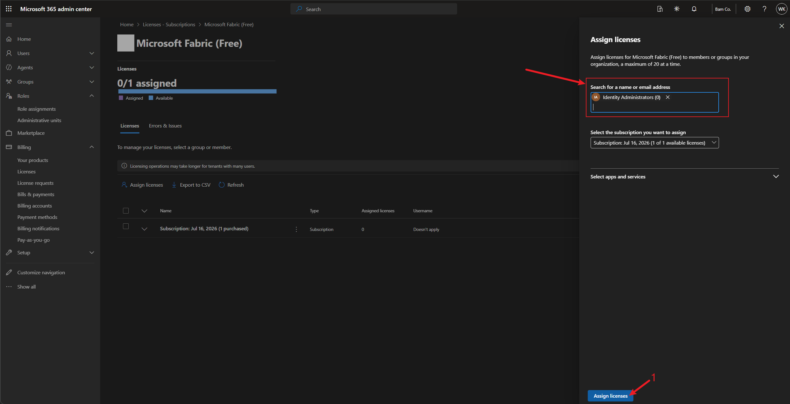

> You need **enough licenses for everyone in the group**. Members who don't get a license show up under **Errors & issues**.

---

## Task 4 — Custom Security Attributes

Custom security attributes are key-value pairs you define yourself and attach to users or apps. They're useful for things like security clearance, cost center, or project, and they can later be used in Conditional Access and access control decisions.

### Required roles

Being a **Global Administrator isn't enough** to manage custom security attributes. You need one of these roles:

| Role | Permissions |
|---|---|
| Attribute Definition Administrator | Create and manage attribute sets and definitions, and deactivate attributes |
| Attribute Assignment Administrator | Assign, update, and remove attribute values |
| Attribute Definition Reader | View attribute sets and definitions only |
| Attribute Assignment Reader | View assigned attribute values only |
| Global Administrator | Doesn't get these permissions automatically and needs one of the roles above |

### 4.1 Create an attribute set

**Custom security attributes → Add attribute set:**

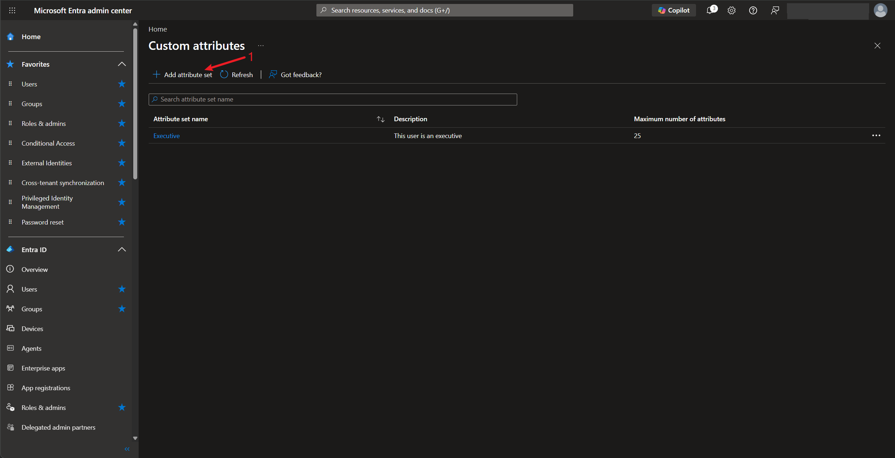

| Setting | Value |
|---|---|
| Attribute set name | SecurityClearanceLevel |
| Description | Access Control for IT team |
| Maximum number of attributes | 25 |

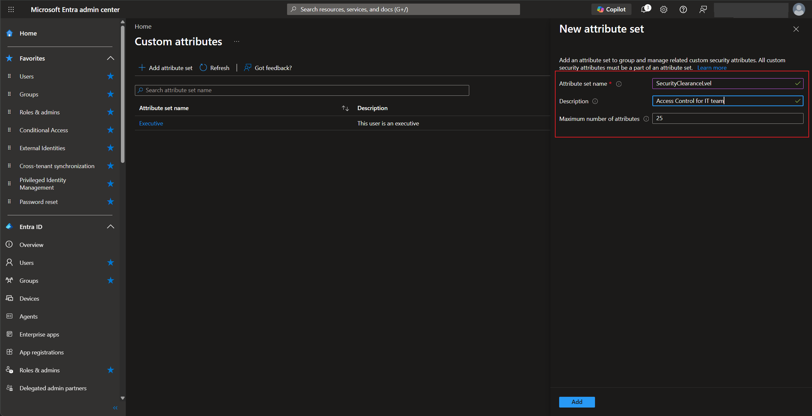

### 4.2 Define the attribute

Open the attribute set, then **Add attribute:**

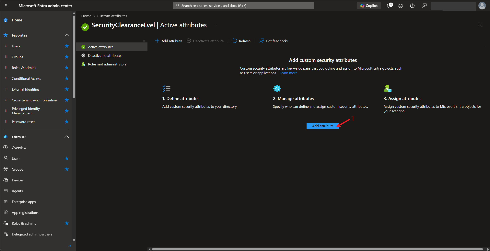

| Setting | Value |
|---|---|
| Attribute name | SecurityClearanceLevel |
| Description | To assign IT SC Level |
| Data type | String |
| Allow multiple values | No |
| Only allow predefined values | Yes |

Predefined values:

| Value | Active |
|---|---|
| Level 1 - Low | ✅ |
| Level 2 - Medium | ✅ |
| Level 3 - High | ✅ |
| Level 4 - Top Secret Clearance | ✅ |

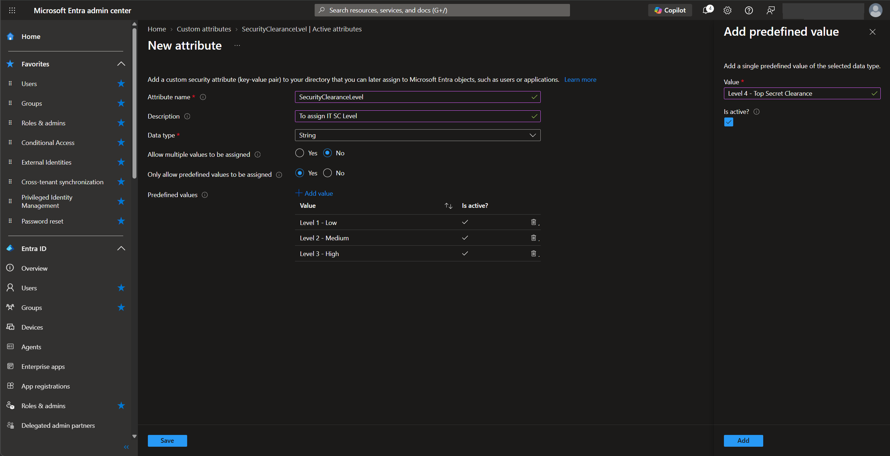

### 4.3 Assign the attribute to a user

**Users → Ben Miller → Custom security attributes → Add assignment:**

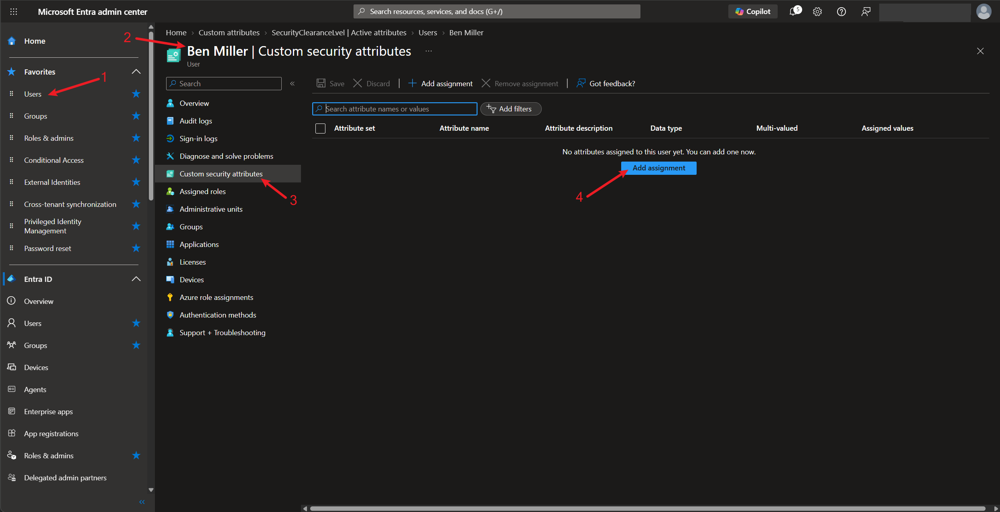

Pick the attribute set and attribute, choose **Level 4 - Top Secret Clearance**, then **Save**:

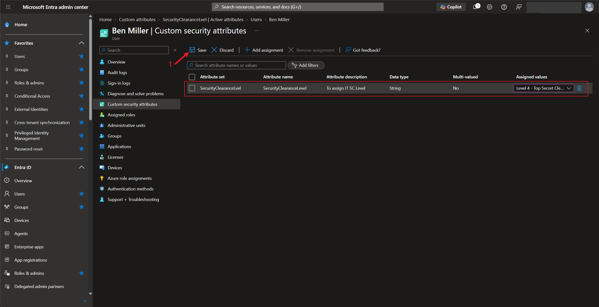

### 4.4 Filter users by attribute

In **All users → Add filter**, you can filter on a custom security attribute. Filtering on `SecurityClearanceLevel == Level 4 - Top Secret` returns only Ben:

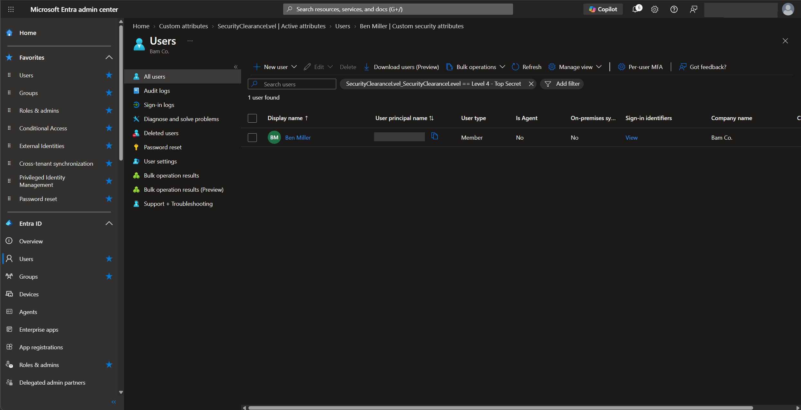

---

## Concepts: Device Identities

This section of the course was slides only, but here are the three ways a device can be connected to Entra ID:

| Join type | Ownership | Signs in with | Typical OS | Notes |
|---|---|---|---|---|
| Entra **registered** | Personal (BYOD) | Local account, plus a work account added | Windows 10/11, iOS, Android, macOS | Managed with MDM like Intune. The company can remotely wipe the work data if the device is lost or the user leaves |
| Entra **joined** | Organization | Organizational Entra account | Windows 10/11 (not Home) | For cloud-first or cloud-only orgs. Conditional Access can use the device identity |
| Entra **hybrid joined** | Organization | On-prem AD account, synced to Entra | Windows 10/11, Windows Server | For orgs that still need Group Policy, on-prem imaging, or Win32 apps that use machine authentication |

## What I Learned

- A user only needs a few fields to be created, but filling in things like department and job title is what makes automation work later
- You can create an account turned off and turn it on the day the person starts, so it can't be used before it's needed
- Deleted users stay around for 30 days, so you can get them back if they were deleted by mistake
- Security groups are for giving access and licenses, and Microsoft 365 groups are for teamwork like shared email, files, and calendars
- Dynamic groups add people automatically based on a rule, like "everyone in the IT department"
- Some group settings can't be changed after the group is created, so it's worth planning before making one
- Licensing a whole group is easier than licensing people one at a time, as long as there are enough licenses for everyone
- Even a Global Administrator can't manage custom security attributes without being given a separate role

---

> **Note:** Screenshots are from my personal lab tenant. The tenant domain, admin account, user principal names, Object IDs, and my own accounts have been redacted. The users shown (Frank Gallagher, Ben Miller, etc.) are fictional test accounts for a made-up company.

[← Back to Entra ID Labs](../)
