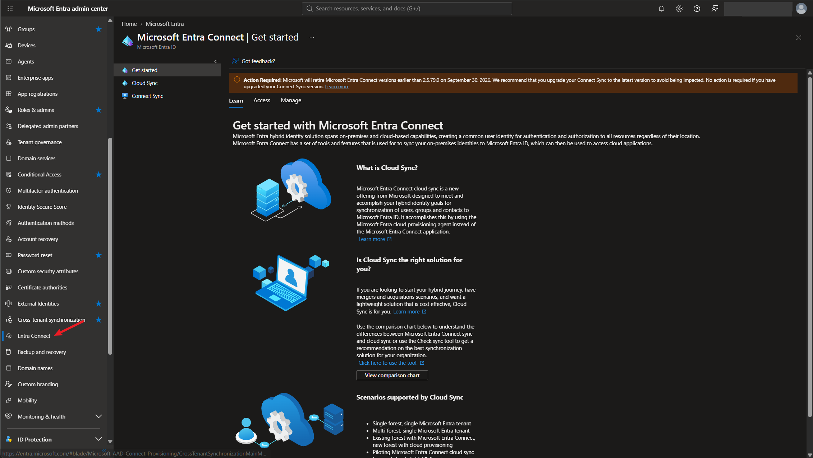

# Lab 4 — Hybrid Identity: Entra Connect and Authentication Methods

## Overview

This is my fourth SC-300 lab. It follows *Implement an Identity Management Solution, Part 4* in the Microsoft Learn SC-300 series.

The first three labs were all in the cloud. This one is about **hybrid identity**, which is what a company uses when it still has an on-premises Active Directory and also uses Microsoft Entra ID. The goal is for each person to have **one identity** that works in both places.

This lab is mostly concepts. I don't have an on-prem Active Directory server, so I didn't install or sync anything. I looked at the **Entra Connect** page in my tenant, compared the two sync tools, and learned the three ways a hybrid user can sign in: password hash synchronization, pass-through authentication, and federation.

The big takeaway is that the three sign-in methods differ in **where the password is checked**. The more that stays on-prem, the more servers there are to run, and the more can break if on-prem goes down.

## Objectives

- Understand what hybrid identity is and what gets synced from on-prem to the cloud
- Understand what password writeback does
- Compare Microsoft Entra Cloud Sync and Connect Sync
- Explain how password hash synchronization (PHS), pass-through authentication (PTA), and federation work
- Know the trade-offs between the three authentication methods

## Tools & Technologies

| Category | Tools |
|---|---|
| Identity platform | Microsoft Entra ID P2 |
| Portals | Microsoft Entra admin center |
| Concepts | Hybrid identity, Entra Connect Sync, Entra Cloud Sync, password writeback, PHS, PTA, federation |
| Course | Microsoft Learn: SC-300 Identity and Access Administrator |

---

## Task 1 — What Hybrid Identity Is

A company with an on-prem Active Directory already has its **users, groups, and devices** stored there. **Microsoft Entra Connect** copies those objects up to Microsoft Entra ID, so the same user exists on-prem and in the cloud.

```text
        ON-PREMISES                                        CLOUD

  ┌──────────────────────┐                         ┌──────────────────────┐
  │  Server OS           │                         │                      │
  │  Active Directory    │ ── Entra Connect ─────► │  Microsoft Entra ID  │
  │                      │      (sync)             │                      │
  │   · users            │                         │   user 1             │
  │   · groups           │ ◄── password ────────── │                      │
  │   · devices          │     writeback           │                      │
  └──────────────────────┘                         └──────────────────────┘
                                                              ▲
                                                              │ changes password
                                                     user 1 at office.com

  user 1 exists on-prem and in the cloud.
```

Sync normally goes one way, from on-prem up to the cloud. **Password writeback** is the exception. If user 1 changes or resets their password in the cloud (for example from office.com), the new password is written back to on-prem Active Directory, so it's the same in both places.

> Without password writeback, a hybrid user can't use self-service password reset from the cloud, because the on-prem password would never get updated.

---

## Task 2 — Entra Connect in the Portal

**Entra admin center → Entra ID → Entra Connect → Get started.** This page explains the sync options and links to both of them in the left menu: **Cloud Sync** and **Connect Sync**.



The banner at the top is a notice that older versions of Entra Connect are being retired, so a server running Connect Sync has to be kept up to date.

### Cloud Sync vs Connect Sync

There are two tools that do the syncing. **Connect Sync** is the original one and runs on a server you manage on-prem. **Cloud Sync** is newer. Most of it runs in the cloud, and only a small agent is installed on-prem.

| Feature | Cloud Sync | Connect Sync |
|---|---|---|
| Runs / managed | Cloud service plus a lightweight on-prem agent | On-prem sync server |
| Configuration | Entra admin center | Server tools |
| Default sync interval | 2 minutes | 30 minutes |
| Users, groups, contacts | ✅ | ✅ |
| Password hash sync | ✅ | ✅ |
| Password writeback | ✅ | ✅ |
| Device sync / hybrid join | ❌ | ✅ |
| Disconnected forests | ✅ | Requires server connectivity |
| Automatic failover | ✅ Multiple active agents | Standby staging server |
| OU filtering / custom attributes | ✅ | ✅ |
| Advanced sync rules | Limited | ✅ |
| PTA setup | Separate configuration | Built-in configuration |
| Cloud security groups → AD | ✅ | Use Cloud Sync |
| Microsoft 365 groups → AD | Use Connect Sync | ✅ Writeback v1 |

> **Cloud Sync** fits a company that is just starting with hybrid, has several forests that aren't connected to each other (like after a merger), or wants something light. **Connect Sync** is still needed for things Cloud Sync can't do, like syncing devices for hybrid join.

---

## Task 3 — Authentication Methods

Once users are synced, the next question is **how they sign in**. There are two cloud authentication methods and one federated method:

| Type | Method | In one sentence |
|---|---|---|
| Cloud authentication | Password hash synchronization (PHS) | Entra ID checks the password itself, using a synced hash |
| Cloud authentication | Pass-through authentication (PTA) | Entra ID passes the password to an on-prem agent, and Active Directory checks it |
| Federated authentication | Federation (AD FS or another identity provider) | Entra ID hands the whole sign-in off to a separate, trusted system |

### 3.1 Password hash synchronization (PHS)

Entra Connect syncs a **hash** of each user's on-prem password to Entra ID. Users sign in with the same username and password they use on-prem, and Entra ID does the checking.

```text
  1. User tries to open a cloud app (Office 365, Azure, a SaaS app)
  2. The app sends the user to Entra ID to sign in
  3. Entra ID asks the user for their password and checks it against the synced hash
  4. The hash matches, so the user is authenticated and gets into the app

  In the background:  Active Directory ── Entra Connect ──► Entra ID
                                          (syncs password hashes)
```

Nothing on-prem is involved at sign-in time. If the on-prem servers go down, users can still sign in to cloud apps.

**How it's turned on:** in the Entra Connect setup wizard, the **User sign-in** page lists the sign-in methods: *Password Hash Synchronization*, *Pass-through authentication*, *Federation with AD FS*, and *Do not configure*. There's also a checkbox to *Enable single sign-on*.

### 3.2 Pass-through authentication (PTA)

With PTA, the password is checked by **on-prem Active Directory**, not by Entra ID. A small piece of software called an **authentication agent** runs on one or more on-prem servers and does the check.

```text
  1. User tries to open a cloud app and is sent to Entra ID to sign in
  2. User enters their password at Entra ID
  3. Entra ID passes the request to an authentication agent on-prem
  4. The agent verifies the password against Active Directory
     and sends the result back to Entra ID

        Entra ID ◄────► Authentication agent 1 ──┐
                 ◄────► Authentication agent 2 ──┴──► Active Directory
```

> Run **at least two agents** for redundancy. If the only agent goes down, nobody can sign in.

Because Active Directory makes the decision, on-prem account rules apply right away, like a disabled account, an expired password, or sign-in hours.

### 3.3 Federated authentication

With federation, Entra ID doesn't check the password at all. It **redirects the sign-in** to a separate, trusted authentication system, usually **AD FS** (Active Directory Federation Services). That system validates the user and tells Entra ID the result.

```text
  User ──► Entra ID ──redirect──► Federation proxy ──► Federation server ──► Active Directory
                                    (perimeter)          (on-premises)
```

Federation needs the most infrastructure: federation servers on the internal network and federation proxies in the perimeter network. Its advantage is that the on-prem system can enforce extra requirements Entra ID can't do natively, like smart card sign-in or a third-party MFA product.

### 3.4 Comparing the three

| Feature | Password Hash Sync (PHS) | Pass-through Authentication (PTA) | Federation |
|---|---|---|---|
| How it works | Syncs a derived password hash to Entra | Agent checks the password against on-prem AD | Entra redirects sign-in to a trusted identity provider |
| Password validated by | Microsoft Entra ID | On-prem AD, through an agent | AD FS or another identity provider |
| Password hash stored in Entra | ✅ Hash of the AD password | Not required. PHS is an optional backup | Not required. PHS is an optional backup |
| On-prem needed for each password sign-in | ❌ | ✅ Agent and a domain controller | ✅ For on-prem AD FS |
| On-prem outage | Cloud sign-ins continue using synced credentials | Password sign-ins fail if no agent can reach AD | Sign-ins fail if the federation service is unavailable |
| Infrastructure | Directory sync tool | Directory sync plus authentication agents | Directory sync plus federation infrastructure |
| Complexity | Low | Medium | High, especially AD FS |
| Main benefit | Simple, resilient cloud authentication | Checks AD account restrictions immediately | Specialized authentication requirements |

> PHS can be turned on as a **backup** even when PTA or federation is the main method. If the on-prem side fails, an admin can switch sign-in over to PHS so people can still work.

---

## What I Learned

- Hybrid identity means one user account that exists both in on-prem Active Directory and in Entra ID, kept in sync by Entra Connect
- Sync normally goes from on-prem to the cloud. Password writeback is the part that goes the other way
- There are two sync tools: Connect Sync runs on a server you manage, and Cloud Sync mostly runs in the cloud with a small agent on-prem
- Cloud Sync can't sync devices, so hybrid join still needs Connect Sync
- With PHS the password is checked in the cloud, with PTA it's checked by on-prem AD through an agent, and with federation it's checked by a separate system like AD FS
- PHS keeps working when on-prem is down. PTA and federation don't, which is why PTA needs at least two agents and why PHS is often kept as a backup
- The simplest option that meets the requirements is usually the right one. Federation is only worth the extra servers if it's needed for something like smart cards

---

> **Note:** The screenshot is from my personal lab tenant, with my admin account and tenant name redacted. I don't have an on-prem Active Directory, so nothing was installed or synced in this lab. The diagrams are my own versions of the flows from the course.

[← Back to Entra ID Labs](../)
