# Lab 2 — Company Branding, Entra Roles, Custom Roles, and Administrative Units

## Overview

This is my second SC-300 lab. It follows *Implement an Identity Management Solution, Part 2* in the Microsoft Learn SC-300 series, and like Lab 1, I did everything in my own Microsoft Entra tenant for the made-up company **Bam Co.**

First I branded the sign-in page with a favicon, a background image, and a welcome message. Then I worked on who gets admin access: I assigned Entra roles three ways (from a user, from a role, and through a role-assignable group) and built a custom role that only has app registration permissions. After that I created an administrative unit for a St. Louis team so an admin could manage just those users. Last, I added a custom domain and went through the tenant-wide properties and user settings.

The big takeaway is **least privilege for admins**. Instead of making everyone a Global Administrator, you give people the smallest built-in role that fits, make a custom role if none of them fit, and limit where the role applies with an administrative unit.

## Objectives

- Customize the Entra sign-in experience with company branding
- Know which admin center manages what
- Assign Microsoft Entra roles to a user, from a role, and through a role-assignable group
- Create a custom role with only the permissions a job needs
- Create an administrative unit, scope a role to it, and add members manually, dynamically, and in bulk
- Add a custom domain and understand the DNS TXT record used to verify it
- Review tenant properties and tenant-wide user settings

## Tools & Technologies

| Category | Tools |
|---|---|
| Identity platform | Microsoft Entra ID P2 |
| Portals | Microsoft Entra admin center, Microsoft 365 admin center |
| Objects | Company branding, Entra roles, custom roles, role-assignable groups, administrative units, custom domains |
| Course | Microsoft Learn: SC-300 Identity and Access Administrator |

---

## Task 1 — Company Branding

Company branding changes how the Microsoft sign-in page looks for anyone signing in to your tenant. It needs **Entra ID P1/P2** or a **Microsoft 365** license, and you can set different branding for each browser language.

**Entra admin center → Company Branding → Default sign-in → Edit:**

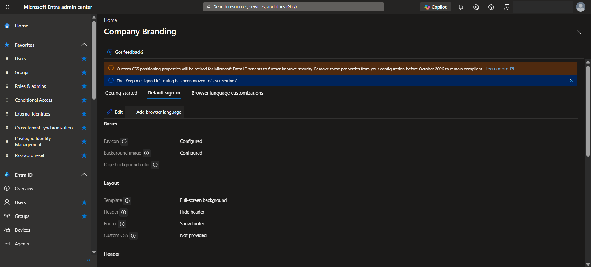

The editor has these tabs:

| Tab | What it controls |
|---|---|
| Basics | Favicon, background image, and page background color |
| Layout | Template and where things sit on the page |
| Header | What shows at the top of the page |
| Footer | Links shown at the bottom, like Terms of use and Privacy |
| Sign-in form | The sign-in box itself: banner logo, username hint, sign-in page text |
| Review | Check everything before saving |

### 1.1 Favicon and background

I added a **favicon** (the little icon in the browser tab). It should be 32×32 px and under 5 KB.

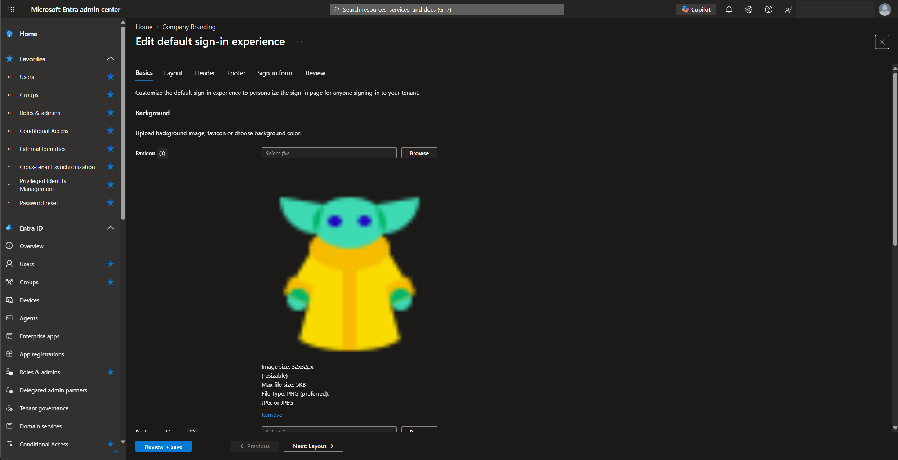

Then I added a **background image**. It should be 1920×1080 px and under 300 KB. Entra darkens it a little so the sign-in box is easier to read.

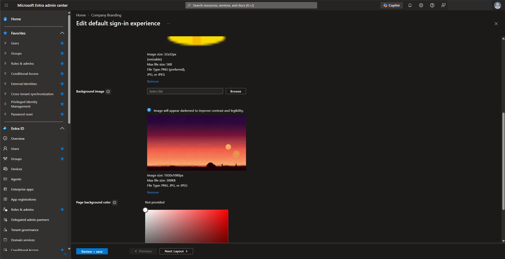

### 1.2 Result

Here is the sign-in page for a Bam Co. user after my changes. It has the new favicon in the tab, the background image, and the **"Welcome to Bam Co!"** text I added under the sign-in box.

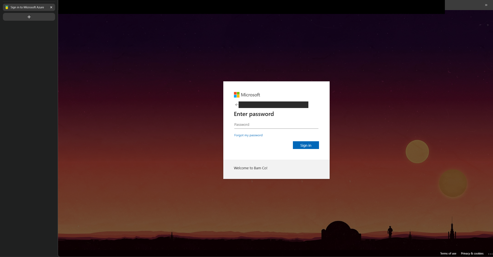

> Branding isn't only about looks. When users always see the same branded page, a fake phishing page stands out more.

---

## Task 2 — Admin Centers

Different portals manage different parts of the Microsoft cloud:

| Portal | URL | Used for |
|---|---|---|
| Microsoft Entra admin center | `entra.microsoft.com` | Identities, roles, groups, authentication |
| Azure portal | `portal.azure.com` | Azure resources and subscriptions |
| Microsoft 365 admin center | `admin.microsoft.com` | Licenses, M365 users, billing |
| Microsoft Defender portal | `security.microsoft.com` | Security and threat protection |

The Microsoft 365 admin center lists the other admin centers in the left menu under **Admin centers**:

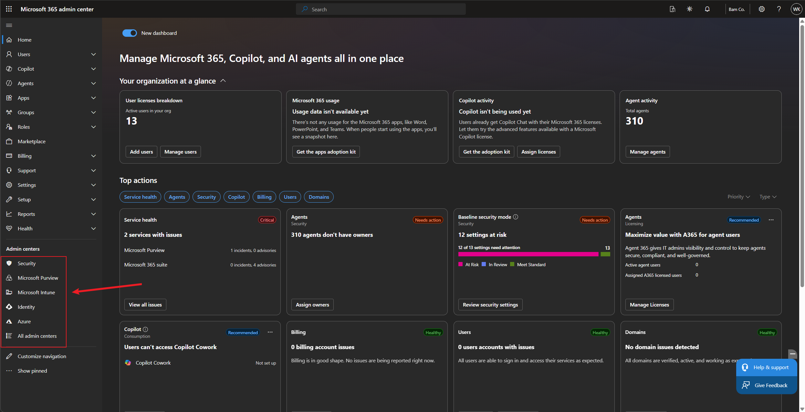

**All admin centers** shows every one of them in one place:

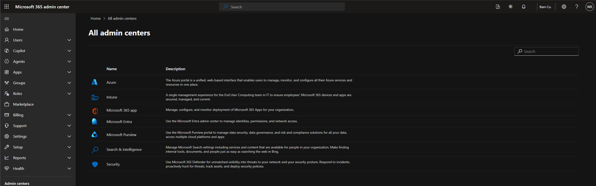

---

## Task 3 — Assign Microsoft Entra Roles

**Roles & admins → All roles** lists all the built-in roles. Roles marked **PRIVILEGED** can be used to raise someone's own access or reach sensitive data, so they need extra care. The page also shows the role I was signed in with: **Global Administrator and 3 other roles**.

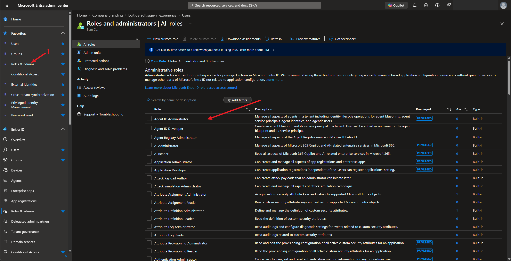

Opening a role and choosing **Description** shows exactly what it's allowed to do. Each permission is written like `microsoft.directory/<resource>/<action>`.

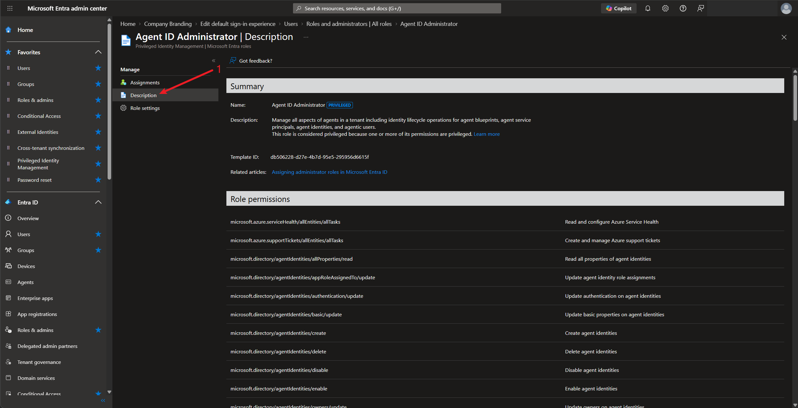

I assigned roles three different ways.

### 3.1 From the user

**Users → Kaitlyn Ly → Assigned roles → Add assignments.** Kaitlyn already had **User Administrator**.

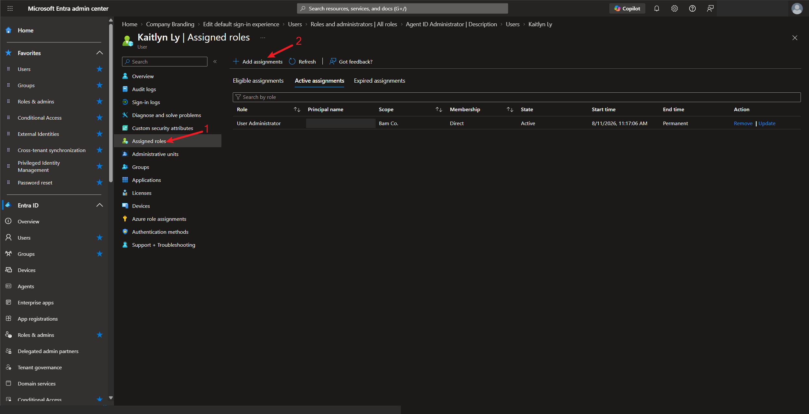

Pick the role and the **scope type**. The scope can be the whole **directory**, an **administrative unit**, or a single **app** or **service principal**, depending on the role.

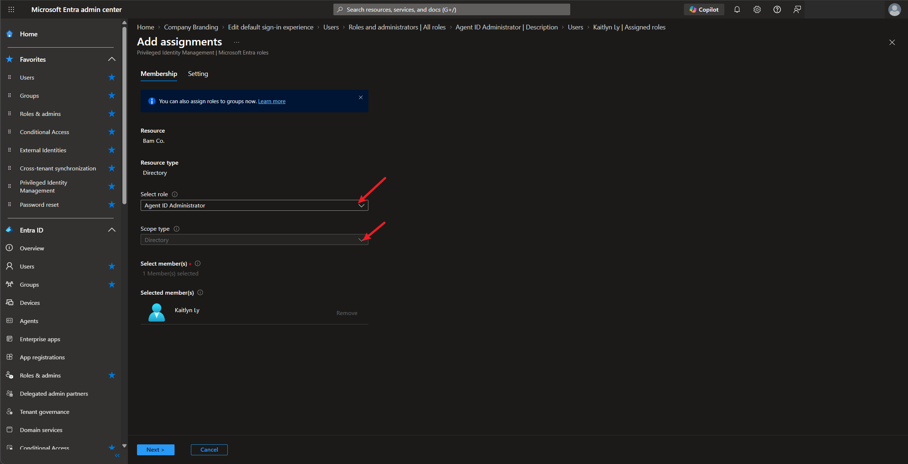

> **Active vs eligible:** an *active* assignment works all the time. An *eligible* assignment has to be turned on when it's needed, which is how **Privileged Identity Management (PIM)** gives just-in-time admin access.

### 3.2 From the role

You can also start from the role: **All roles → Agent ID Administrator → Assignments → Add assignments.**

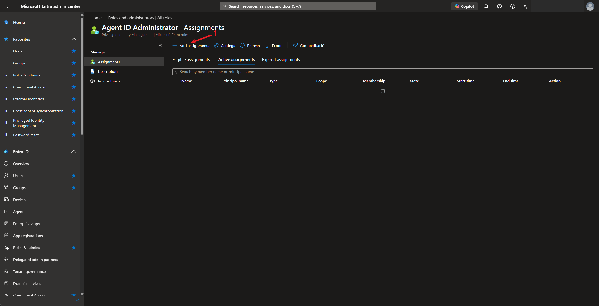


### 3.3 Through a group

When you assign a role to a group, everyone in the group gets that role. When the member picker is used for a role assignment, it only shows groups that are **role-assignable**. I picked the **Agent ID Admins** group:

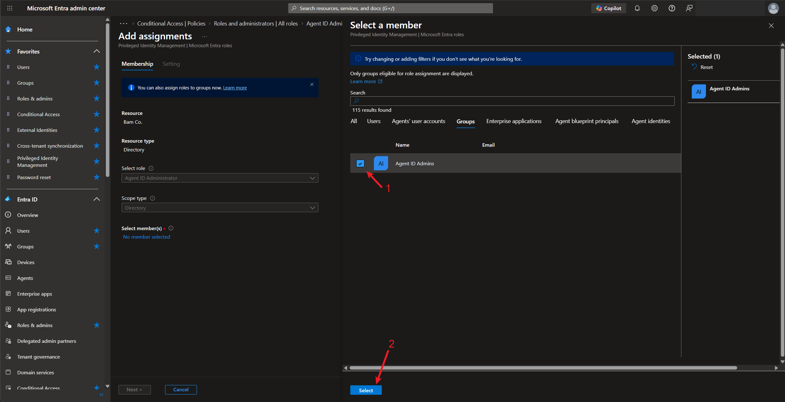

Now the **Agent ID Admins** group holds the **Agent ID Administrator** role, and anyone added to the group gets it.

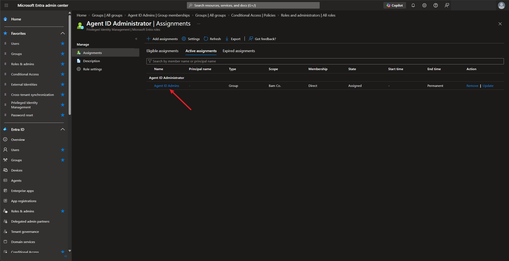

> **Important:** whether a group is role-assignable can **only be set when the group is created**, and you can't change it later. If you forget, the only fix is making a new group. (I also ran into this in [Lab 1](../lab-01-manage-users-groups-licenses/).)

---

## Task 4 — Custom Roles

If no built-in role fits, you can build your own. Right now custom roles only support **app registration** and **enterprise application** permissions.

**All roles → New custom role:**

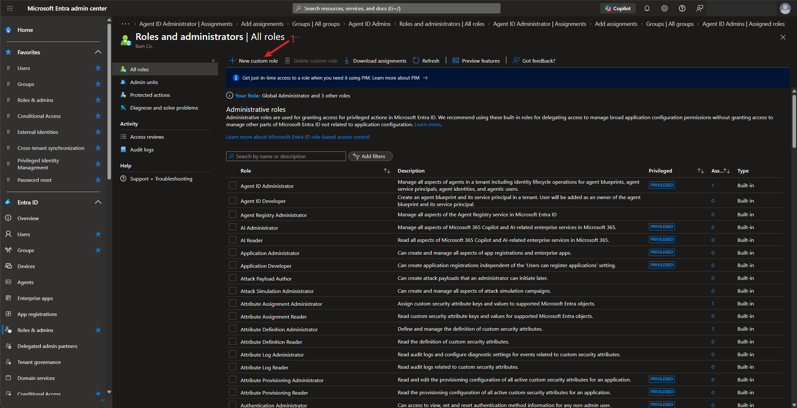

| Setting | Value |
|---|---|
| Name | Elevated App. Administrator |
| Description | Project 1 special app permissions |
| Baseline permissions | Start from scratch |

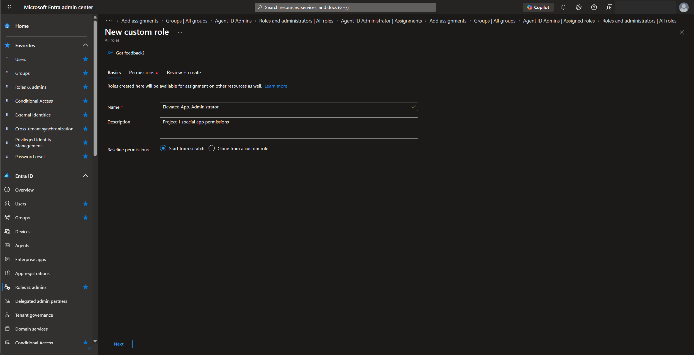

On the **Permissions** tab I searched for "Applications" and picked only what this job needed:

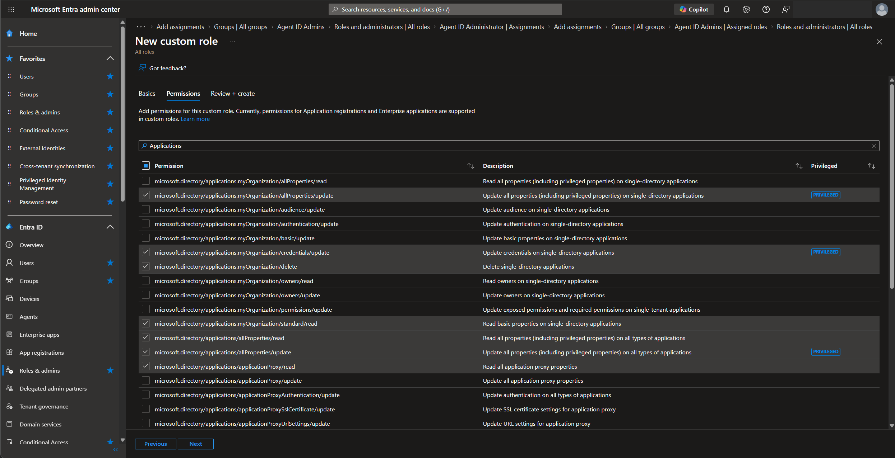

| Permission | Privileged |
|---|---|
| `applications.myOrganization/allProperties/update` | ✅ |
| `applications.myOrganization/credentials/update` | ✅ |
| `applications.myOrganization/delete` | |
| `applications.myOrganization/standard/read` | |
| `applications/allProperties/read` | |
| `applications/allProperties/update` | ✅ |
| `applications/applicationProxy/read` | |

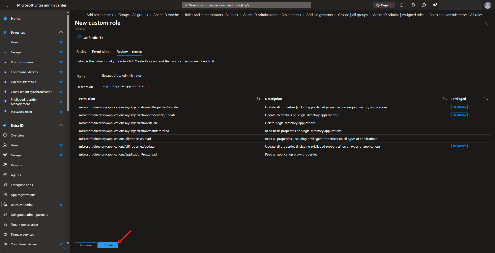

The new role shows up in the list with the type **Custom**. It's also marked **PRIVILEGED**, because some of the permissions I picked are privileged.

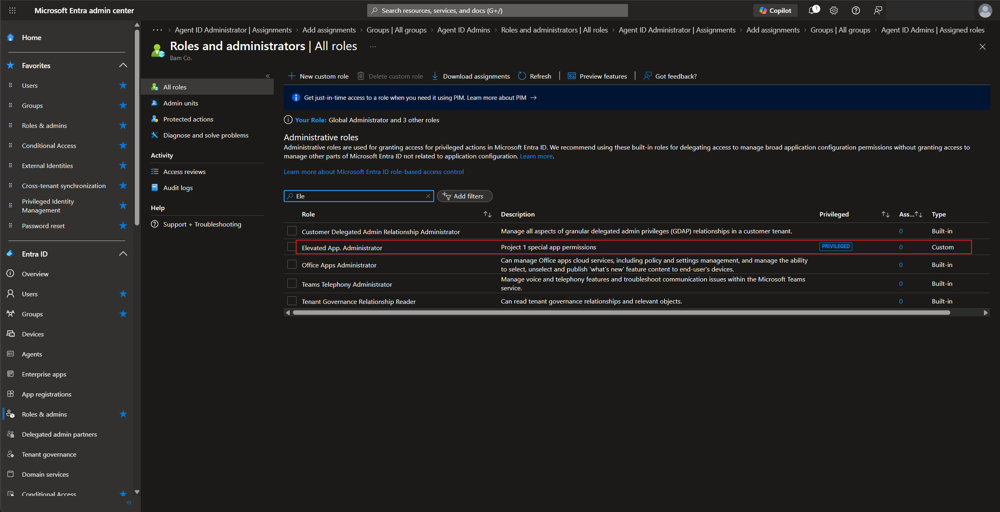

---

## Task 5 — Administrative Units

An **administrative unit (AU)** is a container for users, groups, and devices. When you scope a role to an AU, the admin can only manage what's inside it.

```text
         Adele ── User Administrator role
                        │  (scoped to)
                        ▼
            ┌──── HR Administrative Unit ────┐
            │   users · groups · devices     │
            └────────────────────────────────┘

  Adele can manage HR users only, not everyone in the tenant.
```

This is useful for a big company with regional offices or departments, where each location's IT person should only manage their own people.

### 5.1 Create the administrative unit

**Roles & admins → Admin units → Add:**

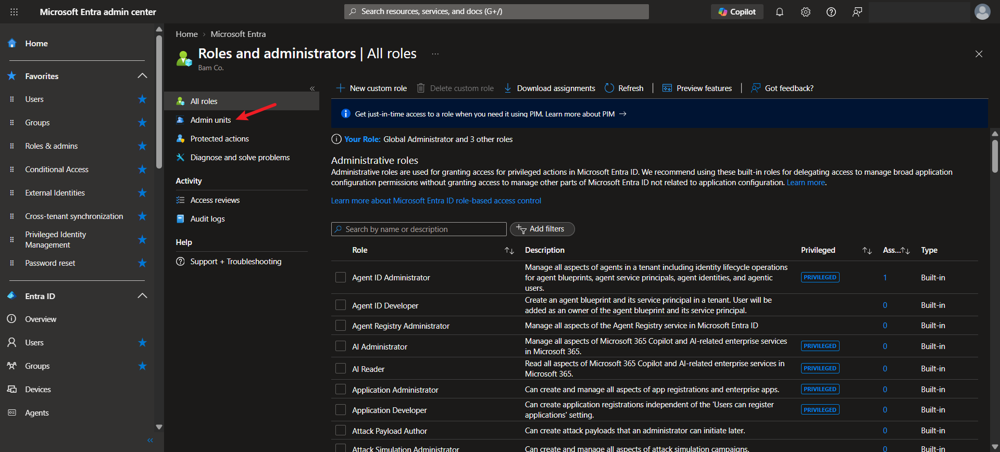

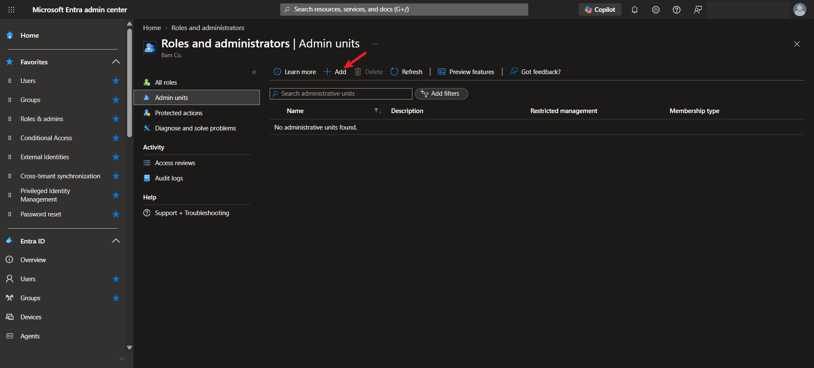

| Setting | Value |
|---|---|
| Name | St. Louis |
| Description | St. Louis team members only |
| Restricted management administrative unit | No |

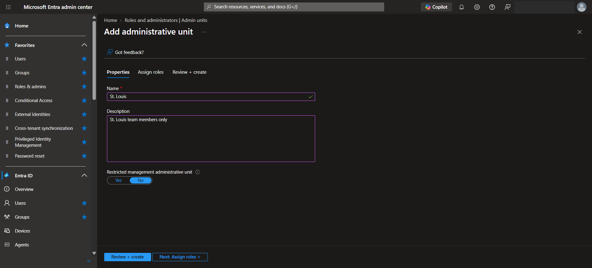

**Restricted management** changes who can manage the objects inside:

| Setting | What it means |
|---|---|
| No (normal AU) | Tenant-wide admins still have their normal permissions over the objects in the AU |
| Yes (restricted AU) | Tenant-wide admin permissions **don't apply automatically**. An admin needs a role scoped to this AU to change anything in it |

### 5.2 Scope a role to the AU

The **Assign roles** tab only lists roles that can be scoped to an AU:

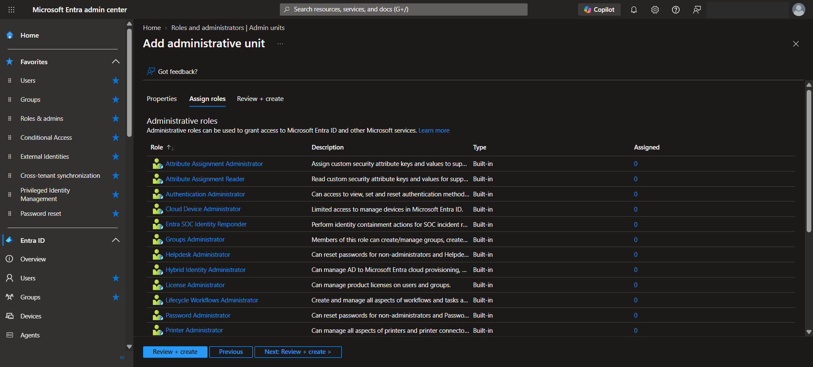

I gave **Ben Miller** the **User Administrator** role for the St. Louis AU, so he can manage St. Louis users but nobody else.

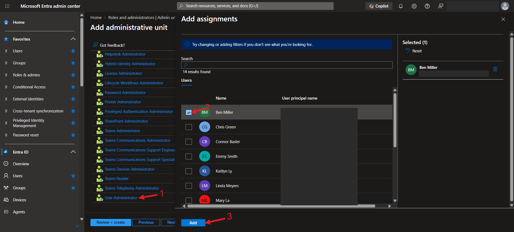

### 5.3 Add members manually

**St. Louis → Users → Add member:**

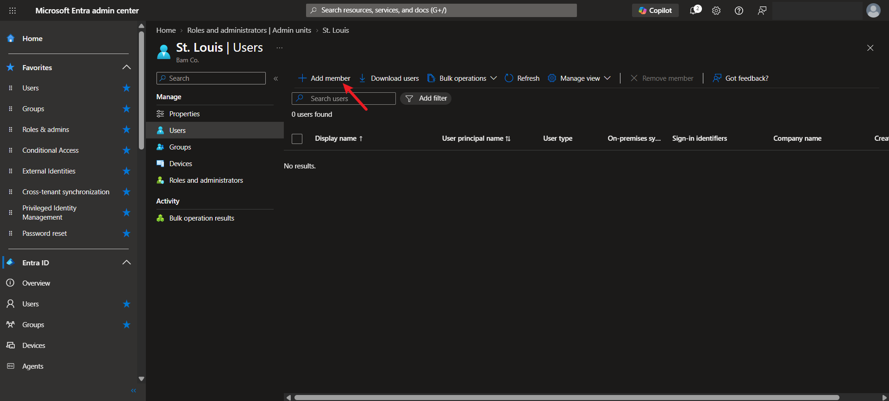

I added **Kaitlyn Ly, Nancy Cunningham, and Pat Meyer**:

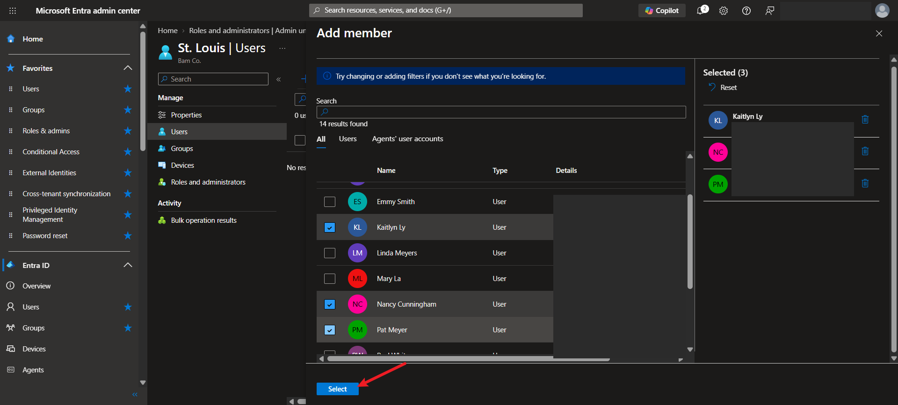

### 5.4 Dynamic membership

Like groups, an AU can use **Assigned** or **Dynamic** membership (for users or devices). I changed the membership type in **Properties**:

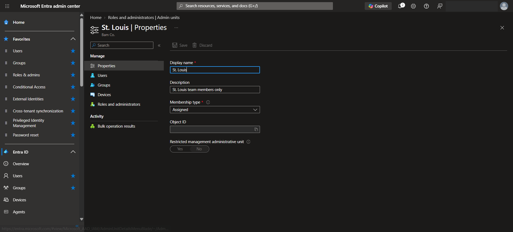

With this rule, anyone whose city is St. Louis is added to the AU automatically:

```text
(user.city -eq "St. Louis")
```

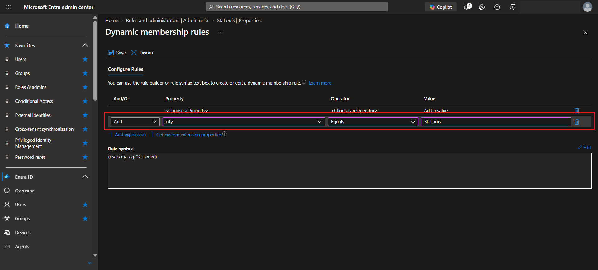

> When membership is dynamic, **Add member** is grayed out, just like with dynamic groups. The rule decides who's in.

### 5.5 Bulk operations

**Bulk operations → Bulk add members** lets you upload a CSV file to add a lot of users at once, and **Bulk remove members** does the opposite.

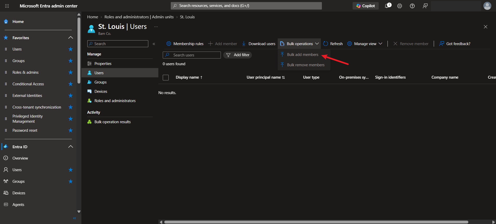

---

## Task 6 — Custom Domains

Every tenant starts with a `<tenant>.onmicrosoft.com` domain. To give users addresses like `name@bamco.com`, you add a **custom domain** that you own.

**Custom domain names → Add custom domain:**

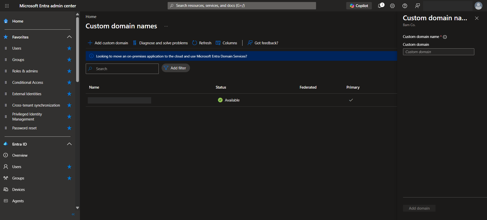

After I added `bamco.com`, Entra gave me a **TXT record** to create with the domain registrar. The record proves I own the domain.

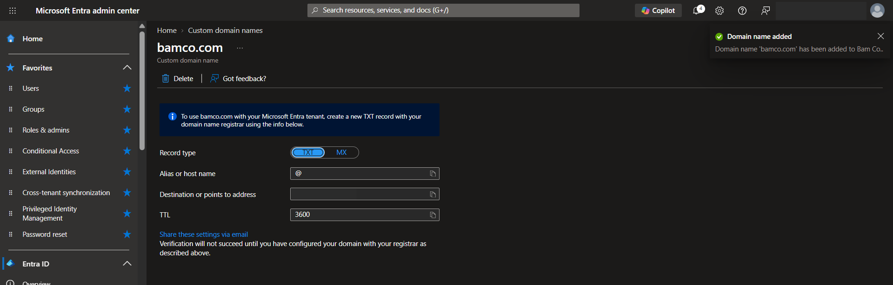

| Field | What it means |
|---|---|
| Record type: `TXT` | A DNS record that proves you own the domain (MX is also an option) |
| Alias or host name: `@` | The root of the domain itself, like `bamco.com` |
| Destination: `MS=ms########` | A unique value from Microsoft that you copy into your DNS settings |
| TTL: `3600` | How long DNS servers cache the record: 3600 seconds, or 1 hour |

> I don't own `bamco.com`, so I couldn't finish verifying it. The domain has to be **bought from a registrar** (like GoDaddy) first, and verification only works after the TXT record is live in DNS.

---

## Task 7 — Tenant-Wide Settings

### 7.1 Tenant properties

**Entra ID → Overview → Properties** shows settings for the whole tenant:

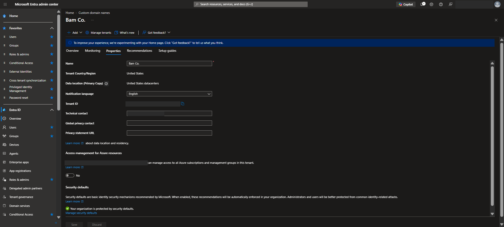

| Setting | What it means |
|---|---|
| Name | The tenant's display name |
| Tenant Country/Region | Chosen when the tenant was created and can't be changed |
| Data location | Where the tenant's data is stored |
| Notification language | The language Microsoft uses for notifications |
| Tenant ID | The tenant's unique ID |
| Technical contact | Email address for technical and service notices |
| Global privacy contact / Privacy statement URL | Who to contact about privacy, and a link to the privacy policy |
| Access management for Azure resources | Lets a Global Admin give themselves access to all Azure subscriptions. It should stay **off** unless it's needed |
| Security defaults | Microsoft's basic protections, like requiring MFA and blocking legacy authentication. My tenant has them turned on |

### 7.2 User settings

**Users → User settings** controls what regular users can do across the tenant:

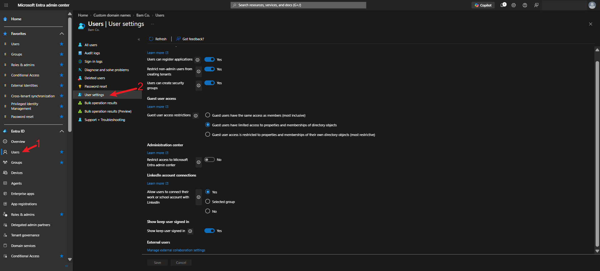

| Setting | What it controls |
|---|---|
| Users can register applications | Whether regular users can create app registrations |
| Restrict non-admin users from creating tenants | Stops regular users from creating new Entra tenants |
| Users can create security groups | Whether regular users can create security groups |
| Guest user access restrictions | How much of the directory guest users can see |
| Restrict access to Microsoft Entra admin center | Blocks non-admins from the portal, but **doesn't remove their permissions** (they could still use PowerShell or Graph) |
| LinkedIn account connections | Whether users can connect their work account to LinkedIn |
| Show keep user signed in | Shows the "Stay signed in?" prompt when users sign in |

> Several of these are **Yes** by default (register apps, create security groups). In a real company it would be safer to turn them off so only admins can do those things.

---

## What I Learned

- Company branding makes the sign-in page look like it belongs to your company, which also makes fake sign-in pages easier to spot
- Different admin centers handle different things: Entra for identities, Azure for resources, and Microsoft 365 for licenses
- A role can be given from the user, from the role, or through a group, and a group can only hold roles if that was turned on when the group was made
- Active roles work all the time, while eligible roles have to be turned on first. That's what PIM uses
- If no built-in role fits, a custom role can give just the app permissions someone needs
- Administrative units let an admin manage just one team or location instead of the whole company
- A custom domain has to be owned and verified with a DNS TXT record before anyone can use it
- Some default user settings, like letting anyone register apps, are more open than a real company would want

---

> **Note:** Screenshots are from my personal lab tenant. The tenant domain, tenant ID, my admin account and name, the technical contact email, user principal names, Object IDs, and the domain verification value have been redacted. The users shown (Kaitlyn Ly, Ben Miller, etc.) are fictional test accounts for a made-up company, and `bamco.com` was never verified.

[← Back to IAM Labs](../)
