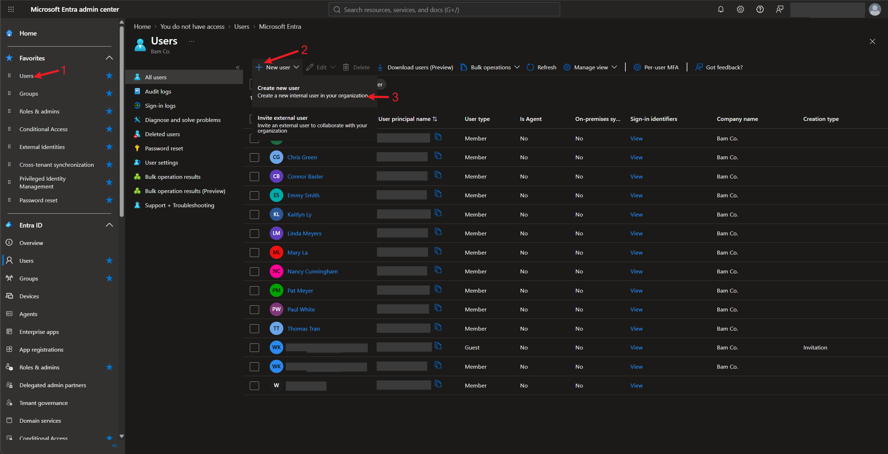
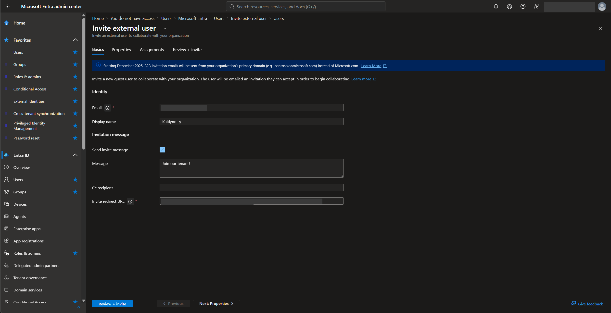
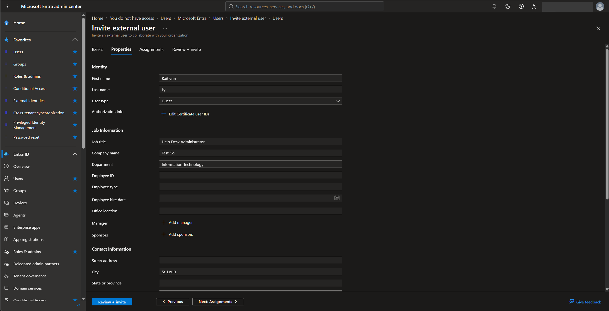
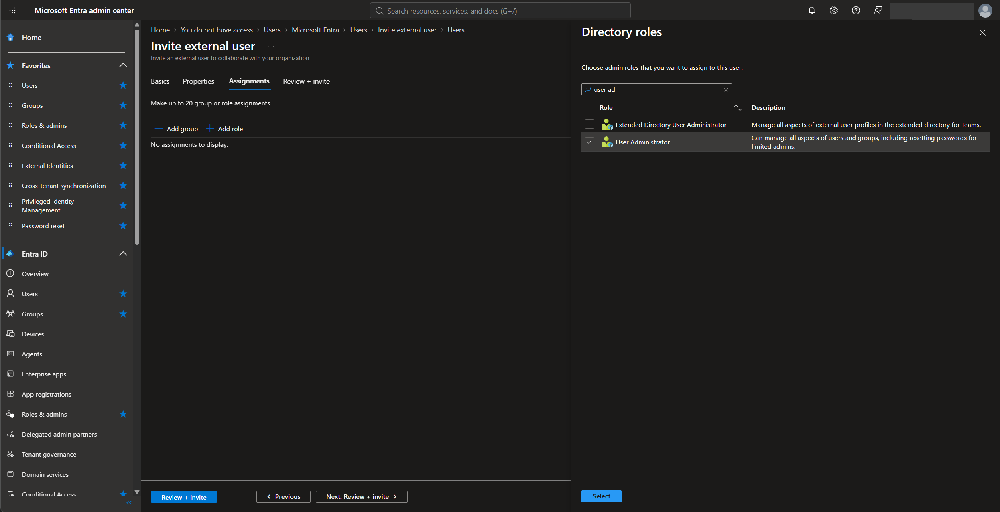
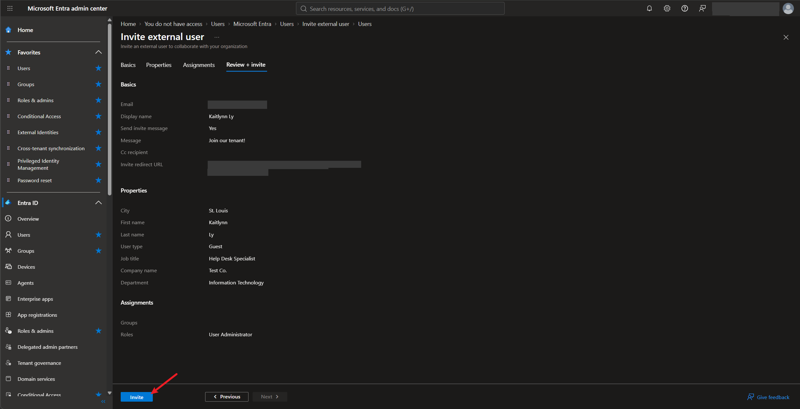
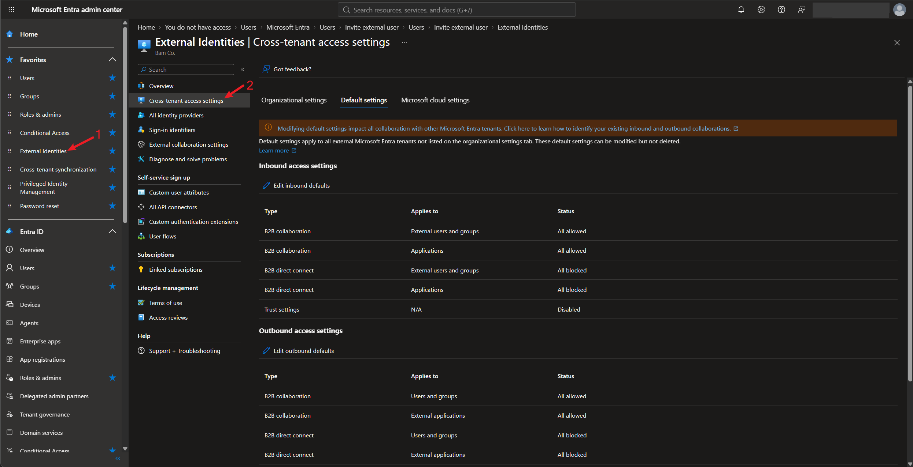
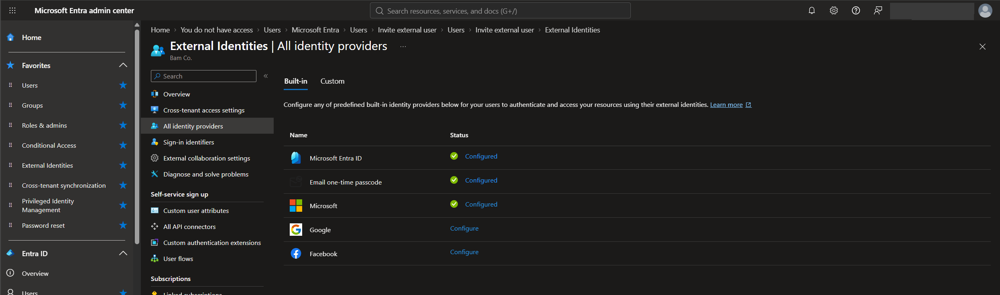
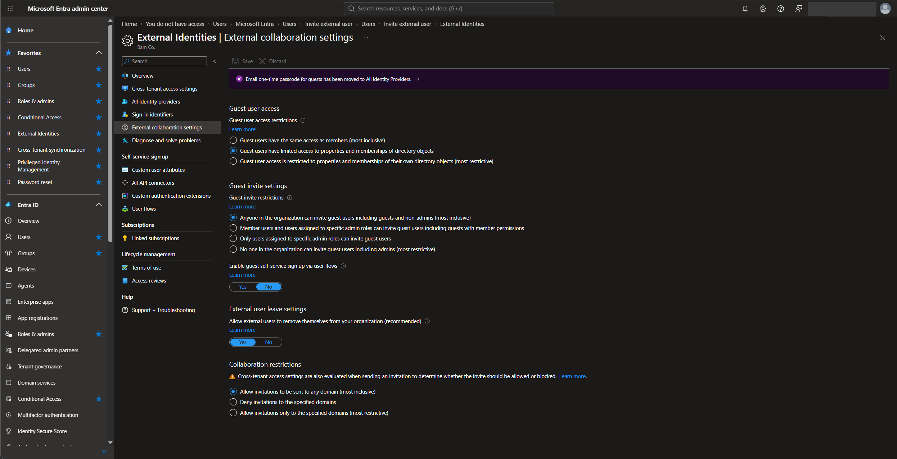

# Lab 3 — External Identities: Guest Users, Cross-Tenant Access, and Collaboration Settings

## Overview

This is my third SC-300 lab. It follows *Implement an Identity Management Solution, Part 3* in the Microsoft Learn SC-300 series, and like the first two labs, I did everything in my own Microsoft Entra tenant for the made-up company **Bam Co.**

[Lab 1](../lab-01-manage-users-groups-licenses/) and [Lab 2](../lab-02-branding-roles-admin-units/) were about people inside the company. This lab is about people **outside** it, like contractors, vendors, and partners. First I invited an external user as a guest and went through each tab of the invite. Then I looked at the three places that control how outside users get in: cross-tenant access settings, identity providers, and external collaboration settings.

The big takeaway is that guests are real accounts in your directory, so they need the same care as employees. The default settings are pretty open (anyone in the company can invite a guest from any domain), and a real company would want to tighten them.

## Objectives

- Understand the four kinds of users: internal and external, member and guest
- Invite an external user and know what each tab of the invite does
- Understand what cross-tenant access settings control, inbound and outbound
- See which identity providers external users can sign in with
- Review the external collaboration settings and what each one restricts

## Tools & Technologies

| Category | Tools |
|---|---|
| Identity platform | Microsoft Entra ID P2 |
| Portals | Microsoft Entra admin center |
| Objects | Guest users, B2B collaboration, cross-tenant access settings, identity providers, external collaboration settings |
| Course | Microsoft Learn: SC-300 Identity and Access Administrator |

---

## Task 1 — External vs Member Users

Every user has two things that describe them: **where they sign in** (internal or external) and their **user type** (member or guest). That gives four combinations:

| | Guest | Member |
|---|---|---|
| **External** (signs in with another org's account, a social account, or another identity provider) | **External guest.** Most outside users are this type, like contractors and vendors | **External member.** Signs in from outside but has member-level access. Common when one company has several tenants |
| **Internal** (has an account in your own directory) | **Internal guest.** Has an account in your directory but only guest-level access. Usually a legacy account from before B2B collaboration existed | **Internal member.** A regular employee. Most of your users are this type |

> User type and where someone signs in are separate things. "Guest" describes how much access they get, not where they come from.

---

## Task 2 — Invite an External User

### 2.1 Start the invite

**Users → All users → New user → Invite external user.** (The other option, **Create new user**, makes an internal user like in [Lab 1](../lab-01-manage-users-groups-licenses/).)

The user list already shows one guest. Its **User type** is *Guest* and its **Creation type** is *Invitation*.

### 2.2 Basics

| Field | Required | Value |
|---|---|---|
| Email | ✅ | The guest's outside email address |
| Display name | | Kaitlynn Ly |
| Send invite message | | Yes |
| Message | | Join our tenant! |
| Cc recipient | | (empty) |
| Invite redirect URL | ✅ | The My Apps portal for my tenant (the default) |

Only **Email** and **Invite redirect URL** are mandatory. The redirect URL is where the guest lands after they accept. The default is the My Apps portal for the tenant.

> The guest has to sign in as the email address that was invited before the invitation is accepted. So even if the invite link gets exposed, someone else can't just use it.

### 2.3 Properties

None of these are required, but it's worth filling in as many as possible. Properties like department and city are what **dynamic groups** and dynamic administrative units use to add people automatically. The **User type** is set to *Guest* here.

### 2.4 Assignments

A guest can be added to groups and given roles as part of the invite, up to 20 assignments. I searched the directory roles and picked **User Administrator**.

> I gave a guest an admin role only to see that it's possible. In a real company a guest should get the least access they need, and an admin role for an outside user should be rare.

### 2.5 Review + invite

| Property | Value |
|---|---|
| Display name | Kaitlynn Ly |
| User type | Guest |
| Job title | Help Desk Specialist |
| Company name | Test Co. |
| Department | Information Technology |
| City | St. Louis |
| Role | User Administrator |

Clicking **Invite** sends the invitation email.

---

## Task 3 — Cross-Tenant Access Settings

Inviting guests one at a time doesn't scale. **Cross-tenant access settings** control how my tenant works with *other Microsoft Entra tenants*. Once two organizations trust each other here, there's no need to mass invite users from one tenant into the other, and the same goes the other way.

**External Identities → Cross-tenant access settings → Default settings:**

| Tab | What it's for |
|---|---|
| Organizational settings | Settings for one specific tenant that you add. These override the defaults |
| Default settings | Apply to every external Entra tenant that isn't listed under Organizational settings |
| Microsoft cloud settings | Collaboration with tenants in other Microsoft clouds, like Azure Government |

**Inbound** settings control what users from *other* tenants can do in mine. **Outbound** settings control what *my* users can do in other tenants. These were my tenant's defaults:

| Direction | Type | Applies to | Status |
|---|---|---|---|
| Inbound | B2B collaboration | External users and groups | All allowed |
| Inbound | B2B collaboration | Applications | All allowed |
| Inbound | B2B direct connect | External users and groups | All blocked |
| Inbound | B2B direct connect | Applications | All blocked |
| Inbound | Trust settings | N/A | Disabled |
| Outbound | B2B collaboration | Users and groups | All allowed |
| Outbound | B2B collaboration | External applications | All allowed |
| Outbound | B2B direct connect | Users and groups | All blocked |
| Outbound | B2B direct connect | External applications | All blocked |

- **B2B collaboration** is the guest account model from Task 2. The outside user gets a guest object in your directory.
- **B2B direct connect** is a two-way trust where outside users get access without a guest object. It's used for Teams shared channels.
- **Trust settings** decide whether to accept MFA and device compliance claims from the other tenant, so guests don't have to do MFA twice.

> The default settings can be changed but not deleted, and changing them affects collaboration with **every** other Entra tenant.

---

## Task 4 — Identity Providers

**External Identities → All identity providers** lists what external users can use to sign in:

| Identity provider | Status in my tenant | Who it's for |
|---|---|---|
| Microsoft Entra ID | Configured | Guests from other organizations that use Entra |
| Email one-time passcode | Configured | Guests with no other option. They get a code by email each time they sign in |
| Microsoft | Configured | Personal Microsoft accounts |
| Google | Not configured | Gmail and Google accounts |
| Facebook | Not configured | Facebook accounts, for self-service sign-up user flows |

The **Custom** tab is for adding other identity providers, like a partner's SAML or WS-Fed provider.

---

## Task 5 — External Collaboration Settings

**External Identities → External collaboration settings** is where the tenant-wide guest rules are set:

| Setting | What it controls | My tenant |
|---|---|---|
| Guest user access restrictions | How much of the directory guests can see: the same as members, limited, or only their own profile | Limited access |
| Guest invite restrictions | Who can invite guests: everyone, members and specific admins, specific admins only, or no one | Anyone in the organization, including guests |
| Guest self-service sign-up | Lets outside users sign up for your apps through user flows, which creates guest accounts | No |
| External user leave settings | **Yes:** guests can remove themselves from your organization. **No:** they have to ask to be removed | Yes |
| Collaboration restrictions | Which domains invitations can go to: any domain, block specific domains, or allow only specific domains | Any domain |

> Two of these are at their most open setting: **anyone, even a guest, can invite more guests**, and invites can go to **any domain**. A real company would likely limit invites to certain admin roles and use an allow list or block list for domains. Cross-tenant access settings are also checked when an invitation is sent, so both places decide whether an invite goes through.

---

## What I Learned

- Guest and member describe how much access a user has, while internal and external describe where they sign in. There are four combinations of the two
- Only the email and the redirect URL are needed to invite a guest, but filling in properties like department and city lets dynamic groups pick the guest up
- A guest can be given groups and even admin roles in the invite, which is a good reason to be careful about who is allowed to invite
- Cross-tenant access settings handle the relationship with whole organizations, so users don't have to be invited one by one
- Inbound settings are about outside users coming into my tenant, and outbound settings are about my users going into other tenants
- Guests don't need a Microsoft work account. They can sign in with a personal Microsoft account, an email one-time passcode, or Google if it's set up
- The default guest settings are open, and locking down who can invite and which domains are allowed is one of the first things to check in a real tenant

---

> **Note:** Screenshots are from my personal lab tenant. The tenant domain, tenant ID, my admin account and name, user principal names, the guest's email address, and the invite redirect URL have been redacted. The member users shown (Chris Green, Kaitlyn Ly, etc.) are fictional test accounts for a made-up company.

[← Back to IAM Labs](../)
