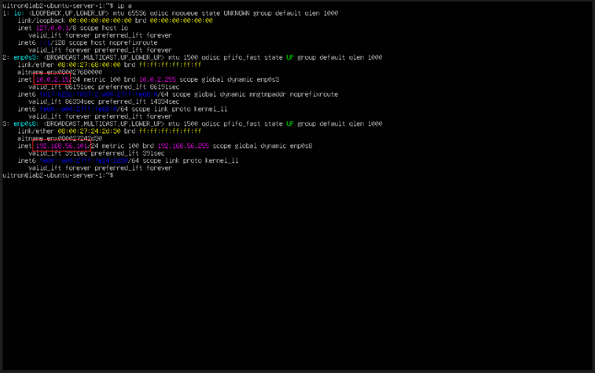
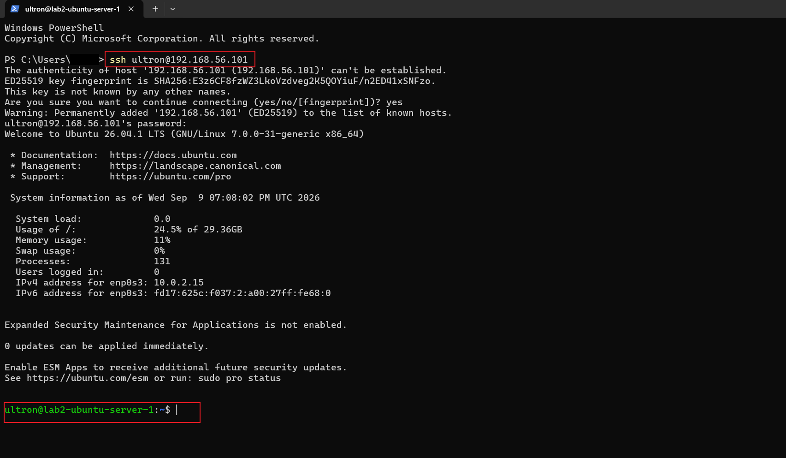
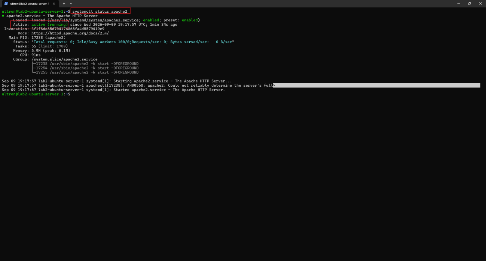
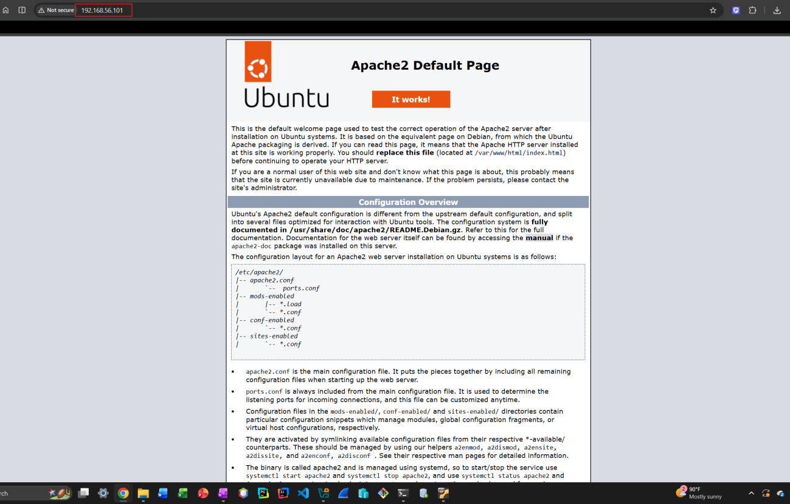
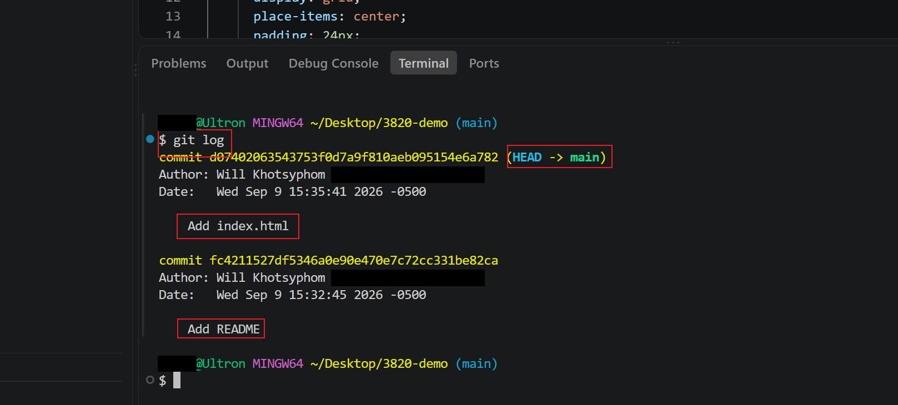
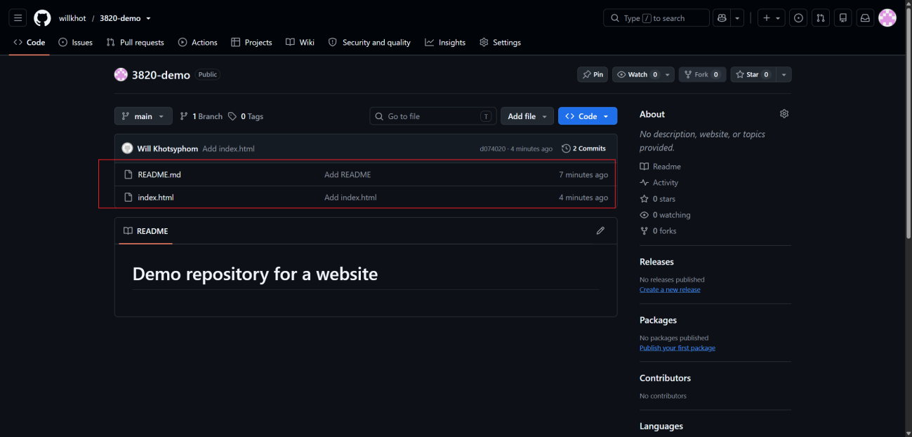
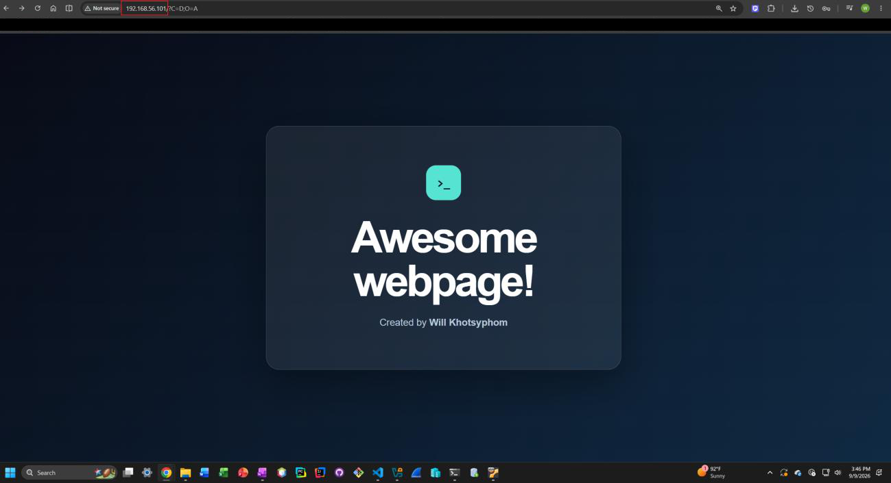

# Lab 2 — Deploy Services, Test, and Manage Workflow

## Overview

This lab builds a small but complete web-hosting workflow on a local Linux server:

1. Stand up an **Ubuntu Server** VM with two network adapters (NAT + Host-only)
2. Install **OpenSSH Server** and manage the box remotely from Windows
3. Install **Apache HTTP Server** and serve the default page to the host machine
4. Version-control a simple website with **Git**, push it to **GitHub**, then clone it onto the server and deploy it to Apache's web root

```
 Windows host                       Ubuntu Server VM (VirtualBox)
┌───────────────────┐   Host-only   ┌─────────────────────────────┐
│ VS Code + Git     │──────────────▶│ enp0s8  192.168.56.x        │
│ PowerShell (SSH)  │   SSH :22     │  ├─ sshd                     │
│ Browser (HTTP)    │   HTTP :80    │  └─ apache2 → /var/www/html  │
└─────────┬─────────┘               │ enp0s3  10.0.2.x (NAT) ──▶ Internet
          │ git push                └──────────────▲──────────────┘
          ▼                                        │ git clone
      ┌────────┐                                   │
      │ GitHub │───────────────────────────────────┘
      └────────┘
```

## Objectives

- Configure a VM with NAT (internet access) and Host-only (host ↔ VM) networking
- Install and manage services with `apt` and `systemctl`
- Connect to a Linux server over SSH using its Host-only IP
- Serve web content with Apache and test it from the host's browser
- Use a Git → GitHub → server workflow to deploy a site
- Use `sudo` to write to a root-owned directory (`/var/www/html`)

## Tools & Technologies

| Category | Tools |
|---|---|
| Virtualization | Oracle VirtualBox (NAT + Host-only adapters) |
| OS | Ubuntu Server 26.04 LTS |
| Services | OpenSSH Server, Apache2 |
| Version control | Git, GitHub |
| Client | VS Code, Git Bash, Windows PowerShell, Chrome |

---

## Task 1 — Ubuntu Server VM with Two Network Adapters

### VM configuration

| Setting | Value |
|---|---|
| OS | Ubuntu Server LTS (fresh install, unattended install skipped) |
| CPU / RAM | 2 vCPU / 2 GB or more |
| Disk | 30 GB |
| Adapter 1 | **NAT**, so the VM can reach the internet (package installs, `git clone`) |
| Adapter 2 | **Host-only Adapter**, so the host can reach the VM (SSH, HTTP) |

I added Adapter 2 in **Settings → Network** *before* the first boot, then completed the Ubuntu Server install. I deliberately **did not** install OpenSSH during setup so I could install it manually in Task 2.

### Verify both interfaces

```bash
ip a
```

| Interface | Network | Address |
|---|---|---|
| `enp0s3` | NAT | `10.0.2.15/24` |
| `enp0s8` | Host-only | `192.168.56.101/24` |



---

## Task 2 — Install OpenSSH and Connect from the Host

### On the VM

```bash
sudo apt update
sudo apt install openssh-server
sudo systemctl status ssh      # should show: active (running)
sudo systemctl start ssh       # only needed if it isn't running
```

### From Windows PowerShell

```powershell
ssh <username>@192.168.56.101
```

On first connection, SSH shows the server's ED25519 fingerprint. Answering `yes` saves it to `known_hosts`. After I entered the password, I was at the server's shell prompt. I kept this session open for the rest of the lab.



---

## Task 3 — Install Apache and Load the Default Page

### Install and verify the service (over SSH)

```bash
sudo apt install apache2
systemctl status apache2       # Active: active (running)
```



> **Note:** the log shows `AH00558: Could not reliably determine the server's fully qualified domain name`. This warning is harmless. Apache just doesn't have a `ServerName` set. To silence it, add `ServerName localhost` to `/etc/apache2/apache2.conf` and run `sudo systemctl reload apache2`.

### Test from the host

In a browser on the host, I opened `http://192.168.56.101`. It has to be plain **http**, since there's no TLS yet. The **Apache2 Ubuntu Default Page** loaded.



---

## Task 4 — Git Workflow: Local → GitHub → Server

### 4.1 Create a local repository (VS Code terminal, Git Bash)

```bash
mkdir 3820-demo && cd 3820-demo
git init
git branch -m master main      # make sure the default branch is "main"

# README
echo "# Demo repository for a website" > README.md
git add README.md
git commit -m "Add README"

# index.html (a heading with my name, plus some custom CSS styling)
git add index.html
git commit -m "Add index.html"

git log
```



### 4.2 Push to GitHub

I created a **public** repository on GitHub with the same name, then linked and pushed:

```bash
git remote add origin https://github.com/willkhot/3820-demo.git
git push -u origin main
```

🔗 Repo: [willkhot/3820-demo](https://github.com/willkhot/3820-demo)



### 4.3 Deploy to the web server (over SSH)

```bash
cd ~
git clone https://github.com/willkhot/3820-demo.git
cd 3820-demo
sudo cp index.html /var/www/html/
```

`/var/www/html` is owned by `root`, so a normal user can't write there. The copy needs `sudo`. This replaces Apache's default `index.html` with my page.

### 4.4 Verify

After refreshing `http://192.168.56.101` on the host, my custom page was served by Apache.



---

## Security Takeaways

This setup is intentionally simple and **not production-ready**:

- **HTTP only.** Traffic is unencrypted. Production sites need HTTPS (TLS certificates, e.g. Let's Encrypt).
- **Password SSH.** Key-based authentication, with `PasswordAuthentication no`, is much safer.
- **No firewall.** A host firewall (`ufw allow OpenSSH`, `ufw allow 'Apache'`, `ufw enable`) should restrict open ports.
- **Manual `sudo cp` deploys.** A better workflow uses a dedicated deploy user or group with write access to the web root, or a CI/CD pipeline, so admin rights aren't needed for every update.
- **Least privilege.** Keeping `/var/www/html` root-owned stops ordinary users (and compromised services) from changing site content.

## What I Learned

- How NAT and Host-only adapters give a VM both internet access and a private link to the host
- Managing services with `systemctl` (`status`, `start`, `enable`)
- How Linux file ownership and permissions decide who can deploy to the web root
- A real deploy workflow: develop locally → version with Git → push to GitHub → pull onto the server → publish

## Next Steps

- [ ] Switch SSH to key-based authentication and disable password login
- [ ] Enable `ufw` with only ports 22 and 80 open
- [ ] Automate deploys with `git pull` plus a script, or a GitHub Actions pipeline
- [ ] Add HTTPS with a self-signed certificate

---

> **Note:** Personal details such as my email, local username and browser bookmarks have been redacted. The IP addresses shown are VirtualBox's default private ranges, which can't be reached from the internet.
