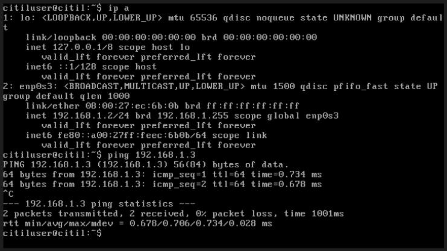
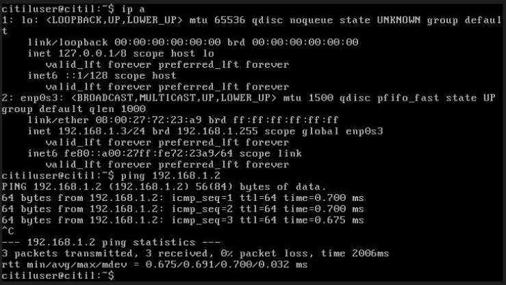
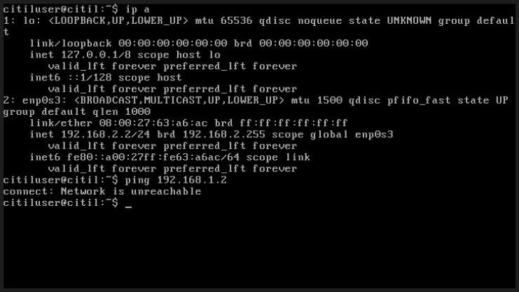
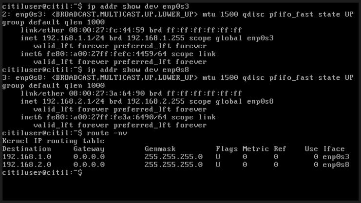
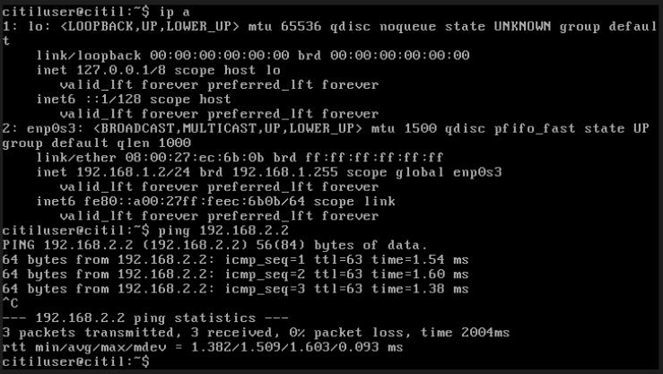
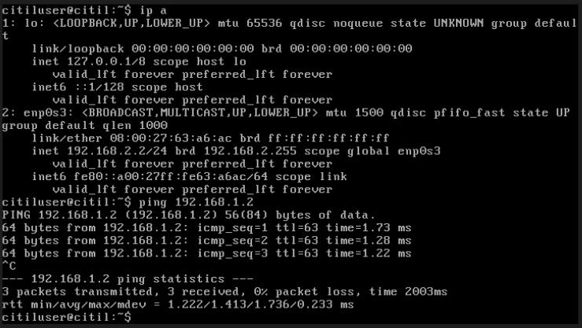

# Lab 4 — Internetworking Basics: One Router, Two Networks

## Overview

This lab builds two separate IPv4 networks in VirtualBox and connects them with a Linux machine acting as a **router**. It covers the core building blocks of IP networking:

- Planning address space (network ID, broadcast, usable range, gateway)
- Layer 2 connectivity (same segment) vs. Layer 3 connectivity (same subnet)
- Static IP configuration on Linux
- Turning a Linux host into a router with **IP forwarding**
- **Default gateways** and how hosts reach other networks

> **Next:** [Lab 5](../lab-05-internetworking-two-routers/) extends this to two routers, three networks and static routes.

## Topology

```
          network-1  192.168.1.0/24                     network-2  192.168.2.0/24
  ┌──────────────────────────────────────┐        ┌──────────────────────────────────┐
  │                                      │        │                                  │
  │  machine-A  192.168.1.2 ──┐          │        │                                  │
  │                           ├──[ switch ]──(enp0s3) router-1 (enp0s8)──[ switch ]── machine-C  192.168.2.2
  │  machine-B  192.168.1.3 ──┘          │   192.168.1.1        192.168.2.1          │
  │                                      │        │                                  │
  └──────────────────────────────────────┘        └──────────────────────────────────┘
```

In VirtualBox, each "switch" is an **Internal Network** (`network-1`, `network-2`). Putting a VM's adapter on one is like plugging its cable into that switch.

## Tools & Technologies

| Category | Tools |
|---|---|
| Virtualization | Oracle VirtualBox (Internal Networks, appliance import, cloning) |
| OS | Lightweight Ubuntu Server appliance |
| Networking | `/etc/network/interfaces`, `ip`, `route`, `ping`, `sysctl` |

---

## Task 1 — Network Planning

| | network-1 | network-2 |
|---|---|---|
| Network ID | `192.168.1.0/24` | `192.168.2.0/24` |
| Broadcast | `192.168.1.255` | `192.168.2.255` |
| Usable range | `.1` – `.254` (254 hosts) | `.1` – `.254` (254 hosts) |
| Gateway (first usable) | `192.168.1.1` | `192.168.2.1` |
| Hosts | machine-A `192.168.1.2`, machine-B `192.168.1.3` | machine-C `192.168.2.2` |

| router-1 | Interface | Address | Connected to |
|---|---|---|---|
| Interface 1 | `enp0s3` | `192.168.1.1/24` | network-1 |
| Interface 2 | `enp0s8` | `192.168.2.1/24` | network-2 |

Both networks come from the RFC 1918 private range `192.168.0.0/16`. A `/24` leaves 8 host bits: 2⁸ = 256 addresses, and 254 are usable once the network ID and broadcast are excluded.

---

## Task 2 — Build network-1 (machine-A + machine-B)

1. Imported the Ubuntu appliance as **machine-A**, generating new MAC addresses.
2. Set a static IP in `/etc/network/interfaces`:

   ```
   auto enp0s3
   iface enp0s3 inet static
       address 192.168.1.2
       netmask 255.255.255.0
   ```

3. Attached Adapter 1 to **Internal Network → `network-1`**.
4. **Cloned** machine-A to make **machine-B**, with new MAC addresses so there are no duplicate MACs on the segment, then changed its address to `192.168.1.3`.
5. Tested connectivity both ways:

| machine-A → machine-B | machine-B → machine-A |
|---|---|
|  |  |

**Why it works:** both machines share a **Layer 2** segment (the same internal network) *and* a **Layer 3** prefix (`192.168.1.0/24`), so they can reach each other directly without a router.

---

## Task 3 — Build network-2 (machine-C)

I cloned machine-A to make **machine-C**, gave it `192.168.2.2/24`, and attached it to **`network-2`**.

```bash
ping 192.168.1.2
# connect: Network is unreachable
```



**Why it fails:** machine-C's routing table only has a route for `192.168.2.0/24`. It has no route or gateway for `192.168.1.0/24`, so the kernel refuses to send the packet. There's also no physical path, because no device connects the two segments yet.

---

## Task 4 — Add router-1 and Default Gateways

### 4.1 Build the router

I cloned machine-B to make **router-1**, enabled **Adapter 2**, and attached Adapter 1 to `network-1` and Adapter 2 to `network-2`.

```
auto enp0s3
iface enp0s3 inet static
    address 192.168.1.1
    netmask 255.255.255.0

auto enp0s8
iface enp0s8 inet static
    address 192.168.2.1
    netmask 255.255.255.0
```

### 4.2 Enable packet forwarding

Linux hosts **drop** packets that aren't addressed to them by default. To turn router-1 into a router:

```bash
# /etc/sysctl.conf
net.ipv4.ip_forward=1

sudo sysctl -p          # apply now
```

### 4.3 Verify the router

router-1 has one address on each network, plus a **directly connected route** for each:



### 4.4 Add default gateways to the hosts

Even with forwarding on, hosts still don't know to *send* off-subnet traffic to the router. I added a `gateway` line under `netmask` on each host:

| Host | Gateway |
|---|---|
| machine-A, machine-B | `gateway 192.168.1.1` |
| machine-C | `gateway 192.168.2.1` |

This adds a **default route** (`0.0.0.0/0 → gateway`) to each host's routing table.

### 4.5 Verify cross-network connectivity

| machine-A → machine-C | machine-C → machine-A |
|---|---|
|  |  |

> 💡 **Proof that the packet went through a router:** in Task 2, same-network pings came back with `ttl=64`. Cross-network pings now show **`ttl=63`**. Each router that forwards a packet decreases its TTL by 1, so this shows exactly one hop.

---

## How a Packet Gets from machine-A to machine-C

1. machine-A builds a packet: **src** `192.168.1.2` → **dst** `192.168.2.2`.
2. It compares the destination to its own subnet (`192.168.1.0/24`). The destination isn't local.
3. It uses its **default route** and sends the frame to the gateway `192.168.1.1` (router-1's `enp0s3`).
4. router-1 checks its routing table. `192.168.2.0/24` is **directly connected** on `enp0s8`.
5. With forwarding enabled, router-1 sends the packet out `enp0s8` to machine-C, and the reply follows the reverse path.

## What I Learned

- How to size a subnet and work out its network ID, broadcast, usable range and gateway
- The difference between Layer 2 reachability (same segment) and Layer 3 reachability (same prefix)
- Why hosts need a default gateway, and why a Linux host needs `ip_forward` to route
- How to read `route -n` output: `U` means the route is up, `G` means it goes through a gateway
- How to use TTL to count router hops

---

> **Note:** All addresses are RFC 1918 private addresses inside isolated VirtualBox internal networks. The VMs come from a course-provided appliance, and its credentials are intentionally left out.
