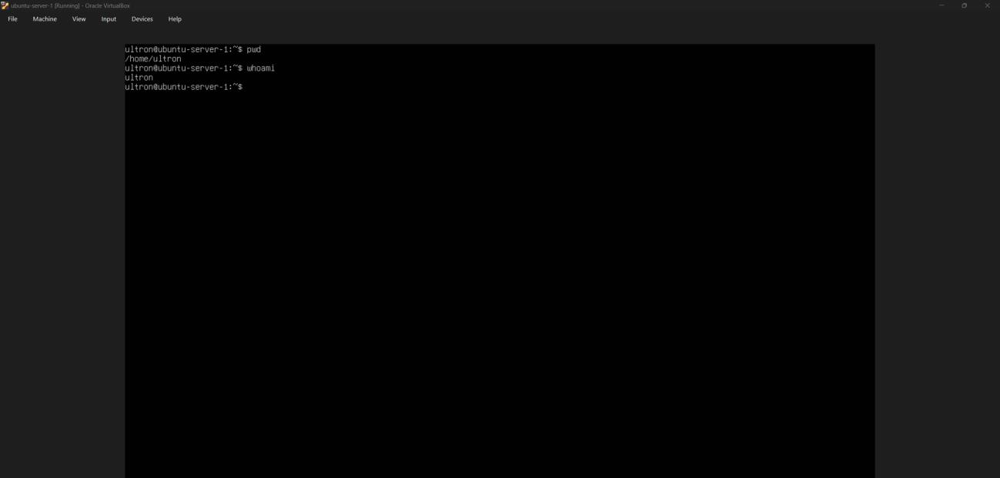
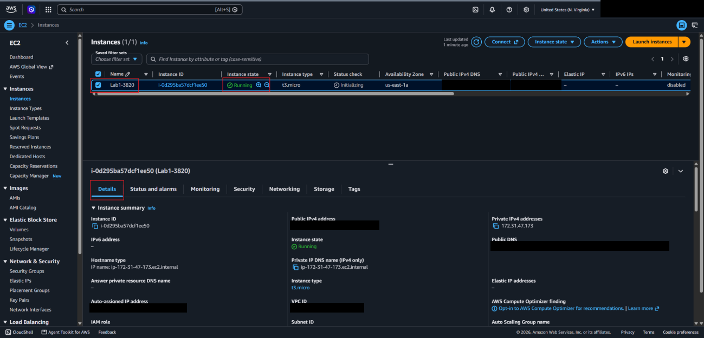
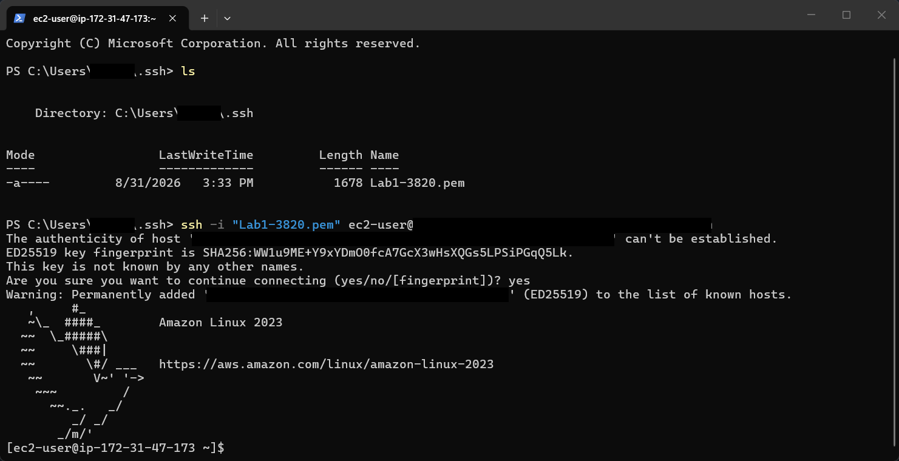
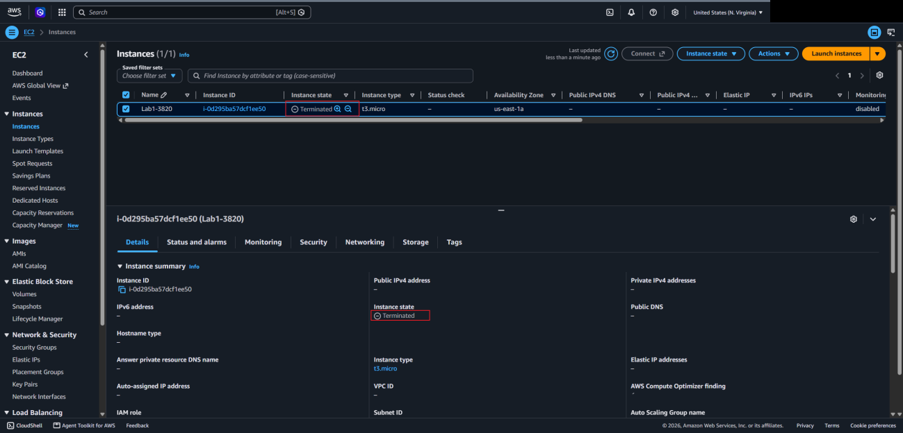

# Lab 1 — Deploy Linux Servers (Local VM + AWS EC2)

## Overview

This was the first lab, and the goal was to get a Linux server running two different ways. First I set up Ubuntu Server as a VM in VirtualBox on my own computer. That VM stuck around as my practice box for the later labs. Then I did the same thing in the cloud by launching an Amazon Linux instance on AWS EC2.

The EC2 part was the more interesting half. Before launching anything I had to create a key pair, which is how you log in instead of using a password, and a security group, which acts like a firewall in front of the instance. I set the security group to only allow SSH from my own IP. Once the instance was running I SSH'd into it from PowerShell, made sure everything worked, and then terminated it so it wouldn't keep costing money or sit there exposed.

## Objectives

- Create and run a Linux VM with a type-2 hypervisor (VirtualBox)
- Launch an EC2 instance in `us-east-1` with a custom key pair and security group
- Restrict inbound access to SSH (port 22) from a single trusted IP
- Connect to the instance over SSH from Windows PowerShell
- Terminate cloud resources after use (cost + security best practice)

## Tools & Technologies

| Category | Tools |
|---|---|
| Virtualization | Oracle VirtualBox |
| Operating Systems | Ubuntu Server, Amazon Linux 2023 |
| Cloud | AWS EC2, Security Groups, Key Pairs (AWS Academy Learner Lab) |
| Client | Windows PowerShell, OpenSSH |

---

## Task 1 — Ubuntu Server VM in VirtualBox

### Steps

1. Created a new VM in VirtualBox named `ubuntu-server-1`.
2. Attached the latest Ubuntu Server ISO and allocated CPU, RAM and disk.
3. Chose **Skip Unattended Installation** so the user I created during setup would get `sudo` privileges automatically.
4. Walked through the Ubuntu Server installer, created a user account, and rebooted into the new system.
5. Logged in and verified the environment:

```bash
pwd      # confirm the home directory
whoami   # confirm the logged-in user
```

6. Shut the VM down cleanly (`sudo shutdown now`) and kept it installed for later labs.

### Result



---

## Task 2 — Linux Instance on AWS EC2

### 2.1 Configuration

All work was done in the **`us-east-1` (N. Virginia)** region.

**Key pair**

| Setting | Value |
|---|---|
| Type | RSA |
| Format | `.pem` (for OpenSSH) |
| Location | Saved to `~/.ssh/` on my local machine |

**Security group**

| Direction | Rule |
|---|---|
| Inbound | SSH (TCP 22) from **my current public IP only** (`/32`) |
| Outbound | Default — all traffic allowed |

**Instance**

| Setting | Value |
|---|---|
| AMI | Amazon Linux 2023 (kernel 6.1), Free Tier eligible |
| Instance type | `t3.micro` |
| VPC | Default VPC |
| Subnet / AZ | `us-east-1a` |
| Key pair / SG | The ones created above |
| Everything else | Defaults |

### 2.2 Launch the instance

Created the key pair and the security group first, then launched the instance with those settings. The instance reached the **Running** state in `us-east-1a`.



### 2.3 Connect over SSH

From PowerShell, in my `.ssh` folder:

```powershell
cd ~\.ssh
ls                                   # confirm the .pem key is there
ssh -i "<KEY_NAME>.pem" ec2-user@<EC2_PUBLIC_DNS>
```

- `ec2-user` is the default user on Amazon Linux AMIs.
- On first connection, SSH asks you to confirm the host's key fingerprint. Answering `yes` adds it to `known_hosts`.
- On macOS/Linux, run `chmod 400 <KEY_NAME>.pem` first, or SSH will reject a key file that other users can read.



### 2.4 Terminate the instance

After verifying the connection, I terminated the instance from **Instance state → Terminate instance**. The console confirmed the **Terminated** state.



---

## Security Takeaways

- **Least-privilege networking:** open only the ports you need (here, just 22) and only to trusted sources, never `0.0.0.0/0` for SSH.
- **Protect SSH keys:** private keys stay on your machine, are never shared, and are **never committed to Git**. Each person should use their own key pair so actions can be traced to them.
- **Shared responsibility:** AWS secures the infrastructure, but patching the OS and software on the instance is the customer's job.
- **Ephemeral storage:** an instance's root volume is deleted on termination by default. Persistent data belongs on separate (encrypted) EBS volumes.
- **Clean up:** terminate resources as soon as you're done. Idle instances cost money and add attack surface.

## What I Learned

- Running a VM on my own computer is pretty similar to running one in the cloud. The main difference is who owns the hardware.
- The key pair is how you prove who you are, and the security group decides who's even allowed to try connecting
- How to SSH into a remote server from PowerShell using a key file instead of a password
- To shut down cloud stuff when I'm done with it, because it costs money and it's one more thing someone could attack

---

> **Note:** Sensitive values such as the account ID, public IPs/DNS names, VPC ID, usernames and key names have been redacted or replaced with placeholders like `<EC2_PUBLIC_DNS>`. All resources shown were terminated after the lab.
