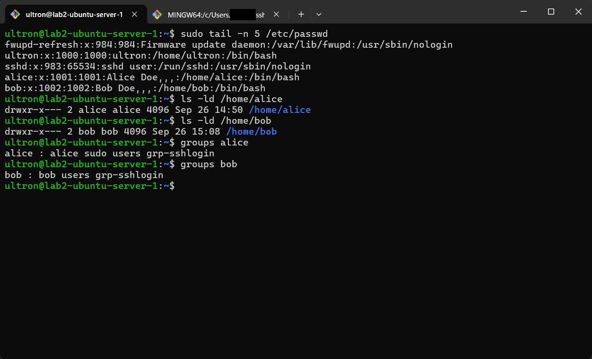
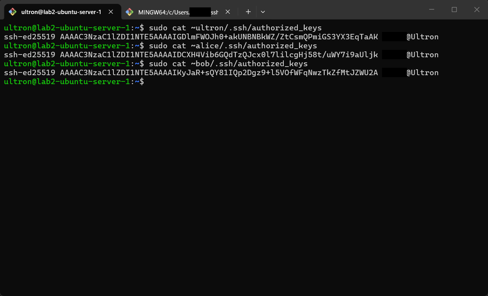
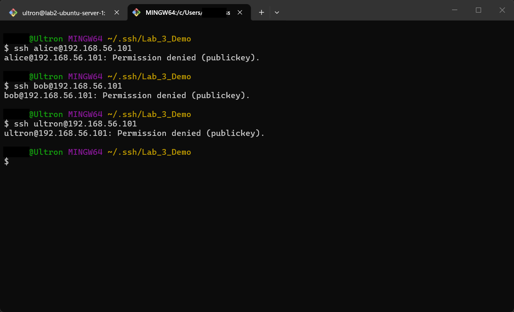
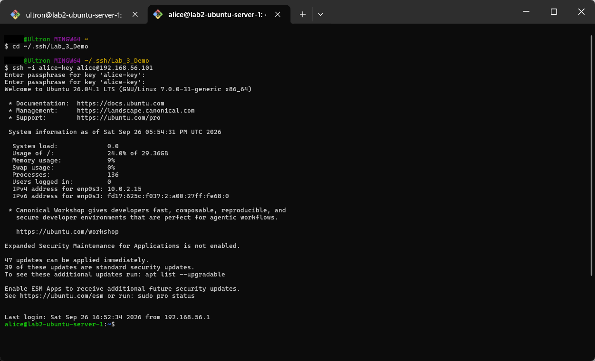
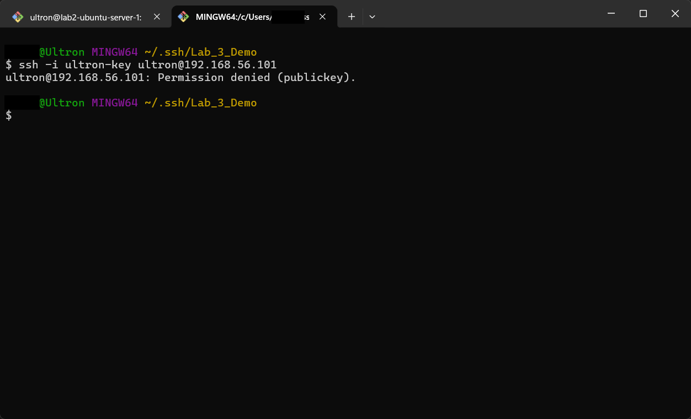
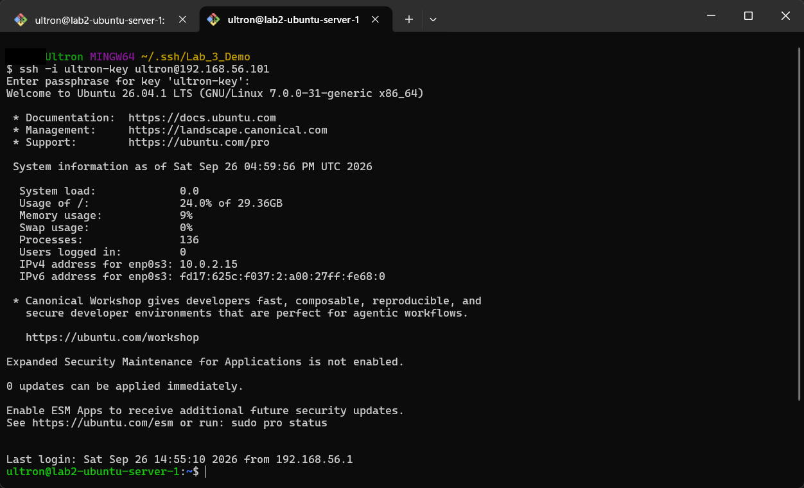
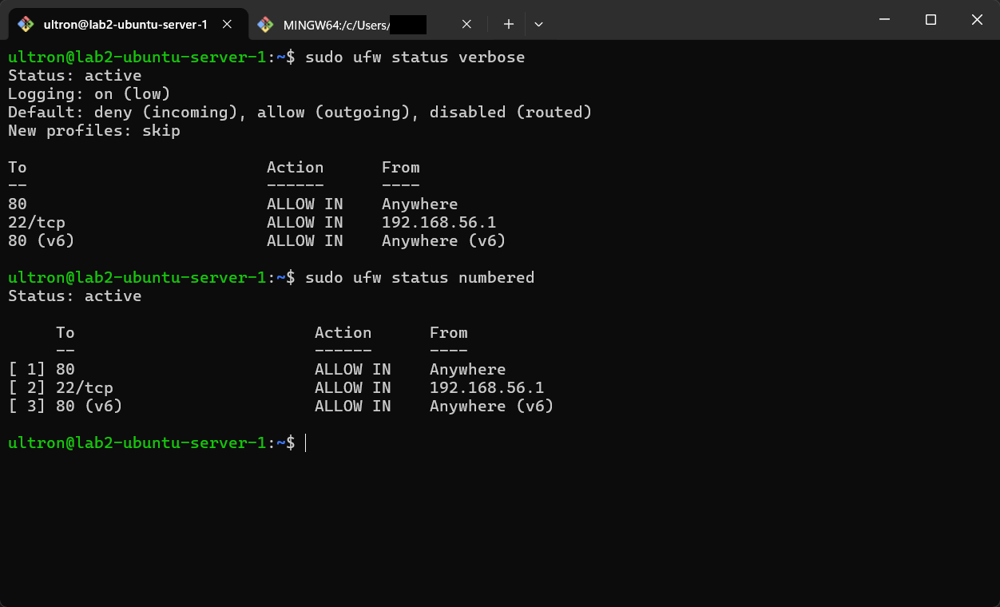

# Lab 3 — Manage Access, Harden Services, Host Security Basics

## Overview

[Lab 2](../lab-02-deploy-services-and-workflow/) got the server working, but it wasn't very secure. Anyone with a password could SSH in, and there was no firewall. This lab was about locking it down.

I created two users, alice and bob, gave only alice admin rights, and made it so they couldn't look through each other's home folders. Then I gave each account its own SSH key and changed the SSH settings so passwords don't work anymore, root can't log in, and only members of one group are allowed in. That group setting ended up locking me out of my own admin account, which turned out to be the most useful part of the lab (Task 3 covers how I got back in). Finally I turned on a firewall that only allows SSH from my computer and leaves the web server open.

The big takeaway is that installing a service is only half the job. A lot of real attacks go after services that were set up and never configured properly.

## Objectives

- Manage users, groups and home-directory permissions on Linux
- Grant admin rights through the `sudo` group
- Generate per-user SSH key pairs and install them with `ssh-copy-id`
- Edit `/etc/ssh/sshd_config` to block brute-force and root-login attacks
- Use `AllowGroups` for group-based SSH access control, and recover from a lockout
- Configure a default-deny firewall with specific allow rules

## Tools & Technologies

| Category | Tools |
|---|---|
| OS | Ubuntu Server 26.04 LTS (VirtualBox, NAT + Host-only) |
| Access control | `adduser`, `addgroup`, `chmod`, `sudo`, `groups` |
| SSH | OpenSSH (`ssh-keygen`, `ssh-copy-id`, `sshd_config`) |
| Firewall | ufw (Uncomplicated Firewall) |
| Client | Git Bash on Windows |

---

## Task 1 — Users, Permissions, and Groups

### Create users and lock down home directories

```bash
sudo adduser alice              # Full name: Alice Doe
sudo adduser bob                # Full name: Bob Doe

sudo chmod 0750 /home/alice     # owner rwx, group r-x, others ---
sudo chmod 0750 /home/bob
```

### Grant sudo and create an SSH login group

```bash
sudo adduser alice sudo         # alice becomes an administrator

sudo addgroup grp-sshlogin
sudo adduser alice grp-sshlogin # adduser appends, so existing groups are kept
sudo adduser bob grp-sshlogin
```

### Verify

```bash
sudo tail -n 5 /etc/passwd
ls -ld /home/alice /home/bob
groups alice
groups bob
```

| User | Home perms | Groups |
|---|---|---|
| alice | `drwxr-x---` (0750) | alice, **sudo**, users, **grp-sshlogin** |
| bob | `drwxr-x---` (0750) | bob, users, **grp-sshlogin** |



---

## Task 2 — SSH Key Pairs for Each User

On my **Windows host** (Git Bash), I generated a separate, passphrase-protected key pair for each account and installed each public key on the server:

```bash
mkdir -p ~/.ssh/Lab_3_Demo && cd ~/.ssh/Lab_3_Demo

ssh-keygen -f alice-key          # creates alice-key (private) + alice-key.pub (public)
ssh-keygen -f bob-key
ssh-keygen -f <admin>-key

ssh-copy-id -i alice-key.pub  alice@192.168.56.101
ssh-copy-id -i bob-key.pub    bob@192.168.56.101
ssh-copy-id -i <admin>-key.pub <admin>@192.168.56.101
```

> Using `-f` with a unique name matters. Plain `ssh-keygen` writes to the default `id_*` file and can **overwrite** an existing key.

Each user's `~/.ssh/authorized_keys` on the server now contains their own ED25519 public key:



> Public keys are safe to share. **Private keys never leave the client** and are never committed to Git. This repo's `.gitignore` blocks key files.

---

## Task 3 — Harden the SSH Daemon

### 3.1 Key-only authentication and no root login

```bash
sudo nano /etc/ssh/sshd_config
```

```diff
- #PermitRootLogin prohibit-password
+ PermitRootLogin no
- #PubkeyAuthentication yes
+ PubkeyAuthentication yes
- #PasswordAuthentication yes
+ PasswordAuthentication no
```

```bash
sudo systemctl restart ssh
```

Trying to log in **without a key** now fails for every user, because the server no longer offers password authentication. That shuts down password brute-force attacks entirely.



### 3.2 Restrict SSH to one group

```diff
  PubkeyAuthentication yes
+ AllowGroups grp-sshlogin
```

```bash
sudo systemctl restart ssh
```

**alice** is in `grp-sshlogin`, so she can log in with her key:

```bash
ssh -i alice-key alice@192.168.56.101
```



### 3.3 The lockout, and the fix

My own admin account **was not** in `grp-sshlogin`, so even with a valid key, sshd refused the connection:

```bash
ssh -i <admin>-key <admin>@192.168.56.101
# Permission denied (publickey).
```



**Why:** `AllowGroups` is an allow-list. Once it's set, *anyone not in a listed group is denied*, whatever key they present.

**Fix:** `alice` could still get in and has `sudo`, so I used her session to add my admin account to the group:

```bash
sudo adduser <admin> grp-sshlogin
```

Key-based login as my admin account then worked:



> **Lesson:** before tightening SSH access, keep an open session and confirm you still have a path back in, whether that's a second admin account or console access. Here, alice and the VirtualBox console were the recovery paths.

---

## Task 4 — Host Firewall with ufw

My Windows host's VirtualBox Host-Only adapter is `192.168.56.1` (found with `ipconfig /all`).

```bash
sudo ufw allow proto tcp from 192.168.56.1 to any port 22   # SSH from my host only
sudo ufw allow 80                                            # HTTP from anywhere
sudo ufw enable

sudo ufw status verbose
sudo ufw status numbered
```

| # | To | Action | From |
|---|---|---|---|
| 1 | 80 | ALLOW IN | Anywhere |
| 2 | 22/tcp | ALLOW IN | 192.168.56.1 |
| 3 | 80 (v6) | ALLOW IN | Anywhere (v6) |

**Default policy:** deny incoming, allow outgoing. Anything not explicitly allowed is dropped.



> Add the SSH allow rule **before** running `ufw enable`. Otherwise you can cut off your own SSH session.

---

## Defense in Depth: What Each Layer Stops

| Layer | Control | Stops |
|---|---|---|
| Network | ufw: port 22 only from `192.168.56.1` | Anyone else even reaching sshd |
| Service | `AllowGroups grp-sshlogin` | Valid system accounts that shouldn't have remote access |
| Authentication | `PasswordAuthentication no` + keys | Password guessing and brute force |
| Authentication | `PermitRootLogin no` | Direct attacks on the all-powerful `root` account |
| Keys | Passphrase-protected private keys | Use of a stolen key file |
| Filesystem | `chmod 0750` home dirs | Users browsing each other's files |
| Privilege | `sudo` group membership only for admins | Unnecessary admin rights |

## What I Learned

- How users, groups, and file permissions decide who can see and change what
- How SSH keys work (the public key goes on the server, the private key stays on my computer) and why they're safer than passwords
- `AllowGroups` blocks everyone who isn't in the listed group, including me. I found that out the hard way.
- How to set up a firewall that blocks everything by default and only lets in what I actually need
- Before changing how people log in, make sure there's still a way back in if something goes wrong

---

> **Note:** My local username has been redacted from the screenshots, and the admin account is written as `<admin>` in commands. The IPs are private VirtualBox Host-only addresses. The SSH keys shown are **public** keys only, and all lab accounts and keys are for a local, non-production VM.
