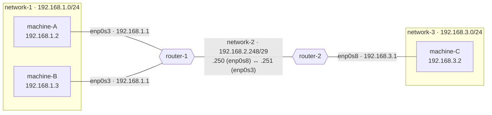
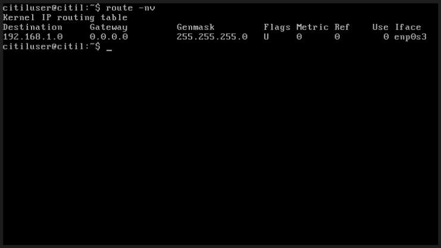
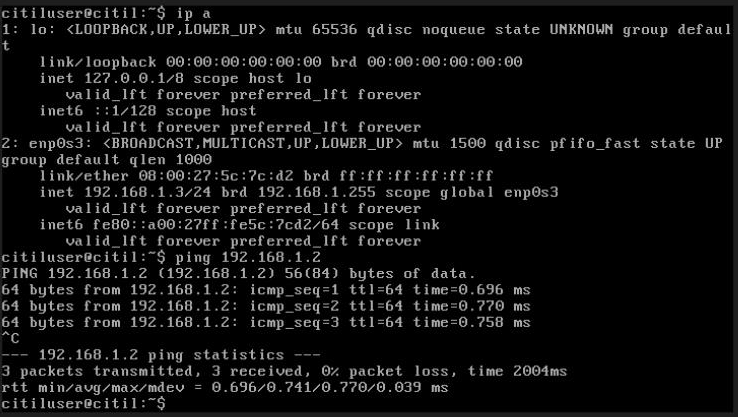
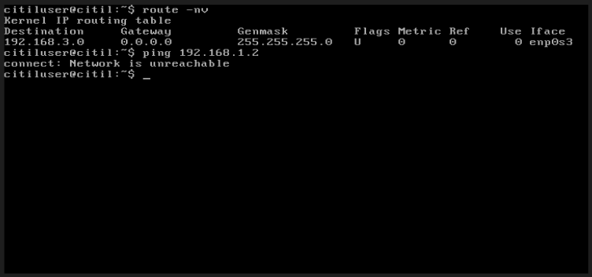
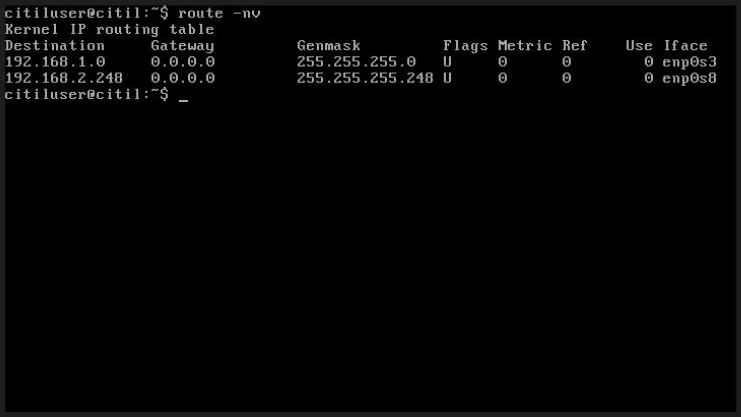
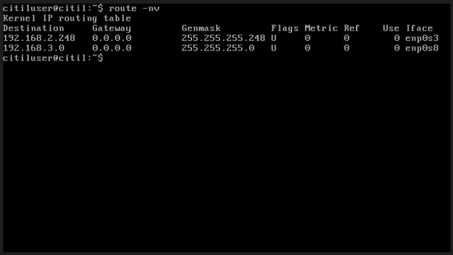
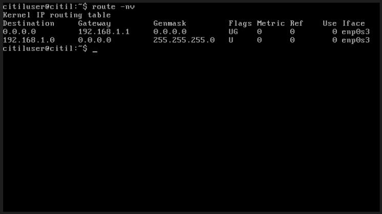
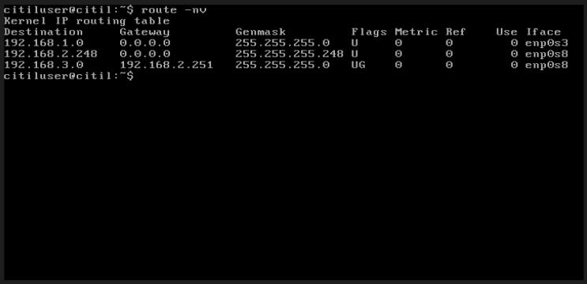
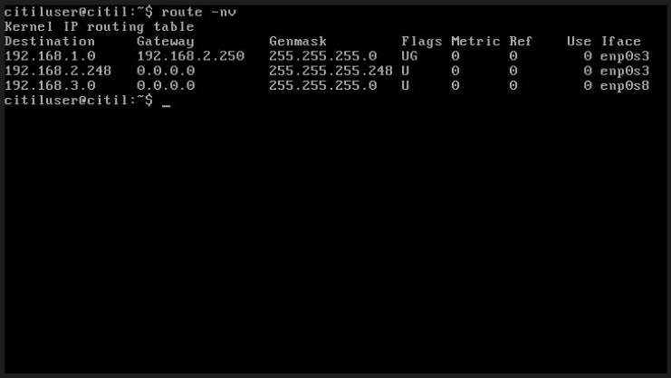
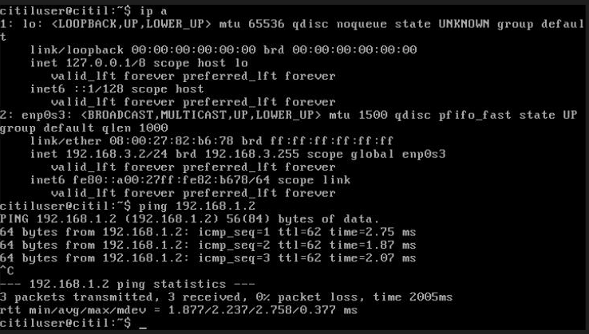

# Lab 5 — Internetworking Basics: Two Routers, Three Networks, Static Routes

## Overview

This lab builds on [Lab 4](../lab-04-internetworking-one-router/) by adding a **second router** and a **third network**. With two routers in series, each router is only directly connected to two of the three networks, so it has to be *told* how to reach the far one. That's done with **static routes**.

Key concepts:

- Subnetting a small **point-to-point link** (`/29`) between routers
- Directly connected routes vs. **static routes** with a next hop
- How default routes on hosts and static routes on routers work together
- Tracing a packet hop by hop across three networks

## Topology



## Tools & Technologies

| Category | Tools |
|---|---|
| Virtualization | Oracle VirtualBox (3 Internal Networks, 5 VMs) |
| OS | Lightweight Ubuntu Server appliance |
| Networking | `/etc/network/interfaces`, `route`, `ip`, `ping`, `sysctl` |

---

## Task 1 — Network Planning

### Networks

| | network-1 | network-2 (router link) | network-3 |
|---|---|---|---|
| Network ID | `192.168.1.0/24` | `192.168.2.248/29` | `192.168.3.0/24` |
| Netmask | `255.255.255.0` | `255.255.255.248` | `255.255.255.0` |
| Broadcast | `192.168.1.255` | `192.168.2.255` | `192.168.3.255` |
| Usable range | `.1` – `.254` | `.249` – `.254` (6 hosts) | `.1` – `.254` |
| Gateway | `192.168.1.1` | `192.168.2.249` *(reserved for future use)* | `192.168.3.1` |
| Hosts | machine-A `.2`, machine-B `.3` | *(routers only)* | machine-C `.2` |

**Why `/29` for network-2:** it only needs a handful of addresses (the two routers, plus room to grow). A `/29` leaves 3 host bits: 2³ = 8 addresses, 6 usable. That's much less wasteful than another `/24`.

### Routers

| Router | Interface | Address | Network |
|---|---|---|---|
| router-1 | `enp0s3` | `192.168.1.1/24` | network-1 (its gateway) |
| router-1 | `enp0s8` | `192.168.2.250/29` | network-2 |
| router-2 | `enp0s3` | `192.168.2.251/29` | network-2 |
| router-2 | `enp0s8` | `192.168.3.1/24` | network-3 (its gateway) |

### Static routes

| On | Destination | Next hop |
|---|---|---|
| router-1 | `192.168.3.0/24` (network-3) | `192.168.2.251` (router-2 `enp0s3`) |
| router-2 | `192.168.1.0/24` (network-1) | `192.168.2.250` (router-1 `enp0s8`) |

---

## Task 2 — Build network-1

The setup is the same as Lab 4: I imported the appliance as **machine-A** (`192.168.1.2`) and cloned it to make **machine-B** (`192.168.1.3`), with new MACs each time, both on Internal Network `network-1`.

With no gateway yet, machine-A has just **one route**, its directly connected subnet:





---

## Task 3 — Build network-3

I cloned machine-A to make **machine-C** (`192.168.3.2/24`) on Internal Network `network-3`. Its only route is `192.168.3.0/24`, so reaching network-1 fails right away:



---

## Task 4 — Routers as Gateways (No Static Routes Yet)

### Build the routers

- **router-1:** cloned from machine-B. Adapter 1 on `network-1`, Adapter 2 on `network-2`.
- **router-2:** cloned from router-1. Adapter 1 on `network-2`, Adapter 2 on `network-3`.
- Both have IP forwarding enabled (`net.ipv4.ip_forward=1`, carried over by the clone).

router-2's `/etc/network/interfaces`, for example:

```
auto enp0s3
iface enp0s3 inet static
    address 192.168.2.251
    netmask 255.255.255.248

auto enp0s8
iface enp0s8 inet static
    address 192.168.3.1
    netmask 255.255.255.0
```

Each router only knows its **two directly connected** networks:

| router-1 | router-2 |
|---|---|
|  |  |

### Add default gateways on hosts

A `gateway` line on each host adds a **default route** (`0.0.0.0` via the gateway, flags `UG`):

| machine-A → `192.168.1.1` | machine-C → `192.168.3.1` |
|---|---|
|  |  |

**Still no end-to-end connectivity.** machine-A's packet for `192.168.3.2` reaches router-1, but router-1 has **no route to `192.168.3.0/24`** and drops it. router-2 has the same gap for network-1.

---

## Task 5 — Static Routes

I added one line to the bottom of each router's `/etc/network/interfaces`, so the route comes back every time the interface comes up, and then restarted networking:

**router-1** (to reach network-3, go through router-2):

```
up route add -net 192.168.3.0 netmask 255.255.255.0 gw 192.168.2.251
```

**router-2** (to reach network-1, go through router-1):

```
up route add -net 192.168.1.0 netmask 255.255.255.0 gw 192.168.2.250
```

Each router now has **three routes**: two connected (`U`) and one static through a gateway (`UG`).

| router-1 | router-2 |
|---|---|
|  |  |

### End-to-end test



> 💡 **TTL tells the story:** `ttl=64` on the same network (Task 2), `ttl=63` through one router (Lab 4), and now **`ttl=62`** through **two** routers.

---

## Packet Walk: machine-A → machine-C

| Step | Where | Decision |
|---|---|---|
| 1 | machine-A | dst `192.168.3.2` isn't in `192.168.1.0/24`, so use the **default route** and send to `192.168.1.1` |
| 2 | router-1 | `192.168.3.2` matches the **static route** `192.168.3.0/24`, so forward to next hop `192.168.2.251` via `enp0s8` |
| 3 | router-2 | `192.168.3.2` matches **connected** `192.168.3.0/24`, so deliver out `enp0s8` |
| 4 | machine-C | Receives the echo request and replies to `192.168.1.2` using *its* default route (`192.168.3.1`). router-2's static route to network-1 sends the reply back through router-1. |

A route has to exist **in both directions**. If either static route were missing, the request might arrive but the reply would never make it back.

## What I Learned

- How to size subnets to fit (`/24` for LANs, `/29` for a router-to-router link)
- The difference between connected routes (`U`) and static routes through a next hop (`UG`)
- Why every router in the path needs to know how to reach the destination, and how to get back
- How to make static routes persistent with `up route add` in `/etc/network/interfaces`
- How to use TTL to count hops, and how to troubleshoot by reading routing tables at each hop

---

> **Note:** All addresses are RFC 1918 private addresses inside isolated VirtualBox internal networks. The VMs come from a course-provided appliance, and its credentials are intentionally left out.
